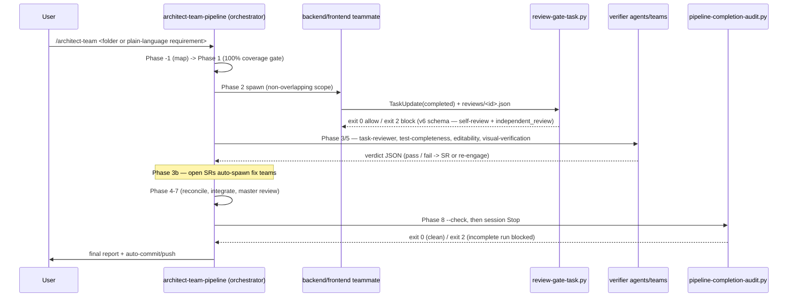

# Codebase Map

> The `architect-team` Claude Code plugin. Last refreshed 2026-05-23 for v0.9.29.

## 1. System Overview

The `architect-team` Claude Code plugin (v0.9.23) is a spec-to-production multi-agent coding pipeline. It accepts EITHER a requirements folder (OpenSpec, Superpowers, or plain markdown) OR a plain-language requirement typed directly as prose (v0.9.17), and drives it end-to-end through a Phase −2 → 8 sequence: **Phase −2** (Triage & Routing, v0.9.22 — the `bug-classifier` agent dispatches the requirement as `bug` / `feature` / `mixed` / `unclear`; pure-bug routes to the sibling `bug-fix-pipeline` skill, pure-feature continues to the existing flow, `mixed` spawns BOTH in parallel with a `triage_done` recursion-prevention flag, `unclear` emits a structured question), intake & mapping (Phase −1, with the v0.9.21 sub-section D producing per-frontend `INTERACTION_INTUITION_MAP.md` and firing a bulk-verify gate), detection & normalization (Phase 0), the 100%-coverage planning-validation gate (Phase 1), parallel team decomposition & spawn (Phase 2), hook-enforced per-team review gates (Phase 3), continuous solution-requirement intake (Phase 3b), reconciliation (Phase 4), cross-layer integration (Phase 5), the outer task-group loop (Phase 6), master review (Phase 7), and the final report + auto-commit (Phase 8). The v0.9.20 `## Default mode of operation` rule (gates are opt-in for *process* gates) and the v0.9.21 *domain-gate* carve-out coexist in the same section. **v0.9.23 promoted the Phase 8 documentation-currency update step from "orchestrator performs the updates" to a dedicated `doc-updater` agent** (opus, bounded `Write` only to the inventory paths, NO `Edit`) — wired into BOTH the main pipeline Phase 8 AND the bug-fix-pipeline Phase B8, so doc currency is structurally automatic for both feature work and bug fixes.

**v0.9.22 ships a sibling `bug-fix-pipeline` skill** with phases B−1 → B8 — replicate-first (Playwright for frontend / backend script for backend / ambiguity-escalation when unclear); reproduction-is-the-regression-test (frontend bugs also author a backend diagnostic); generalized-fix (the `system-architect` Bug-Fix Generalization Audit mode rejects symptom patches unless explicitly authorized); QA-replay-against-live-dev (the `qa-replayer` agent re-runs the reproduction artifacts against the deployed dev fix; pass criterion is symptom-gone-end-to-end); live-dev-environment-by-default (production is an opt-in escalation). Reached via `/architect-team:bug-fix` (explicit) OR the main pipeline's Phase −2 triage. **At Phase B8 the bug-fix pipeline runs the same documentation-currency gate as the main pipeline** (v0.9.23 dispatch parity).

The plugin ships **22 skills, 22 named agent definitions, 7 slash commands, 3 enforcement hooks** (plus a shared schema module), **3 setup/support scripts** (the `setup.py` + `install_mempalace.py` installers and the `scripts/notify/notify.py` email notifier, v0.9.18), and **858 pytest self-tests** across 40 test files that validate every structural artifact and guard against cross-component drift. Its enforcement is layered: Python hooks gate teammate task-completion, teammate idle, and the orchestrator's terminal state; independent verifier agents and teams re-check test-completeness, editability, interactive-element-and-page genuineness, visual fidelity, and (v0.9.23) documentation currency against reality; and the discipline skills are pressure-written to resist rationalization. A run optionally emits per-project email notifications (v0.9.18) when the target project supplies a `.architect-team-notify.json`.

## 2. Architecture Diagram

```mermaid
graph TB
    subgraph "Entry points (6 commands)"
        CMD_AT["/architect-team"]
        CMD_SETUP["/architect-team-setup"]
        CMD_VQA["/architect-team:visual-qa"]
        CMD_MEM["/architect-team:memory"]
        CMD_MEMINST["/architect-team:mempalace-install"]
        CMD_EDIT["/architect-team:editability-audit"]
    end

    subgraph "Orchestrator"
        SK_PIPELINE["skill: architect-team-pipeline (Phase -1 -> 8)"]
    end

    subgraph "Skills (20)"
        SK_INTAKE["intake-and-mapping"]
        SK_PLAN["coverage-mapping / reuse-first-design"]
        SK_MAP["frontend-route-mapping / design-fidelity-mapping"]
        SK_TEST["playwright-user-flows / dev-api-integration-testing"]
        SK_TEAM["team-spawning-and-review-gates"]
        SK_RCA["root-cause-test-failures / expensive-verification-debugging"]
        SK_DRT["diagnostic-research-team"]
        SK_VFR["visual-fidelity-reconciliation / visual-verification-team"]
        SK_EDIT["editability-completeness / interaction-completeness"]
        SK_DVD["dynamic-value-discovery"]
        SK_MEMP["mempalace-integration"]
        SK_README["readme-styling / documentation-currency"]
    end

    subgraph "Agents (17)"
        AG_IMPL["frontend / backend (opus implementers)"]
        AG_FLOW["reconciler / integration"]
        AG_MAP["codebase-map-reviewer x3 / route-mapper / integration-explorer x3 / master-synthesizer"]
        AG_ARCH["system-architect (5 review modes)"]
        AG_VERIF["task-reviewer / test-completeness-verifier / editability-reviewer x3 / interaction-reviewer x3 / diagnostic-researcher x3"]
        AG_VIS["visual-capture xN / visual-analyzer xN"]
        AG_SCAFFOLD["scaffold-agent"]
    end

    subgraph "Hooks (3 + shared module)"
        H_GATE["PostToolUse(TaskUpdate) -> review-gate-task.py"]
        H_IDLE["SubagentStop -> teammate-idle-check.py"]
        H_STOP["Stop -> pipeline-completion-audit.py"]
        H_SCHEMA["review_evidence_schema.py (shared, imported by both evidence hooks)"]
    end

    subgraph "External"
        EXT["superpowers / cartographer / ralph-loop / openspec CLI / pytest+httpx / Playwright+chromium / MemPalace (optional) / Gmail SMTP + SendGrid API (opt-in notifier)"]
    end

    CMD_AT --> SK_PIPELINE
    SK_PIPELINE --> SK_INTAKE & SK_PLAN & SK_TEAM & SK_RCA & SK_DRT & SK_VFR & SK_EDIT & SK_DVD & SK_MEMP
    SK_INTAKE --> AG_MAP
    SK_PIPELINE --> AG_IMPL & AG_FLOW & AG_ARCH & AG_VERIF & AG_VIS
    AG_IMPL --> H_GATE & H_IDLE
    SK_PIPELINE --> H_STOP
    H_GATE --> H_SCHEMA
    H_IDLE --> H_SCHEMA
    SK_PIPELINE --> EXT
```



## 3. Directory Structure

```
claude_skill_lib/
├── .claude/                 # OpenSpec-installed workspace commands + skills (opsx/* commands + openspec-* skills; tracked)
├── .claude-plugin/          # Plugin identity: plugin.json + marketplace.json (v0.9.19)
├── agents/                  # 17 named subagent definitions (.md with frontmatter)
├── commands/                # 6 slash-command bodies (.md with frontmatter)
├── hooks/                   # hooks.json wiring + 3 enforcement scripts + 1 shared module
│   ├── hooks.json           #   wires PostToolUse(TaskUpdate), SubagentStop, Stop
│   ├── review_evidence_schema.py   # shared single-source-of-truth evidence schema (v0.9.9)
│   ├── review-gate-task.py         # PostToolUse(TaskUpdate) gate
│   ├── teammate-idle-check.py      # SubagentStop gate
│   └── pipeline-completion-audit.py # Stop gate + standalone --check pre-commit gate
├── scripts/
│   ├── setup/               # setup.py (deps) + install_mempalace.py (MemPalace CLI/MCP)
│   └── notify/              # notify.py — best-effort per-project email notifier (v0.9.18)
├── skills/                  # 20 skill directories, each containing SKILL.md
├── openspec/                # OpenSpec workspace (tracked); config.yaml + changes/ (archive/ nested inside) + specs/
├── docs/
│   ├── CODEBASE_MAP.md      # this file
│   ├── INTEGRATION_MAP.md   # external-integration synthesis (single-codebase degenerate)
│   └── superpowers/         # historical design doc + plan (read-only reference)
├── tests/                   # 647 pytest self-tests (29 test files + conftest + helpers/)
├── .scratch/                # working notes (tracked; not part of the installed surface)
├── .architect-team-notify.example.json   # template per-project email-notification config (v0.9.18)
├── CLAUDE.md  CHANGELOG.md  README.md  LICENSE  pytest.ini  .gitignore
```

Runtime state is written under `<workspace>/.architect-team/` (gitignored) and `<workspace>/.mempalace/` (gitignored) — see §6.

## 4. Module Guide

### Skills (20)

| Skill | Role |
|---|---|
| `architect-team-pipeline` | The orchestrator playbook — Phase −1 → 8. Run-state rules: iteration ceiling (20), oscillation detection, the shared-state concurrency model, the escalation marker. |
| `intake-and-mapping` | Phase −1 codebase discovery + the per-codebase / integration ralph loops. Map-invalidation flag forces re-validation of a wrong-but-fresh map. |
| `reuse-first-design` | The extend > compose > reuse > build-new ladder; the Reuse Decision Log. |
| `frontend-route-mapping` | ROUTE_MAP.md schema + completeness rubric. |
| `design-fidelity-mapping` | Conditional DESIGN_MAP.md (design tokens, asset registry, per-screen specs). `design_baseline` frontmatter; a baseline migration forces a full re-derive. |
| `visual-fidelity-reconciliation` | Strict QA vs DESIGN_MAP. Phase 0 live-app precondition; zero-tolerance; the design-migration "unchanged inverts" rule; verify-against-the-Oracle-not-a-classification. |
| `visual-verification-team` | Independent live-app verification — `visual-capture` → `visual-analyzer` → `system-architect` synthesis. The verdict is measured data, not eyeballed images. |
| `playwright-user-flows` | White-box Playwright methodology; real-backend-by-default for `both`-layer features. |
| `dev-api-integration-testing` | Live-dev-API testing — real DB / queue / cache, side-effect verification. |
| `coverage-mapping` | `coverage-map.json` schema + lifecycle (Phase 1 / 3 / 7 / 8). |
| `team-spawning-and-review-gates` | Teammate manifests; the v6 review-gate evidence schema (12 self-review fields incl. `ui_interaction_review` + the independent `task-reviewer` verdict); the independent-review dispatch; the SR schema. |
| `root-cause-test-failures` | Predict → 3-pass RCA (forward / backward / falsify) → evidence-backed verdict; multiple-simultaneous-causes. |
| `diagnostic-research-team` | 3 `diagnostic-researcher` agents + `system-architect` robustness review before a test-failure fix team spawns. |
| `expensive-verification-debugging` | When a verify cycle is expensive (deploy / rebuild / slow CI), audit the whole failure pathway and batch the fixes. |
| `editability-completeness` | 3 `editability-reviewer` agents enumerate every attribute, classify editability, trace UI→DB; architect robustness review; multi-pass. |
| `interaction-completeness` | The judgment-heavy VERIFICATION gate that `playwright-user-flows` was followed (v0.9.19) — 3 `interaction-reviewer` agents independently re-enumerate every interactive element AND every page/screen/route, classify element wiring + page `live`/`placeholder`/`confirmed-stub`, audit Playwright test authenticity, trace element→endpoint, flag hardcoded-should-be-dynamic values; architect Round-3; bounded multi-pass; gaps → SRs. The sibling of `editability-completeness` at the granularity of controls and pages. |
| `dynamic-value-discovery` | A cross-role discipline (v0.9.19) for telling a genuine static literal from sample data standing in for a dynamic, data-bound value — classify every displayed value `static`/`dynamic` FROM CONTEXT, bind every dynamic one to a named data source, escalate genuine ambiguity. Modeled on `reuse-first-design`; consulted by the architect, the developers, and the evaluator. |
| `mempalace-integration` | Per-workspace MemPalace store — `--wing` mining (rooms are `init`-detected from directory structure, not a `mine` flag), auto-mine on artifact write, search before output. |
| `readme-styling` | The bitmap house style for READMEs — canvas/centering, pipe-table + ASCII-graph alignment, banner / dividers / panels / flowcharts / logic maps, the GitHub-safe + ANSI color model, and the theming engine (6 preset themes + an interactive picker + the `readme-theme` marker). |
| `documentation-currency` | The Phase 8 docs-reflect-the-code gate — the doc inventory (maps + README + CHANGELOG + CLAUDE.md), what "current" means, the orchestrator-updates-then-system-architect-audits flow. |

### Agents (17)

| Agent | Model | Color | One-line purpose |
|---|---|---|---|
| system-architect | opus | blue | On-demand architecture; + 5 review modes (Diagnostic Plan, Editability Map, Visual Gap Synthesis, Master Review Audit, Documentation Currency Audit). Analysis-only. |
| frontend | opus | cyan | Phase 2 frontend implementer; Playwright + visual-fidelity workflow. |
| backend | opus | green | Phase 2 backend implementer; live dev-API integration tests. |
| reconciler | opus | orange | Phase 4 conflict resolution; no feature code. |
| integration | sonnet | magenta | Phase 5 cross-layer; live dev API + Playwright + the visual-fidelity sweep. |
| scaffold-agent | sonnet | purple | Generates new agent files. |
| codebase-map-reviewer | sonnet | red | Spawned ×3 per codebase in Phase −1B; read-only verdict. |
| integration-explorer | opus | blue | Spawned ×3 in Phase −1C; round-robin convergence. |
| master-synthesizer | opus | purple | Phase −1C final; merges the 3 integration drafts. |
| route-mapper | opus | cyan | Per frontend codebase in Phase −1B; ROUTE_MAP.md always, DESIGN_MAP.md conditionally. |
| test-completeness-verifier | sonnet | red | Phase 3 + 5; confirms unit/integration/Playwright kinds ran + the real-backend audit. |
| task-reviewer | opus | red | Phase 3; independent per-task review of a teammate's diff vs the acceptance criteria; writes the `independent_review` block. Read-only on source. |
| diagnostic-researcher | opus | red | Spawned ×3 for a test-failure SR; full-pathway trace + ranked hypotheses. |
| editability-reviewer | opus | yellow | Spawned ×3; enumerate + classify + trace every attribute UI→DB. |
| visual-capture | sonnet | cyan | Spawned ×N; starts the live app, captures screenshots + computed-style data. Mechanical; no verdicts. |
| visual-analyzer | opus | red | Spawned ×N; the objective data diff + pixel diff + code cross-check. |
| interaction-reviewer | opus | yellow | Spawned ×3 (v0.9.19); independently enumerates every interactive element AND page, classifies element wiring + page genuineness, traces element→endpoint, audits Playwright test authenticity, flags hardcoded-dynamic values; round-robin convergence. Analysis-only — read-only on source, no `Edit` of feature code. |

### Commands (6)

- `architect-team` — runs the Phase −1 → 8 pipeline against EITHER a requirements folder OR a plain-language requirement typed directly as prose (v0.9.17). Flags: `--no-commit` / `--no-push` / `--no-compact` / `--allow-push-to-default`.
- `architect-team-setup` — installs openspec CLI, pytest+httpx, Playwright+chromium.
- `visual-qa` — on-demand visual-fidelity audit → the visual-verification-team gate.
- `mempalace-install` — installs the MemPalace CLI + prints the MCP wire-up.
- `memory` — ad-hoc MemPalace `search` / `mine` / `status` / `wake-up` / `sweep`.
- `editability-audit` — on-demand editability-completeness audit.

### Hooks (3) + shared module

- **`hooks/hooks.json`** — wires `PostToolUse[TaskUpdate]` → `review-gate-task.py`, `SubagentStop[*]` → `teammate-idle-check.py`, `Stop[*]` → `pipeline-completion-audit.py`. All `async: false`.
- **`hooks/review_evidence_schema.py`** — NOT a hook; the shared single source of truth for the evidence contract (`SCHEMA_VERSION` = 6, `REQUIRED_EVIDENCE_FIELDS` = the 12 teammate self-review fields incl. `ui_interaction_review` (v0.9.19), `REQUIRED_INDEPENDENT_REVIEW_FIELDS` for the v5 `independent_review` block, the `VALID_*` value sets incl. `VALID_UI_INTERACTION_VALUES`, `safe_id()`, `validate_evidence()`). `validate_evidence()` rejects evidence missing the `independent_review` block or whose `independent_review.reviewer == teammate`, blocks a `*_review` field set to `fail`, and requires the `_note` on an `n/a`. Both evidence hooks import it (added v0.9.9 — before that the two hooks carried drifted copies).
- **`hooks/review-gate-task.py`** — `PostToolUse(TaskUpdate)`. Blocks a teammate task flipping to `completed` without valid review-gate evidence. Exit 0 = allow, 2 = block.
- **`hooks/teammate-idle-check.py`** — `SubagentStop`. On a teammate going idle, validates every `expected_review_evidence` task. Blocks on a corrupt matched manifest (v0.9.9 — was fail-open).
- **`hooks/pipeline-completion-audit.py`** — `Stop` hook + standalone `--check`. Gates the orchestrator's terminal state: blocks a stop while `.architect-team/` shows an incomplete run (open SRs, a test-failure SR with no diagnostic plan, an unsatisfied editability loop, a test-completeness debt, an unverified visual reconciliation, a failing Phase 7 master-review audit verdict, a failing Phase 8 documentation-currency audit verdict, a blown iteration ceiling). Escalation-marker- and `stop_hook_active`-aware; fails open on any error.

### Setup & support scripts (3)

- **`scripts/setup/setup.py`** — checks Python ≥ 3.10 / Node ≥ 20.19; installs openspec CLI, pytest+pytest-asyncio+httpx, Playwright+chromium; checks for prerequisite plugins.
- **`scripts/setup/install_mempalace.py`** — uv-first (pip fallback) MemPalace install; prints the `claude mcp add` + `mempalace init` commands; never auto-runs them.
- **`scripts/notify/notify.py`** — the **best-effort per-project email notifier** (v0.9.18). A path-addressed CLI (invoked exactly like `setup.py`) that the orchestrator runs at five pipeline moments — `phase_start`, `phase_complete`, `issue_discovered`, `git_commit`, `deploy`. Single stdlib-only module: config loader, two interchangeable providers (`GmailProvider` over `smtp.gmail.com:587` STARTTLS via `smtplib`; `SendGridProvider` POSTing to `https://api.sendgrid.com/v3/mail/send` via `urllib.request`), per-recipient event filtering, an `argparse` CLI. Opt-in (a `.architect-team-notify.json` at the target project root) and best-effort by construction — every failure path (missing config, missing secret, provider/network error, bad arguments) exits 0, so a notification can never block, fail, or alter a run. Provider secrets are read only from the env var named in config, never committed, never logged.

### Config files

- **`.architect-team-notify.json`** (in a *target* project's repo root — NOT in this plugin) — the opt-in per-project email-notification config (v0.9.18) consumed by `scripts/notify/notify.py`: `provider` (`gmail`/`sendgrid`), `from_address`, optional `from_name`, the provider-settings object naming the secret env var, and a non-empty `recipients[]` (each with `email` + an `events[]` subscription list, or the `"all"` shorthand). Absent config ⇒ the notifier is a silent no-op.
- **`.architect-team-notify.example.json`** (this repo's root) — the documented, schema-valid template a project copies to enable notifications.

### Tests (647, all PASS)

29 test files under `tests/` (discovered via `test_*.py`), plus `conftest.py` (session fixtures) and `helpers/frontmatter.py`. Coverage: plugin/marketplace JSON; all 20 skill + 17 agent + 6 command frontmatters; hooks.json wiring for all 3 events; the three hooks' script logic (review-gate, teammate-idle, pipeline-completion-audit incl. the master-review + documentation-currency audit checks); the setup + MemPalace install scripts; the `scripts/notify/notify.py` notifier module (`test_notify.py` — config load/validate, Gmail + SendGrid message construction with `smtplib`/`urllib` mocked, dispatch + per-recipient filtering, secret resolution, CLI + failure isolation) and its pipeline wiring (`test_notify_wiring.py` — the five wired events + the best-effort/non-blocking statement); the v0.9.19 ui-interaction-fidelity discipline (`test_interaction_completeness.py` — skill + agent registration + the structural mandates + the element/page rubrics; `test_ui_interaction_review.py` — the v6 `ui_interaction_review` field's required/valid/`n/a`-note behavior + `SCHEMA_VERSION == 6`; `test_dynamic_value_discovery.py` — the dynamic-value-discovery skill + its context-classification rubric + the cross-role references; `test_ui_fidelity_wiring.py` — the pipeline + discipline wiring); **cross-component consistency** (`test_cross_consistency.py` — the two evidence hooks share one schema module; the Stop hook's origin set matches the pipeline; no unregistered skills/agents/commands; the shared schema has 12 required evidence fields); and one structural test file per discipline shipped v0.9.0 → v0.9.19.

## 5. Data Flow (abridged)



## 6. Conventions

**Skill frontmatter:** required `name` (matches dir) + `description` (≥ 20 chars). Quote the `description` (or avoid `: `) — an unquoted colon-space breaks the YAML parser.

**Agent frontmatter:** 5 required keys — `name`, `description`, `tools` (from a 13-tool valid set), `model` (`opus`/`sonnet`/`haiku`), `color`. Model pattern: opus for synthesis/judgment + implementers, sonnet for mechanical reviewers/capture.

**Command frontmatter:** required `description`; optional `argument-hint`, `allowed-tools`.

**Map artifacts:** `<codebase>/docs/CODEBASE_MAP.md` (`last_mapped`), `ROUTE_MAP.md` (`last_routed`), `DESIGN_MAP.md` (`last_designed` + `design_baseline`), `<workspace>/docs/INTEGRATION_MAP.md` (`last_synthesized`).

**Runtime state (gitignored under `.architect-team/`):** `intake-state.json` (re-entry + `dev_loop_iterations` + `map_invalidated`), `reviews/<task-id>.json` (evidence), `teammates/<name>.json` (manifests), `handoffs/`, `solution-requirements/SR-*.json`, `diagnostic-research/`, `editability/`, `master-review/`, `documentation-currency/`, `failure-pathway/`, `test-completeness/`, `visual-fidelity/` (`capture/` + `analysis/` + `verification-verdict-*.json`), `runs/`, `escalation-pending.md` (the Stop-hook stand-down marker). MemPalace store at `<workspace>/.mempalace/palace`.

**Review-gate evidence schema (v6 — defined once in `hooks/review_evidence_schema.py`):** the 12 teammate self-review fields — `task_id`, `spec_review`, `quality_review`, `real_not_stubbed`, `tests`, `demo_artifact`, `files_changed`, `reuse_compliance`, `visual_fidelity_review`, `test_completeness_review`, `integration_testing_review`, `ui_interaction_review` (v0.9.19) — PLUS the required `independent_review` block (v0.9.13). The four `*_review` fields take `pass`/`n/a`/`fail` — `fail` blocks; `n/a` needs a `_note`. `ui_interaction_review` gates the genuineness of a shipped UI — every interactive element genuinely user-flow-tested, every page live not a placeholder, every displayed value correctly static or dynamically bound, or a confirmed stub. The `independent_review` block is the verdict of an independent `task-reviewer` agent: it carries `reviewer` / `verdict` / `spec_review` / `quality_review` / `real_not_stubbed` / `reuse_compliance` / `reviewed_at`, and `validate_evidence()` rejects it when `reviewer == teammate` — the producer cannot be its own checker.

## 7. Gotchas (cross-cutting)

- **Hook exit codes:** 2 blocks, 0 allows; never return 1 for an intentional block. A malformed hook *payload* fails open (exit 0); a malformed *evidence file* blocks.
- **The two evidence hooks must not drift.** They import one shared `review_evidence_schema.py`; before v0.9.9 they carried separate copies and `teammate-idle-check.py` had drifted to an 8-field schema. `test_cross_consistency.py` guards this.
- **The `Stop` hook can block a session.** `pipeline-completion-audit.py` is deliberately conservative — it acts only on a real architect-team run, stands down on a `.architect-team/escalation-pending.md` marker or `stop_hook_active`, and fails open on any error. To finish an intentionally-parked run, write the escalation marker or remove `.architect-team/`.
- **The orchestrator cannot be hooked mid-run.** Every phase discipline is trust-based Markdown; the `Stop` hook + the Phase 8 `--check` gate enforce only the *terminal* state.
- **A classification is not a verdict.** "Unchanged" / "untouched" from an intake recon answers *what changed*, not *what is design-compliant* — and during a design-baseline migration "unchanged" inverts to "drifted." Verification re-checks against the Oracle / the live app, never skips on a classification.
- **Visual fidelity is verified against the LIVE app.** The `visual-verification-team` renders the running app itself; a self-reported reconciliation does not gate the run.
- **No arbitrary wakeups.** The pipeline runs synchronously; `ScheduleWakeup` / `CronCreate` / timer tools are forbidden inside a pipeline phase (v0.9.2).
- **`$ARGUMENTS` does not propagate** from a command into the skill it invokes — `commands/architect-team.md` binds `$REQ_DIR` explicitly.
- **Scaffold-agent does not update `EXPECTED_AGENTS`** — `test_cross_consistency.py::test_no_unregistered_agents` catches an unregistered agent.
- **Plugin-cache vs. source-on-disk lag (operational reality, v0.9.28 note).** The Claude Code plugin cache lives at `~/.claude/plugins/cache/architect-team-marketplace/architect-team/<version>/`. When `/architect-team` or `/architect-team:bug-fix` is invoked, the harness loads the cached version's skill bodies — NOT the source-on-disk in the development repo. After a `git pull` (or after a dogfood `git push` to main), consumers must run `/plugin marketplace update` → `/plugin update architect-team` → `/reload-plugins` to pick up the new skills/agents/commands. The repo never validates "the cached skill matches the source" — it can't, by design. For dogfood runs: the orchestrator reads source-on-disk via the `Read` tool (so the LATEST skill bodies are honored during the build) but the harness's Skill-tool dispatch uses the cached version's body for the orchestrator's own behavior. This explains why some dogfood-shipped features only take effect on the NEXT consumer run after their release commit lands. Closes cohesion-review issue #10.
- **One-time v0.9.23 dogfood asymmetry (historical, v0.9.28 note).** v0.9.23 shipped the `doc-updater` agent, but the agent didn't yet exist in the cached plugin when its own Phase 8 doc-currency gate ran — the orchestrator typed the v0.9.23 doc updates manually as a transition step. From v0.9.24 onward, every Phase 8 / Phase B8 dispatches the agent automatically. Closes cohesion-review issue #6.

## 8. Navigation Guide

- **Add a skill:** `skills/<name>/SKILL.md` (quote the description) → add to `EXPECTED_SKILLS` in `tests/test_skills.py` → reference from `architect-team-pipeline` if pipeline-participating.
- **Add an agent:** `agents/<name>.md` (5 frontmatter keys) → add to `EXPECTED_AGENTS` in `tests/test_agents.py`.
- **Add a command:** `commands/<name>.md` → add to `EXPECTED_COMMANDS` in `tests/test_commands.py`.
- **Add a hook:** write `hooks/<name>.py` (read stdin JSON, exit 0/2, fail open on its own errors) → register in `hooks/hooks.json` → add `tests/test_<name>.py` + a wiring assertion in `tests/test_hooks_structure.py`.
- **Touch the evidence schema:** edit `hooks/review_evidence_schema.py` ONLY — both hooks import it. Update `tests/test_review_gate_task.py` + `tests/test_teammate_idle_check.py` helpers in lockstep.
- **Bump version & release:** update `.claude-plugin/plugin.json` + `marketplace.json` → add a `## [x.y.z]` CHANGELOG entry → refresh `README.md` per `skills/readme-styling` (banner, badges, inventory counts, NEW IN, timeline) → commit with the author override → push. Consumers update via `/plugin marketplace update` → `/plugin update` → `/reload-plugins`.
