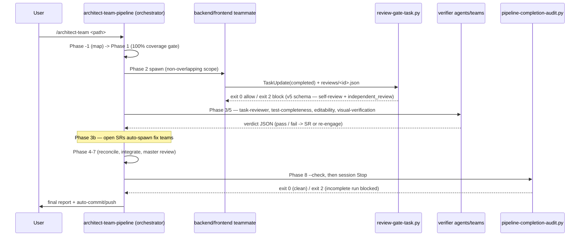

# Codebase Map

> The `architect-team` Claude Code plugin. Last refreshed 2026-05-21 for v0.9.13.

## 1. System Overview

The `architect-team` Claude Code plugin (v0.9.13) is a spec-to-production multi-agent coding pipeline. It accepts a requirements folder (OpenSpec, Superpowers, or plain markdown) and drives it end-to-end through eight-and-a-bit phases: intake & mapping (Phase −1), detection & normalization (Phase 0), a 100%-coverage planning-validation gate (Phase 1), parallel team decomposition & spawn (Phase 2), hook-enforced per-team review gates (Phase 3), continuous solution-requirement intake (Phase 3b), reconciliation (Phase 4), cross-layer integration (Phase 5) with its visual-fidelity and editability and live-app-verification sub-gates, the outer task-group loop (Phase 6), master review (Phase 7), and the final report + auto-commit (Phase 8).

The plugin ships **17 skills, 16 named agent definitions, 6 slash commands, 3 enforcement hooks** (plus a shared schema module), **2 setup scripts**, and **388 pytest self-tests** that validate every structural artifact and guard against cross-component drift. Its enforcement is layered: Python hooks gate teammate task-completion, teammate idle, and the orchestrator's terminal state; independent verifier agents and teams re-check test-completeness, editability, and visual fidelity against reality; and the discipline skills are pressure-written to resist rationalization.

## 2. Architecture Diagram

```mermaid
graph TB
    subgraph "Entry points (6 commands)"
        CMD_AT["/architect-team"]
        CMD_SETUP["/architect-team-setup"]
        CMD_VQA["/architect-team:visual-qa"]
        CMD_MEM["/architect-team:memory + mempalace-install"]
        CMD_EDIT["/architect-team:editability-audit"]
    end

    subgraph "Orchestrator"
        SK_PIPELINE["skill: architect-team-pipeline (Phase -1 -> 8)"]
    end

    subgraph "Skills (17)"
        SK_INTAKE["intake-and-mapping"]
        SK_PLAN["coverage-mapping / reuse-first-design"]
        SK_MAP["frontend-route-mapping / design-fidelity-mapping"]
        SK_TEST["playwright-user-flows / dev-api-integration-testing"]
        SK_TEAM["team-spawning-and-review-gates"]
        SK_RCA["root-cause-test-failures / expensive-verification-debugging"]
        SK_DRT["diagnostic-research-team"]
        SK_VFR["visual-fidelity-reconciliation / visual-verification-team"]
        SK_EDIT["editability-completeness"]
        SK_MEMP["mempalace-integration"]
        SK_README["readme-styling"]
    end

    subgraph "Agents (16)"
        AG_IMPL["frontend / backend (opus implementers)"]
        AG_FLOW["reconciler / integration"]
        AG_MAP["codebase-map-reviewer x3 / route-mapper / integration-explorer x3 / master-synthesizer"]
        AG_ARCH["system-architect (4 review modes)"]
        AG_VERIF["task-reviewer / test-completeness-verifier / editability-reviewer x3 / diagnostic-researcher x3"]
        AG_VIS["visual-capture xN / visual-analyzer xN"]
        AG_SCAFFOLD["scaffold-agent"]
    end

    subgraph "Hooks (3 + shared module)"
        H_GATE["PostToolUse(TaskUpdate) -> review-gate-task.py"]
        H_IDLE["SubagentStop -> teammate-idle-check.py"]
        H_STOP["Stop -> pipeline-completion-audit.py"]
        H_SCHEMA["review_evidence_schema.py (shared, imported by both evidence hooks)"]
    end

    subgraph "External"
        EXT["superpowers / cartographer / ralph-loop / openspec CLI / pytest+httpx / Playwright+chromium / MemPalace (optional)"]
    end

    CMD_AT --> SK_PIPELINE
    SK_PIPELINE --> SK_INTAKE & SK_PLAN & SK_TEAM & SK_RCA & SK_DRT & SK_VFR & SK_EDIT & SK_MEMP
    SK_INTAKE --> AG_MAP
    SK_PIPELINE --> AG_IMPL & AG_FLOW & AG_ARCH & AG_VERIF & AG_VIS
    AG_IMPL --> H_GATE & H_IDLE
    SK_PIPELINE --> H_STOP
    H_GATE --> H_SCHEMA
    H_IDLE --> H_SCHEMA
    SK_PIPELINE --> EXT
```



## 3. Directory Structure

```
claude_skill_lib/
├── .claude-plugin/          # Plugin identity: plugin.json + marketplace.json (v0.9.12)
├── agents/                  # 16 named subagent definitions (.md with frontmatter)
├── commands/                # 6 slash-command bodies (.md with frontmatter)
├── hooks/                   # hooks.json wiring + 3 enforcement scripts + 1 shared module
│   ├── hooks.json           #   wires PostToolUse(TaskUpdate), SubagentStop, Stop
│   ├── review_evidence_schema.py   # shared single-source-of-truth evidence schema (v0.9.9)
│   ├── review-gate-task.py         # PostToolUse(TaskUpdate) gate
│   ├── teammate-idle-check.py      # SubagentStop gate
│   └── pipeline-completion-audit.py # Stop gate + standalone --check pre-commit gate
├── scripts/setup/           # setup.py (deps) + install_mempalace.py (MemPalace CLI/MCP)
├── skills/                  # 17 skill directories, each containing SKILL.md
├── openspec/                # OpenSpec workspace (tracked); changes/ + archive/ + specs/
├── docs/
│   ├── CODEBASE_MAP.md      # this file
│   ├── INTEGRATION_MAP.md   # external-integration synthesis (single-codebase degenerate)
│   └── superpowers/         # historical design doc + plan (read-only reference)
├── tests/                   # 348 pytest self-tests (~22 test files + conftest + helpers/)
├── .scratch/                # working notes (tracked; not part of the installed surface)
├── CLAUDE.md  CHANGELOG.md  README.md  LICENSE  pytest.ini  .gitignore
```

Runtime state is written under `<workspace>/.architect-team/` (gitignored) and `<workspace>/.mempalace/` (gitignored) — see §6.

## 4. Module Guide

### Skills (17)

| Skill | Role |
|---|---|
| `architect-team-pipeline` | The orchestrator playbook — Phase −1 → 8. Run-state rules: iteration ceiling (20), oscillation detection, the shared-state concurrency model, the escalation marker. |
| `intake-and-mapping` | Phase −1 codebase discovery + the per-codebase / integration ralph loops. Map-invalidation flag forces re-validation of a wrong-but-fresh map. |
| `reuse-first-design` | The extend > compose > reuse > build-new ladder; the Reuse Decision Log. |
| `frontend-route-mapping` | ROUTE_MAP.md schema + completeness rubric. |
| `design-fidelity-mapping` | Conditional DESIGN_MAP.md (design tokens, asset registry, per-screen specs). `design_baseline` frontmatter; a baseline migration forces a full re-derive. |
| `visual-fidelity-reconciliation` | Strict QA vs DESIGN_MAP. Phase 0 live-app precondition; zero-tolerance; the design-migration "unchanged inverts" rule; verify-against-the-Oracle-not-a-classification. |
| `visual-verification-team` | Independent live-app verification — `visual-capture` → `visual-analyzer` → `system-architect` synthesis. The verdict is measured data, not eyeballed images. |
| `playwright-user-flows` | White-box Playwright methodology; real-backend-by-default for `both`-layer features. |
| `dev-api-integration-testing` | Live-dev-API testing — real DB / queue / cache, side-effect verification. |
| `coverage-mapping` | `coverage-map.json` schema + lifecycle (Phase 1 / 3 / 7 / 8). |
| `team-spawning-and-review-gates` | Teammate manifests; the v5 review-gate evidence schema (11 self-review fields + the independent `task-reviewer` verdict); the independent-review dispatch; the SR schema. |
| `root-cause-test-failures` | Predict → 3-pass RCA (forward / backward / falsify) → evidence-backed verdict; multiple-simultaneous-causes. |
| `diagnostic-research-team` | 3 `diagnostic-researcher` agents + `system-architect` robustness review before a test-failure fix team spawns. |
| `expensive-verification-debugging` | When a verify cycle is expensive (deploy / rebuild / slow CI), audit the whole failure pathway and batch the fixes. |
| `editability-completeness` | 3 `editability-reviewer` agents enumerate every attribute, classify editability, trace UI→DB; architect robustness review; multi-pass. |
| `mempalace-integration` | Per-workspace MemPalace store — wing/room taxonomy, auto-mine on artifact write, search before output. |
| `readme-styling` | The bitmap house style for READMEs — banner, dividers, panels, flowcharts, logic maps. |

### Agents (16)

| Agent | Model | Color | One-line purpose |
|---|---|---|---|
| system-architect | opus | blue | On-demand architecture; + 4 review modes (Diagnostic Plan, Editability Map, Visual Gap Synthesis, Master Review Audit). Analysis-only. |
| frontend | opus | cyan | Phase 2 frontend implementer; Playwright + visual-fidelity workflow. |
| backend | opus | green | Phase 2 backend implementer; live dev-API integration tests. |
| reconciler | opus | orange | Phase 4 conflict resolution; no feature code. |
| integration | sonnet | magenta | Phase 5 cross-layer; live dev API + Playwright + the visual-fidelity sweep. |
| scaffold-agent | sonnet | purple | Generates new agent files. |
| codebase-map-reviewer | sonnet | red | Spawned ×3 per codebase in Phase −1B; read-only verdict. |
| integration-explorer | opus | blue | Spawned ×3 in Phase −1C; round-robin convergence. |
| master-synthesizer | opus | purple | Phase −1C final; merges the 3 integration drafts. |
| route-mapper | opus | cyan | Per frontend codebase in Phase −1B; ROUTE_MAP.md always, DESIGN_MAP.md conditionally. |
| test-completeness-verifier | sonnet | red | Phase 3 + 5; confirms unit/integration/Playwright kinds ran + the real-backend audit. |
| task-reviewer | opus | red | Phase 3; independent per-task review of a teammate's diff vs the acceptance criteria; writes the `independent_review` block. Read-only on source. |
| diagnostic-researcher | opus | red | Spawned ×3 for a test-failure SR; full-pathway trace + ranked hypotheses. |
| editability-reviewer | opus | yellow | Spawned ×3; enumerate + classify + trace every attribute UI→DB. |
| visual-capture | sonnet | cyan | Spawned ×N; starts the live app, captures screenshots + computed-style data. Mechanical; no verdicts. |
| visual-analyzer | opus | red | Spawned ×N; the objective data diff + pixel diff + code cross-check. |

### Commands (6)

- `architect-team` — runs the Phase −1 → 8 pipeline. Flags: `--no-commit` / `--no-push` / `--no-compact` / `--allow-push-to-default`.
- `architect-team-setup` — installs openspec CLI, pytest+httpx, Playwright+chromium.
- `visual-qa` — on-demand visual-fidelity audit → the visual-verification-team gate.
- `mempalace-install` — installs the MemPalace CLI + prints the MCP wire-up.
- `memory` — ad-hoc MemPalace `search` / `mine` / `status` / `wake-up` / `sweep`.
- `editability-audit` — on-demand editability-completeness audit.

### Hooks (3) + shared module

- **`hooks/hooks.json`** — wires `PostToolUse[TaskUpdate]` → `review-gate-task.py`, `SubagentStop[*]` → `teammate-idle-check.py`, `Stop[*]` → `pipeline-completion-audit.py`. All `async: false`.
- **`hooks/review_evidence_schema.py`** — NOT a hook; the shared single source of truth for the evidence contract (`SCHEMA_VERSION` = 5, `REQUIRED_EVIDENCE_FIELDS` = the 11 teammate self-review fields, `REQUIRED_INDEPENDENT_REVIEW_FIELDS` for the v5 `independent_review` block, the `VALID_*` value sets, `safe_id()`, `validate_evidence()`). `validate_evidence()` rejects evidence missing the `independent_review` block or whose `independent_review.reviewer == teammate`. Both evidence hooks import it (added v0.9.9 — before that the two hooks carried drifted copies).
- **`hooks/review-gate-task.py`** — `PostToolUse(TaskUpdate)`. Blocks a teammate task flipping to `completed` without valid review-gate evidence. Exit 0 = allow, 2 = block.
- **`hooks/teammate-idle-check.py`** — `SubagentStop`. On a teammate going idle, validates every `expected_review_evidence` task. Blocks on a corrupt matched manifest (v0.9.9 — was fail-open).
- **`hooks/pipeline-completion-audit.py`** — `Stop` hook + standalone `--check`. Gates the orchestrator's terminal state: blocks a stop while `.architect-team/` shows an incomplete run (open SRs, a test-failure SR with no diagnostic plan, an unsatisfied editability loop, a test-completeness debt, an unverified visual reconciliation, a failing Phase 7 master-review audit verdict, a blown iteration ceiling). Escalation-marker- and `stop_hook_active`-aware; fails open on any error.

### Setup scripts (2)

- **`scripts/setup/setup.py`** — checks Python ≥ 3.10 / Node ≥ 20.19; installs openspec CLI, pytest+pytest-asyncio+httpx, Playwright+chromium; checks for prerequisite plugins.
- **`scripts/setup/install_mempalace.py`** — uv-first (pip fallback) MemPalace install; prints the `claude mcp add` + `mempalace init` commands; never auto-runs them.

### Tests (348, all PASS)

~22 test files under `tests/` (discovered via `test_*.py`), plus `conftest.py` (session fixtures) and `helpers/frontmatter.py`. Coverage: plugin/marketplace JSON; all 17 skill + 15 agent + 6 command frontmatters; hooks.json wiring for all 3 events; the three hooks' script logic (review-gate, teammate-idle, pipeline-completion-audit); the setup + MemPalace install scripts; **cross-component consistency** (`test_cross_consistency.py` — the two evidence hooks share one schema module; the Stop hook's origin set matches the pipeline; no unregistered skills/agents/commands); and one structural test file per discipline shipped v0.9.0 → v0.9.12.

## 5. Data Flow (abridged)



## 6. Conventions

**Skill frontmatter:** required `name` (matches dir) + `description` (≥ 20 chars). Quote the `description` (or avoid `: `) — an unquoted colon-space breaks the YAML parser.

**Agent frontmatter:** 5 required keys — `name`, `description`, `tools` (from a 13-tool valid set), `model` (`opus`/`sonnet`/`haiku`), `color`. Model pattern: opus for synthesis/judgment + implementers, sonnet for mechanical reviewers/capture.

**Command frontmatter:** required `description`; optional `argument-hint`, `allowed-tools`.

**Map artifacts:** `<codebase>/docs/CODEBASE_MAP.md` (`last_mapped`), `ROUTE_MAP.md` (`last_routed`), `DESIGN_MAP.md` (`last_designed` + `design_baseline`), `<workspace>/docs/INTEGRATION_MAP.md` (`last_synthesized`).

**Runtime state (gitignored under `.architect-team/`):** `intake-state.json` (re-entry + `dev_loop_iterations` + `map_invalidated`), `reviews/<task-id>.json` (evidence), `teammates/<name>.json` (manifests), `handoffs/`, `solution-requirements/SR-*.json`, `diagnostic-research/`, `editability/`, `failure-pathway/`, `test-completeness/`, `visual-fidelity/` (`capture/` + `analysis/` + `verification-verdict-*.json`), `runs/`, `escalation-pending.md` (the Stop-hook stand-down marker). MemPalace store at `<workspace>/.mempalace/palace`.

**Review-gate evidence schema (v5 — defined once in `hooks/review_evidence_schema.py`):** the 11 teammate self-review fields — `task_id`, `spec_review`, `quality_review`, `real_not_stubbed`, `tests`, `demo_artifact`, `files_changed`, `reuse_compliance`, `visual_fidelity_review`, `test_completeness_review`, `integration_testing_review` — PLUS the required `independent_review` block (v0.9.13). The three `*_review` fields take `pass`/`n/a`/`fail` — `fail` blocks; `n/a` needs a `_note`. The `independent_review` block is the verdict of an independent `task-reviewer` agent: it carries `reviewer` / `verdict` / `spec_review` / `quality_review` / `real_not_stubbed` / `reuse_compliance` / `reviewed_at`, and `validate_evidence()` rejects it when `reviewer == teammate` — the producer cannot be its own checker.

## 7. Gotchas (cross-cutting)

- **Hook exit codes:** 2 blocks, 0 allows; never return 1 for an intentional block. A malformed hook *payload* fails open (exit 0); a malformed *evidence file* blocks.
- **The two evidence hooks must not drift.** They import one shared `review_evidence_schema.py`; before v0.9.9 they carried separate copies and `teammate-idle-check.py` had drifted to an 8-field schema. `test_cross_consistency.py` guards this.
- **The `Stop` hook can block a session.** `pipeline-completion-audit.py` is deliberately conservative — it acts only on a real architect-team run, stands down on a `.architect-team/escalation-pending.md` marker or `stop_hook_active`, and fails open on any error. To finish an intentionally-parked run, write the escalation marker or remove `.architect-team/`.
- **The orchestrator cannot be hooked mid-run.** Every phase discipline is trust-based Markdown; the `Stop` hook + the Phase 8 `--check` gate enforce only the *terminal* state.
- **A classification is not a verdict.** "Unchanged" / "untouched" from an intake recon answers *what changed*, not *what is design-compliant* — and during a design-baseline migration "unchanged" inverts to "drifted." Verification re-checks against the Oracle / the live app, never skips on a classification.
- **Visual fidelity is verified against the LIVE app.** The `visual-verification-team` renders the running app itself; a self-reported reconciliation does not gate the run.
- **No arbitrary wakeups.** The pipeline runs synchronously; `ScheduleWakeup` / `CronCreate` / timer tools are forbidden inside a pipeline phase (v0.9.2).
- **`$ARGUMENTS` does not propagate** from a command into the skill it invokes — `commands/architect-team.md` binds `$REQ_DIR` explicitly.
- **Scaffold-agent does not update `EXPECTED_AGENTS`** — `test_cross_consistency.py::test_no_unregistered_agents` catches an unregistered agent.

## 8. Navigation Guide

- **Add a skill:** `skills/<name>/SKILL.md` (quote the description) → add to `EXPECTED_SKILLS` in `tests/test_skills.py` → reference from `architect-team-pipeline` if pipeline-participating.
- **Add an agent:** `agents/<name>.md` (5 frontmatter keys) → add to `EXPECTED_AGENTS` in `tests/test_agents.py`.
- **Add a command:** `commands/<name>.md` → add to `EXPECTED_COMMANDS` in `tests/test_commands.py`.
- **Add a hook:** write `hooks/<name>.py` (read stdin JSON, exit 0/2, fail open on its own errors) → register in `hooks/hooks.json` → add `tests/test_<name>.py` + a wiring assertion in `tests/test_hooks_structure.py`.
- **Touch the evidence schema:** edit `hooks/review_evidence_schema.py` ONLY — both hooks import it. Update `tests/test_review_gate_task.py` + `tests/test_teammate_idle_check.py` helpers in lockstep.
- **Bump version & release:** update `.claude-plugin/plugin.json` + `marketplace.json` → add a `## [x.y.z]` CHANGELOG entry → refresh `README.md` per `skills/readme-styling` (banner, badges, inventory counts, NEW IN, timeline) → commit with the author override → push. Consumers update via `/plugin marketplace update` → `/plugin update` → `/reload-plugins`.
