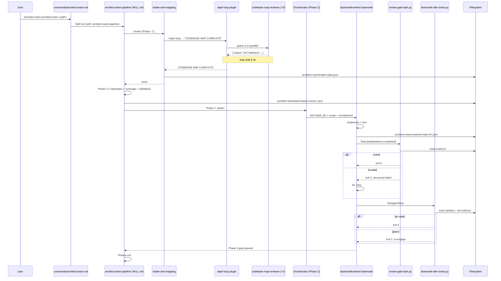

# Codebase Map

> Auto-generated by Cartographer. Last mapped: 2026-05-16T09:32:23Z

## 1. System Overview

The `architect-team` Claude Code plugin (v0.2.1) is a spec-to-production multi-agent coding pipeline. It accepts a requirements folder (in OpenSpec, Superpowers, or plain-markdown format) and drives it end-to-end through intake mapping, 100%-coverage planning validation, parallel team implementation with mandatory review gates, reconciliation, cross-layer integration testing, and a final coverage-verified report. The plugin ships 8 skills, 10 named agent definitions, 2 slash commands, 2 enforcement hooks, a cross-platform setup script, and 52 pytest self-tests that validate every structural artifact.

## 2. Architecture Diagram

```mermaid
graph TB
    subgraph "User Entry Points"
        CMD_AT["/architect-team:architect-team"]
        CMD_SETUP["/architect-team:architect-team-setup"]
    end

    subgraph "Orchestrator Skill"
        SK_PIPELINE["skill: architect-team-pipeline"]
    end

    subgraph "Auxiliary Skills"
        SK_INTAKE["intake-and-mapping"]
        SK_REUSE["reuse-first-design"]
        SK_ROUTE["frontend-route-mapping"]
        SK_PLAYWRIGHT["playwright-user-flows"]
        SK_DEVAPI["dev-api-integration-testing"]
        SK_COVERAGE["coverage-mapping"]
        SK_TEAM["team-spawning-and-review-gates"]
    end

    subgraph "Named Agents"
        AG_SA["system-architect (opus)"]
        AG_FE["frontend (sonnet)"]
        AG_BE["backend (sonnet)"]
        AG_REC["reconciler (opus)"]
        AG_INT["integration (sonnet)"]
        AG_SCAFFOLD["scaffold-agent (sonnet)"]
        AG_REVIEWER["codebase-map-reviewer (sonnet)"]
        AG_EXPLORER["integration-explorer (opus)"]
        AG_SYNTH["master-synthesizer (opus)"]
        AG_ROUTE["route-mapper (opus)"]
    end

    subgraph "Hooks"
        H_GATE["PostToolUse(TaskUpdate)\nreview-gate-task.py"]
        H_IDLE["SubagentStop\nteammate-idle-check.py"]
    end

    subgraph "Setup"
        SETUP["scripts/setup/setup.py"]
    end

    subgraph "Tests"
        TESTS["52 pytest tests"]
        HELPERS["helpers/frontmatter.py"]
    end

    subgraph "External Dependencies"
        EXT_SUPERPOWERS["superpowers plugin"]
        EXT_CARTOGRAPHER["cartographer plugin"]
        EXT_RALPH["ralph-loop plugin"]
        EXT_OPENSPEC["@fission-ai/openspec CLI"]
        EXT_PYTEST["pytest / pytest-asyncio / httpx"]
        EXT_PLAYWRIGHT["playwright + chromium"]
    end

    CMD_AT -->|"Skill tool"| SK_PIPELINE
    CMD_SETUP -->|"runs"| SETUP
    SK_PIPELINE --> SK_INTAKE
    SK_PIPELINE --> SK_REUSE
    SK_PIPELINE --> SK_COVERAGE
    SK_PIPELINE --> SK_TEAM
    SK_PIPELINE --> SK_PLAYWRIGHT
    SK_PIPELINE --> SK_DEVAPI
    SK_INTAKE -->|"spawns ×3"| AG_REVIEWER
    SK_INTAKE -->|"spawns ×3"| AG_EXPLORER
    SK_INTAKE -->|"spawns 1"| AG_SYNTH
    SK_INTAKE -->|"spawns 1 per frontend"| AG_ROUTE
    SK_INTAKE -->|"uses"| EXT_RALPH
    SK_INTAKE -->|"uses"| EXT_CARTOGRAPHER
    SK_PIPELINE -->|"Phase 2"| AG_FE
    SK_PIPELINE -->|"Phase 2"| AG_BE
    SK_PIPELINE -->|"Phase 4"| AG_REC
    SK_PIPELINE -->|"Phase 5"| AG_INT
    SK_PIPELINE -->|"on demand"| AG_SA
    AG_FE -->|"TaskUpdate"| H_GATE
    AG_BE -->|"TaskUpdate"| H_GATE
    AG_FE -->|"SubagentStop"| H_IDLE
    AG_BE -->|"SubagentStop"| H_IDLE
    SK_PIPELINE -->|"uses"| EXT_OPENSPEC
    AG_INT -->|"uses"| EXT_PLAYWRIGHT
    SETUP -->|"installs"| EXT_OPENSPEC
    SETUP -->|"installs"| EXT_PYTEST
    SETUP -->|"installs"| EXT_PLAYWRIGHT
    SETUP -->|"checks"| EXT_SUPERPOWERS
    SETUP -->|"checks"| EXT_CARTOGRAPHER
    SETUP -->|"checks"| EXT_RALPH
    TESTS --> HELPERS
```



## 3. Directory Structure

```
claude_skill_lib/
├── .claude-plugin/          # Plugin identity: plugin.json + marketplace.json
├── agents/                  # 10 named subagent definitions (.md with frontmatter)
├── commands/                # 2 slash-command bodies (.md with frontmatter)
├── hooks/                   # hooks.json wiring + 2 Python enforcement scripts
├── scripts/
│   └── setup/               # Cross-platform idempotent setup.py
├── skills/                  # 8 skill directories, each containing SKILL.md
│   ├── architect-team-pipeline/         # Orchestrator (Phases -1 through 8)
│   ├── coverage-mapping/                # coverage-map.json schema + lifecycle
│   ├── dev-api-integration-testing/     # Live-dev-API test discipline
│   ├── frontend-route-mapping/          # ROUTE_MAP.md schema + completeness rubric
│   ├── intake-and-mapping/              # Phase -1 codebase/integration mapping
│   ├── playwright-user-flows/           # Two-phase Playwright test methodology
│   ├── reuse-first-design/              # Extend > compose > reuse > build-new ladder
│   └── team-spawning-and-review-gates/  # Teammate manifests + evidence schema
├── tests/                   # 52 pytest self-tests
│   ├── helpers/             # frontmatter.py parser (PyYAML or fallback)
│   ├── conftest.py          # repo_root + plugin_root fixtures
│   └── test_*.py            # 8 test files
├── docs/superpowers/        # Historical design doc + plan (read-only reference)
├── CHANGELOG.md
├── README.md
├── LICENSE
├── pytest.ini
└── .gitignore
```

## 4. Module Guide

### Skills

**`skills/architect-team-pipeline/SKILL.md`** — Orchestrator (Phase −1 → 8 playbook).
Frontmatter: `name: architect-team-pipeline`, `argument-hint: [path-to-requirements-folder]`. No `disable-model-invocation` (removed in v0.2.1).
Dependencies: every auxiliary skill + every agent + `openspec` CLI + `cartographer`/`ralph-loop`/`superpowers` plugins. Dependents: `commands/architect-team.md`. Gotcha: must NOT have `disable-model-invocation: true`; must NOT be named `architect-team` (name collision).

**`skills/intake-and-mapping/SKILL.md`** — Phase −1 workflow. Codebase discovery (4-priority), per-codebase ralph loop (exit `"CODEBASE MAP COMPLETE"`, `--max-iterations 10`), integration ralph loop (exit `"INTEGRATION MAP COMPLETE"`, `--max-iterations 8`). Persists state to `.architect-team/intake-state.json`. Gotcha: integration mapping runs even for single-codebase work.

**`skills/reuse-first-design/SKILL.md`** — Extend > compose > reuse > build-new ladder. Every `design.md` must have `## Reuse Decisions` section with one entry per new module/file/dependency. Phase 1 cross-checks Reuse Decisions against actual CODEBASE_MAP.md symbols.

**`skills/frontend-route-mapping/SKILL.md`** — ROUTE_MAP.md schema + completeness rubric. Frontmatter on ROUTE_MAP: `last_routed`, `codebase`, `framework`. Five required body sections including the navigation web. Freshness via `git log -1 --format=%cI`.

**`skills/playwright-user-flows/SKILL.md`** — Two-phase methodology: Examine (read code, build interactivity inventory JSON) → Author (one test per inventory entry, selector hierarchy role>testid>text>css) → Verify (playwright-coverage.json with all inventory IDs accounted for). API-only testing is explicitly rejected.

**`skills/dev-api-integration-testing/SKILL.md`** — Live-dep integration tests; three assertion layers (response shape, side-effect verification, audit/log); per-test data prefix `it-<test_name>-<uuid>`; cover every documented error response; idempotent.

**`skills/coverage-mapping/SKILL.md`** — `coverage-map.json` schema. Used Phase 1 (validation), Phase 3 (per-team slice), Phase 7 (master review), Phase 8 (final report spine). Atomic write pattern (.tmp + rename).

**`skills/team-spawning-and-review-gates/SKILL.md`** — Non-overlapping file scopes, plan-approval-mode triggers (auth/schema/contracts/external/secrets), handoff files as primary coordination (`.architect-team/handoffs/<from>-to-<to>-<timestamp>.md`), review-gate evidence schema (8 required fields), teammate manifest schema (6 fields).

### Agents

| Agent | File | Model | Color | Tools | One-line purpose |
|---|---|---|---|---|---|
| system-architect | `agents/system-architect.md` | opus | blue | Read, Grep, Glob, LS, NotebookRead, Bash, WebFetch, WebSearch, TodoWrite | On-demand architectural recommendations; analysis-only, no Edit/Write. |
| frontend | `agents/frontend.md` | sonnet | cyan | Read, Edit, Write, Glob, Grep, LS, Bash, TodoWrite, NotebookRead, NotebookEdit | Phase 2 frontend implementer; mandatory Playwright workflow. |
| backend | `agents/backend.md` | sonnet | green | Read, Edit, Write, Glob, Grep, LS, Bash, TodoWrite, NotebookRead, NotebookEdit | Phase 2 backend implementer; live dev-API integration tests. |
| reconciler | `agents/reconciler.md` | opus | orange | Read, Grep, Glob, LS, Bash, Edit, Write, TodoWrite | Phase 4 conflict resolution; no feature code. |
| integration | `agents/integration.md` | sonnet | magenta | Read, Edit, Write, Glob, Grep, LS, Bash, TodoWrite, NotebookRead, NotebookEdit, WebFetch | Phase 5 cross-layer; live dev API + Playwright. |
| scaffold-agent | `agents/scaffold-agent.md` | sonnet | purple | Read, Glob, Write, Edit, Bash, TodoWrite, WebFetch | Generates new agent files. |
| codebase-map-reviewer | `agents/codebase-map-reviewer.md` | sonnet | red | Read, Glob, Grep, LS, Bash, TodoWrite | Spawned ×3 per codebase in Phase −1B; read-only verdict. |
| integration-explorer | `agents/integration-explorer.md` | opus | blue | Read, Glob, Grep, LS, Bash, Write, Edit, TodoWrite, WebFetch | Spawned ×3 in Phase −1C; round-robin convergence. |
| master-synthesizer | `agents/master-synthesizer.md` | opus | purple | Read, Glob, Write, Edit, TodoWrite | Phase −1C final; merges 3 drafts. No Bash. |
| route-mapper | `agents/route-mapper.md` | opus | cyan | Read, Glob, Grep, LS, Bash, Write, Edit, TodoWrite | Per frontend codebase in Phase −1B. |

### Commands

**`commands/architect-team.md`** — User entry `/architect-team:architect-team <path>`. Thin wrapper that delegates to `architect-team-pipeline` skill via the Skill tool. **Gotcha**: command-level `$ARGUMENTS` does NOT propagate into the invoked skill body (the skill sees empty `$ARGUMENTS`).

**`commands/architect-team-setup.md`** — User entry `/architect-team:architect-team-setup [--check-only] [--force-reinstall]`. Runs `${CLAUDE_PLUGIN_ROOT}/scripts/setup/setup.py` via a `!` shell block.

### Hooks

**`hooks/hooks.json`** — Wires `PostToolUse[matcher=TaskUpdate]` → `review-gate-task.py` and `SubagentStop[matcher=*]` → `teammate-idle-check.py`. Both `async: false`. Both use `${CLAUDE_PLUGIN_ROOT}`.

**`hooks/review-gate-task.py`** — Entry: `main()`. Reads stdin JSON; checks `tool_name == "TaskUpdate"` and `status == "completed"`; validates `<cwd>/.architect-team/reviews/<taskId>.json`. Exit 0 = allow, exit 2 = block. Validates 8 required fields with specific rules (spec_review/quality_review/reuse_compliance = pass values, tests.added ≥ 1, etc.). Malformed hook payload → exit 0 (infrastructure error tolerance).

**`hooks/teammate-idle-check.py`** — Entry: `main()`. Extracts subagent name (handles both nested `subagent.name` and flat `subagent_name` payload shapes); reads `.architect-team/teammates/<name>.json`; validates each `expected_review_evidence` task ID. No manifest = not an architect-team teammate = exit 0. Shares `_validate` schema with review-gate-task.py (duplicated, not imported).

### Setup script

**`scripts/setup/setup.py`** — Entry: `main(argv)`. Checks Python ≥ 3.10 and Node ≥ 20.19; installs openspec CLI (npm), pytest+pytest-asyncio+httpx, Playwright+chromium; checks for required Claude plugins. Exit codes: 0=all present, 1=plugin missing, 2=install failure. **`_install_packages` adds `--system` to `uv pip install` when no venv detected** (the v0.1.1 fix). `_playwright_browser_installed` checks both the Python package AND the chromium browser cache directory.

### Tests (52 total, all PASS)

| File | Tests | Concerns |
|---|---|---|
| `tests/conftest.py` | — | `repo_root` + `plugin_root` session fixtures |
| `tests/helpers/frontmatter.py` | — | YAML parser (PyYAML or fallback) |
| `tests/test_plugin_metadata.py` | 3 | plugin.json + marketplace.json structural validity |
| `tests/test_skills.py` | 9 | 1 presence + 8 parametrized frontmatter checks |
| `tests/test_agents.py` | 11 | 1 presence + 10 parametrized frontmatter + tool/model validation |
| `tests/test_commands.py` | 3 | 1 presence + 2 parametrized frontmatter |
| `tests/test_hooks_structure.py` | 3 | hooks.json valid + 2 event wires |
| `tests/test_review_gate_task.py` | 8 | subprocess-based hook behavior |
| `tests/test_teammate_idle_check.py` | 4 | subprocess-based hook behavior |
| `tests/test_setup_script.py` | 11 | importlib-based unit tests + mocked install paths |

## 5. Data Flow



## 6. Conventions

**Skill frontmatter:** required `name` (matches dir), `description` (≥ 20 chars). Optional `argument-hint`, `disable-model-invocation` (currently absent from all skills post-v0.2.1).

**Agent frontmatter:** all 5 required: `name`, `description`, `tools` (comma-separated from 13-tool valid set), `model` (opus/sonnet/haiku), `color` (blue/cyan/green/orange/magenta/purple/red). Model pattern: opus for synthesis/judgment, sonnet for implementers/reviewers, haiku for narrow mechanical (none shipped yet).

**Command frontmatter:** required `description`. Optional `argument-hint`, `allowed-tools` (Bash filter strings).

**Map artifacts:**
- `<codebase>/docs/CODEBASE_MAP.md` — cartographer's output (`last_mapped` ISO 8601 frontmatter).
- `<codebase>/docs/ROUTE_MAP.md` — route-mapper's output (`last_routed`, `codebase`, `framework` frontmatter).
- `<workspace>/docs/INTEGRATION_MAP.md` — master-synthesizer's output (`last_synthesized`, `codebases`, `source_drafts` frontmatter).

**Runtime state (gitignored under `.architect-team/`):**
- `intake-state.json` — re-entry short-circuit.
- `reviews/<task-id>.json` — review-gate evidence.
- `teammates/<name>.json` — teammate manifests.
- `handoffs/<from>-to-<to>-<timestamp>.md` — primary coordination primitive.
- `reconciliation-reports/<timestamp>.md` — reconciler output.
- `integration-drafts/explorer-<N>.md` — Phase −1C convergence drafts.

**Test conventions:** all in `tests/`, discovered via `test_*.py` glob. Session fixtures in `conftest.py`. Parametrize pattern with `sorted(EXPECTED_*)` for stable ordering. `pytest.skip` for parametrized tests where set may outpace files. Subprocess tests use `tmp_path` workspace + `PYTHONIOENCODING=utf-8`. Setup script imported via `importlib.util` (avoids package-layout dep). `--strict-markers` enforced.

**Review-gate evidence schema** (8 required fields, all must pass validity):

| Field | Required value |
|---|---|
| `schema_version` | int (presence only) |
| `task_id` | string |
| `teammate` | string |
| `completed_at` | string |
| `spec_review` | `"pass"` |
| `quality_review` | `"pass"` |
| `real_not_stubbed` | `true` |
| `tests.added` | int ≥ 1, == `tests.passing` |
| `tests.passing` | int |
| `demo_artifact` | non-empty string |
| `files_changed` | non-empty array |
| `reuse_compliance` | `"ok"` |

## 7. Gotchas (cross-cutting)

**v0.1.1 — `uv pip install` requires `--system` outside a venv.** Setup script preferred `uv` over plain pip; without an active venv, `uv pip install` refused to install (breaking Playwright). Fix: detect venv via `VIRTUAL_ENV` + `sys.real_prefix` + `sys.base_prefix != sys.prefix`; add `--system` when none active.

**v0.2.0 — skill/command name collision silently broke the pipeline.** Skill name `architect-team` collided with command name `architect-team`; Skill tool resolved to the command body (thin wrapper) instead of the Phase −1 → 8 playbook. The pipeline appeared to start but immediately exited. Fix: renamed skill to `architect-team-pipeline`.

**v0.2.1 — `disable-model-invocation: true` blocks the Skill tool.** The flag prevented the Skill tool from loading the orchestrator body; the command's delegation chain (Skill tool → orchestrator) failed with "cannot be used due to disable-model-invocation". Fix: removed the flag entirely.

**Hook exit-2 vs exit-1 semantics.** Both hooks return exit 2 (not 1) to block. Exit 0 = allow. Exit 1 is treated as error, not block. Never return exit 1 from these hooks for intentional blocking.

**Malformed hook payloads → exit 0.** Both hooks tolerate malformed JSON on stdin (treats as infrastructure error, not teammate failure). Only the EVIDENCE file being malformed triggers exit 2.

**Teammate manifest absence = silent allow.** If `SubagentStop` fires for a subagent without a corresponding `.architect-team/teammates/<name>.json` manifest, the hook returns exit 0. Not a blocking error; just treated as non-architect-team.

**`ROUTE_MAP.md` staleness is a test blocker.** Both `playwright-user-flows` skill and `integration` agent explicitly require re-mapping before authoring tests against a stale ROUTE_MAP. Tests built on stale assumptions are treated as worse than no tests.

**Atomic writes for `coverage-map.json`.** Updated across many phases; the skill specifies write-to-`.tmp` then rename to avoid corruption on crash.

**Plan-approval mode is not retroactive.** Auth/schema/contract teammates must be spawned in plan-approval mode BEFORE any tool calls. There is no retroactive approval mechanism.

**$ARGUMENTS does not propagate from command to invoked skill** (UX wart — open for v0.2.2 fix). When `/architect-team:architect-team <path>` invokes the Skill tool, the skill body sees `$ARGUMENTS` as empty. Model must bind `$REQ_DIR` from the command context instead of re-prompting.

**Hook scripts construct paths from unsanitized identifiers** (defensive gap — open for v0.2.2 fix). `task_id` and subagent name are interpolated into `Path(...) / f"{value}.json"` without traversal guards.

**Scaffold-agent does not update EXPECTED_AGENTS.** Generated agents have valid frontmatter but the presence test (`test_all_expected_agents_present`) won't catch their absence until the set is manually updated.

## 8. Navigation Guide

**Add a new skill:** create `skills/<name>/SKILL.md` with frontmatter → add to `EXPECTED_SKILLS` in `tests/test_skills.py` → run `pytest tests/test_skills.py -v` → reference from `architect-team-pipeline/SKILL.md` if pipeline-participating.

**Add a new agent:** create `agents/<name>.md` with all 5 frontmatter keys (tools from valid 13-tool set, model from {opus,sonnet,haiku}, color from valid set) and required body sections (intro, Boundaries, Reuse-First Mandate, Process, Hard rules) → add to `EXPECTED_AGENTS` in `tests/test_agents.py` → run `pytest tests/test_agents.py -v`. Or invoke `scaffold-agent` and add to set afterward.

**Add a new slash command:** create `commands/<name>.md` with `description` frontmatter → add to `EXPECTED_COMMANDS` in `tests/test_commands.py`. Add `allowed-tools` if needed.

**Add a new hook:** write `hooks/<name>.py` (read stdin JSON; write stderr; exit 0 or 2) → register in `hooks/hooks.json` under appropriate event with matcher and `${CLAUDE_PLUGIN_ROOT}` path → add `tests/test_<name>.py` subprocess tests covering both exit paths + update `tests/test_hooks_structure.py` for the new wire.

**Update setup script:** edit `scripts/setup/setup.py` (`ensure_*` function pattern). Update `tests/test_setup_script.py` via `importlib` mocks. New deps follow `(name, status, detail)` tuple return.

**Bump version & release:** update version in `.claude-plugin/plugin.json` AND `marketplace.json` → add `## [x.y.z] — YYYY-MM-DD` entry to `CHANGELOG.md` (`### Added`/`### Fixed`/`### Changed`) → commit with explicit author override (`git -c user.name="Paul Ingram" -c user.email="paulingram@users.noreply.github.com"`) → annotated tag with same override → push main + tag. Consumers update via `/plugin marketplace update <name>` then `/plugin update <name>@<marketplace>` then `/reload-plugins`.

---

If cartographer helped you, consider starring: https://github.com/kingbootoshi/cartographer - please!
