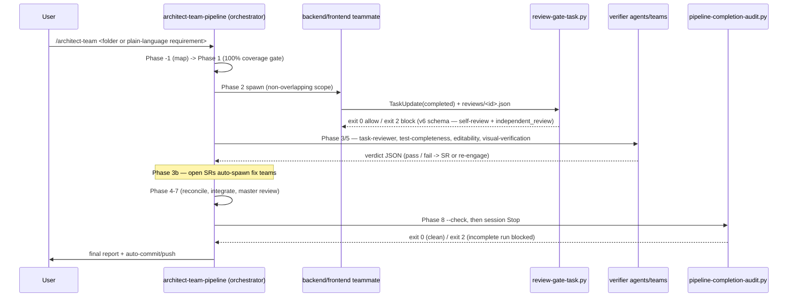

# Codebase Map

> The `architect-team` Claude Code plugin. Last refreshed 2026-05-29T03:00 for v1.8.0.

## 1. System Overview

The `architect-team` Claude Code plugin (v1.0.0) is a spec-to-production multi-agent coding pipeline. It accepts EITHER a requirements folder (OpenSpec, Superpowers, or plain markdown) OR a plain-language requirement typed directly as prose (v0.9.17), and drives it end-to-end through a Phase −2 → 8 sequence: **Phase −2** (Triage & Routing, v0.9.22 — the `bug-classifier` agent dispatches the requirement as `bug` / `feature` / `mixed` / `unclear`; pure-bug routes to the sibling `bug-fix-pipeline` skill, pure-feature continues to the existing flow, `mixed` spawns BOTH in parallel with a `triage_done` recursion-prevention flag, `unclear` emits a structured question), intake & mapping (Phase −1, with the v0.9.21 sub-section D producing per-frontend `INTERACTION_INTUITION_MAP.md` and firing a bulk-verify gate), detection & normalization (Phase 0), the 100%-coverage planning-validation gate (Phase 1), parallel team decomposition & spawn (Phase 2), hook-enforced per-team review gates (Phase 3), continuous solution-requirement intake (Phase 3b), reconciliation (Phase 4), cross-layer integration (Phase 5), the outer task-group loop (Phase 6), master review (Phase 7), and the final report + auto-commit (Phase 8). The v0.9.20 `## Default mode of operation` rule (gates are opt-in for *process* gates) and the v0.9.21 *domain-gate* carve-out coexist in the same section. **v0.9.23 promoted the Phase 8 documentation-currency update step from "orchestrator performs the updates" to a dedicated `doc-updater` agent** (opus, bounded `Write` only to the inventory paths, NO `Edit`) — wired into BOTH the main pipeline Phase 8 AND the bug-fix-pipeline Phase B8, so doc currency is structurally automatic for both feature work and bug fixes.

**v0.9.22 ships a sibling `bug-fix-pipeline` skill** with phases B−1 → B8 — replicate-first (Playwright for frontend / backend script for backend / ambiguity-escalation when unclear); reproduction-is-the-regression-test (frontend bugs also author a backend diagnostic); generalized-fix (the `system-architect` Bug-Fix Generalization Audit mode rejects symptom patches unless explicitly authorized); QA-replay-against-live-dev (the `qa-replayer` agent re-runs the reproduction artifacts against the deployed dev fix; pass criterion is symptom-gone-end-to-end); live-dev-environment-by-default (production is an opt-in escalation). Reached via `/architect-team:bug-fix` (explicit) OR the main pipeline's Phase −2 triage. **At Phase B8 the bug-fix pipeline runs the same documentation-currency gate as the main pipeline** (v0.9.23 dispatch parity).

The plugin ships **26 skills, 27 named agent definitions, 12 slash commands, 3 enforcement hooks** (plus a shared schema module + the v1.0.0 `hooks/locks.py` cross-session lock layer), **6 setup/support scripts** (`setup.py` + `install_mempalace.py` installers, `scripts/notify/notify.py` email notifier from v0.9.18, v1.0.0's `scripts/setup/teams_mode.py` mode-detection helper, v1.1.0's `scripts/setup/worktree_paths.py` worktree-aware state-resolution helper, and **v1.2.0+v1.3.0's `scripts/setup/worktree_lifecycle.py` worktree-lifecycle helper** — extended to 6 public functions in v1.3.0 with the auto-cleanup pair), and **1744 pytest self-tests + 1 skipped** across 76 test files that validate every structural artifact and guard against cross-component drift. **v1.3.0 makes auto-cleanup of merged worktrees the default for every `/architect-team` family invocation** — `/architect-team`, `/architect-team:bug-fix`, and `/architect-team:mini` each fire `cleanup_merged_worktrees()` as their FIRST action (before argument parsing, before refinement, before the v1.2.0 auto-worktree creation). Trigger 1 sweeps merged-and-forgotten worktrees from prior runs at the start of each new run; trigger 2 fires at the end of mini Phase M7 after the auto-merge to main and removes the mini's own worktree. The `exclude_current=True` safeguard means the cwd is never auto-removed (even on re-entry from a merged-branch worktree). The new `/architect-team:cleanup-worktrees` command (12th) exposes the same helper for on-demand invocation with `--dry-run` and `--against <ref>` flags. Merged-branch detection uses `git merge-base --is-ancestor`; squash-merged branches are NOT auto-detected. Best-effort: cleanup failures NEVER block the new run. **v1.2.0 makes auto-worktree creation the default for every `/architect-team` family invocation** — `/architect-team`, `/architect-team:bug-fix`, and `/architect-team:mini` auto-create a fresh worktree at `<parent-of-repo>/<repo-name>-<slug>/` on branch `architect-team/<slug>` before invoking the pipeline skill; the user's main checkout stays on whatever branch they were on; each run is filesystem-isolated; concurrent runs work without any manual `git worktree add` setup. Re-entry detection (`current_worktree_is_run()`) prevents nested worktrees; the `--no-worktree` flag reverts to v1.1.0 single-tree behavior verbatim; cleanup is NOW automatic in v1.3.0 (the v1.2.0 manual recommendation at Phase 8 / B8 / M7 success still appears, but the next run sweeps merged worktrees without user action). **v1.1.0 closes the cross-session coordination gap for git-worktree-based parallel runs** via a 3-layer model: filesystem isolation via git worktrees, architectural coordination via the v1.0.0 lock layer resolved to the main worktree, context sharing via MemPalace resolved to the main worktree. The `scripts/setup/worktree_paths.py` helper exposes `shared_state_dir()` / `run_state_dir()` / `is_worktree()` — used by the lock layer's default resolution and (per skill docs) by the MemPalace integration's palace-path resolution. Single-session users (no worktrees, OR with `--no-worktree`) see ZERO behavior change because both resolvers degenerate to `cwd / '.architect-team'` in non-worktree clones. **v1.0.0 makes Claude Code's experimental Agent Teams primitive the default dispatch mode** — long-lived named teammates with their own 1M context windows, a shared task list, direct `SendMessage`, and a Lead that owns coordination. Teams mode engages when `CLAUDE_CODE_EXPERIMENTAL_AGENT_TEAMS=1` (env or `~/.claude/settings.json`) AND Claude Code ≥ 2.1.32 AND `--no-teams` was not passed; otherwise the pipeline falls back to subagents mode (the v0.10.0 behavior, unchanged). The `hooks/locks.py` primitive lets two concurrent `/architect-team` invocations in separate Claude Code sessions claim disjoint file scopes and run truly parallel — overlapping scopes queue based on a path-glob intersection check (4h TTL stale detection by default). The two evidence hooks now handle both `PostToolUse(TaskUpdate)` / `SubagentStop` AND the teams-mode `TaskCompleted` / `TeammateIdle` triggers, dispatching internally to the same enforcement code path. Its enforcement is layered: Python hooks gate teammate task-completion, teammate idle, and the orchestrator's terminal state; independent verifier agents and teams re-check test-completeness, editability, interactive-element-and-page genuineness, visual fidelity, and (v0.9.23) documentation currency against reality; and the discipline skills are pressure-written to resist rationalization. A run optionally emits per-project email notifications (v0.9.18) when the target project supplies a `.architect-team-notify.json`.

## 2. Architecture Diagram

```mermaid
graph TB
    subgraph "Entry points (12 commands)"
        CMD_AT["/architect-team"]
        CMD_BUG["/architect-team:bug-fix"]
        CMD_UX["/architect-team:ux-test"]
        CMD_REFINE["/architect-team:refine-prompt"]
        CMD_SETUP["/architect-team-setup"]
        CMD_VQA["/architect-team:visual-qa"]
        CMD_MEM["/architect-team:memory"]
        CMD_MEMINST["/architect-team:mempalace-install"]
        CMD_EDIT["/architect-team:editability-audit"]
        CMD_CLEAN["/architect-team:cleanup-worktrees"]
    end

    subgraph "Orchestrator"
        SK_PIPELINE["skill: architect-team-pipeline (Phase -2 -> 8)"]
        SK_BUGFIX["skill: bug-fix-pipeline (Phase B-1 -> B8)"]
        SK_UXTEST["skill: ux-test-builder (Phase U0 -> U9)"]
    end

    subgraph "Skills (26)"
        SK_INTAKE["intake-and-mapping"]
        SK_PLAN["coverage-mapping / reuse-first-design"]
        SK_MAP["frontend-route-mapping / design-fidelity-mapping"]
        SK_TEST["playwright-user-flows / dev-api-integration-testing"]
        SK_TEAM["team-spawning-and-review-gates"]
        SK_RCA["root-cause-test-failures / expensive-verification-debugging"]
        SK_DRT["diagnostic-research-team"]
        SK_VFR["visual-fidelity-reconciliation / visual-verification-team"]
        SK_EDIT["editability-completeness / interaction-completeness"]
        SK_DVD["dynamic-value-discovery / interaction-intuition"]
        SK_MEMP["mempalace-integration"]
        SK_README["readme-styling / documentation-currency"]
        SK_REFINE["proposal-refiner"]
        SK_EMAIL["email-testing"]
    end

    subgraph "Agents (27)"
        AG_IMPL["frontend / backend (opus implementers)"]
        AG_FLOW["reconciler / integration"]
        AG_MAP["codebase-map-reviewer x3 / route-mapper / integration-explorer x3 / master-synthesizer / interaction-intuiter"]
        AG_ARCH["system-architect (5 review modes)"]
        AG_VERIF["task-reviewer / test-completeness-verifier / editability-reviewer x3 / interaction-reviewer x3 / diagnostic-researcher x3"]
        AG_VIS["visual-capture xN / visual-analyzer xN"]
        AG_BUG["bug-classifier / bug-replicator / qa-replayer / fix-sensibility-checker"]
        AG_UX["flow-explorer x3 / flow-executor x3"]
        AG_DOC["doc-updater / prompt-refiner / scaffold-agent"]
    end

    subgraph "Hooks (3 + shared module)"
        H_GATE["PostToolUse(TaskUpdate) -> review-gate-task.py"]
        H_IDLE["SubagentStop -> teammate-idle-check.py"]
        H_STOP["Stop -> pipeline-completion-audit.py"]
        H_SCHEMA["review_evidence_schema.py (shared, imported by both evidence hooks)"]
    end

    subgraph "External"
        EXT["superpowers / cartographer / ralph-loop / openspec CLI / pytest+httpx / Playwright+chromium / MemPalace (optional) / Gmail SMTP + SendGrid API (opt-in notifier)"]
    end

    CMD_AT --> SK_PIPELINE
    CMD_BUG --> SK_BUGFIX
    CMD_UX --> SK_UXTEST
    CMD_REFINE --> SK_REFINE
    SK_PIPELINE --> SK_INTAKE & SK_PLAN & SK_TEAM & SK_RCA & SK_DRT & SK_VFR & SK_EDIT & SK_DVD & SK_MEMP & SK_EMAIL
    SK_INTAKE --> AG_MAP
    SK_PIPELINE --> AG_IMPL & AG_FLOW & AG_ARCH & AG_VERIF & AG_VIS & AG_DOC
    SK_BUGFIX --> AG_BUG & AG_ARCH
    SK_UXTEST --> AG_UX
    AG_IMPL --> H_GATE & H_IDLE
    SK_PIPELINE --> H_STOP
    H_GATE --> H_SCHEMA
    H_IDLE --> H_SCHEMA
    SK_PIPELINE --> EXT
```



## 3. Directory Structure

```
claude_skill_lib/
├── .claude/                 # OpenSpec-installed workspace commands + skills (opsx/* commands + openspec-* skills; tracked)
├── .claude-plugin/          # Plugin identity: plugin.json + marketplace.json (v0.9.19)
├── agents/                  # 26 named subagent definitions (.md with frontmatter)
├── commands/                # 11 slash-command bodies (.md with frontmatter)
├── hooks/                   # hooks.json wiring + 3 enforcement scripts + 1 shared module + 1 lock-layer module
│   ├── hooks.json           #   wires PostToolUse(TaskUpdate), SubagentStop, Stop, TaskCompleted (v1.0.0), TeammateIdle (v1.0.0)
│   ├── review_evidence_schema.py   # shared single-source-of-truth evidence schema (v0.9.9) + _detect_trigger_mode (v1.0.0)
│   ├── locks.py             # cross-session lock layer (v1.0.0) — acquire_lock / release_lock / detect_stale / globs_intersect
│   ├── review-gate-task.py         # PostToolUse(TaskUpdate) OR TaskCompleted gate (v1.0.0 trigger split)
│   ├── teammate-idle-check.py      # SubagentStop OR TeammateIdle gate (v1.0.0 trigger split)
│   └── pipeline-completion-audit.py # Stop gate + standalone --check pre-commit gate (unchanged in v1.0.0)
├── scripts/
│   ├── setup/               # setup.py + install_mempalace.py + teams_mode.py (v1.0.0) + worktree_paths.py (v1.1.0) + worktree_lifecycle.py (v1.2.0 auto-worktree create/cleanup/detect)
│   └── notify/              # notify.py — best-effort per-project email notifier (v0.9.18)
├── skills/                  # 26 skill directories, each containing SKILL.md
├── openspec/                # OpenSpec workspace (tracked); config.yaml + changes/ (archive/ nested inside) + specs/
├── docs/
│   ├── CODEBASE_MAP.md      # this file
│   ├── INTEGRATION_MAP.md   # external-integration synthesis (single-codebase degenerate)
│   └── superpowers/         # historical design doc + plan (read-only reference)
├── tests/                   # 1744 pytest self-tests + 1 skipped (76 test files + conftest + helpers/)
├── .scratch/                # working notes (tracked; not part of the installed surface)
├── .architect-team-notify.example.json   # template per-project email-notification config (v0.9.18)
├── CLAUDE.md  CHANGELOG.md  README.md  LICENSE  pytest.ini  .gitignore
```

Runtime state is written under `<workspace>/.architect-team/` (gitignored) and `<workspace>/.mempalace/` (gitignored) — see §6.

## 4. Module Guide

### Skills (26)

| Skill | Role |
|---|---|
| `architect-team-pipeline` | The orchestrator playbook — Phase −1 → 8. Run-state rules: iteration ceiling (20), oscillation detection, the shared-state concurrency model, the escalation marker. |
| `intake-and-mapping` | Phase −1 codebase discovery + the per-codebase / integration ralph loops. Map-invalidation flag forces re-validation of a wrong-but-fresh map. |
| `reuse-first-design` | The extend > compose > reuse > build-new ladder; the Reuse Decision Log. |
| `frontend-route-mapping` | ROUTE_MAP.md schema + completeness rubric. |
| `design-fidelity-mapping` | Conditional DESIGN_MAP.md (design tokens, asset registry, per-screen specs). `design_baseline` frontmatter; a baseline migration forces a full re-derive. |
| `visual-fidelity-reconciliation` | Strict QA vs DESIGN_MAP. Phase 0 live-app precondition; zero-tolerance; the design-migration "unchanged inverts" rule; verify-against-the-Oracle-not-a-classification. |
| `visual-verification-team` | Independent live-app verification — `visual-capture` → `visual-analyzer` → `system-architect` synthesis. The verdict is measured data, not eyeballed images. |
| `playwright-user-flows` | White-box Playwright methodology; real-backend-by-default for `both`-layer features. |
| `dev-api-integration-testing` | Live-dev-API testing — real DB / queue / cache, side-effect verification. |
| `coverage-mapping` | `coverage-map.json` schema + lifecycle (Phase 1 / 3 / 7 / 8). |
| `team-spawning-and-review-gates` | Teammate manifests; the v6 review-gate evidence schema (12 self-review fields incl. `ui_interaction_review` + the independent `task-reviewer` verdict); the independent-review dispatch; the SR schema. |
| `root-cause-test-failures` | Predict → 3-pass RCA (forward / backward / falsify) → evidence-backed verdict; multiple-simultaneous-causes. |
| `diagnostic-research-team` | 3 `diagnostic-researcher` agents + `system-architect` robustness review before a test-failure fix team spawns. |
| `expensive-verification-debugging` | When a verify cycle is expensive (deploy / rebuild / slow CI), audit the whole failure pathway and batch the fixes. |
| `editability-completeness` | 3 `editability-reviewer` agents enumerate every attribute, classify editability, trace UI→DB; architect robustness review; multi-pass. |
| `interaction-completeness` | The judgment-heavy VERIFICATION gate that `playwright-user-flows` was followed (v0.9.19) — 3 `interaction-reviewer` agents independently re-enumerate every interactive element AND every page/screen/route, classify element wiring + page `live`/`placeholder`/`confirmed-stub`, audit Playwright test authenticity, trace element→endpoint, flag hardcoded-should-be-dynamic values; architect Round-3; bounded multi-pass; gaps → SRs. The sibling of `editability-completeness` at the granularity of controls and pages. |
| `dynamic-value-discovery` | A cross-role discipline (v0.9.19) for telling a genuine static literal from sample data standing in for a dynamic, data-bound value — classify every displayed value `static`/`dynamic` FROM CONTEXT, bind every dynamic one to a named data source, escalate genuine ambiguity. Modeled on `reuse-first-design`; consulted by the architect, the developers, and the evaluator. |
| `mempalace-integration` | Per-workspace MemPalace store — `--wing` mining (rooms are `init`-detected from directory structure, not a `mine` flag), auto-mine on artifact write, search before output. |
| `readme-styling` | The bitmap house style for READMEs — canvas/centering, pipe-table + ASCII-graph alignment, banner / dividers / panels / flowcharts / logic maps, the GitHub-safe + ANSI color model, and the theming engine (6 preset themes + an interactive picker + the `readme-theme` marker). |
| `documentation-currency` | The Phase 8 docs-reflect-the-code gate — the doc inventory (maps + README + CHANGELOG + CLAUDE.md), what "current" means, the orchestrator-updates-then-system-architect-audits flow. |
| `bug-fix-pipeline` | The sibling `Phase B−1 → B8` pipeline — replicate-first, reproduction-is-the-regression-test, generalized-fix, QA-replay-against-live-dev. Reached via `/architect-team:bug-fix` or the main pipeline's Phase −2 triage. (v0.9.22) |
| `interaction-intuition` | Per-frontend codebase intuition map — enumerates every interactive element, intuits each element's action and candidate endpoints, assigns confidence, authors ambiguity questions for low-confidence items. Produces `INTERACTION_INTUITION_MAP.md`. (v0.9.21) |
| `ux-test-builder` | UX test builder pipeline `Phase U0 → U9` — persona + objectives + target site → literal flow → 3 flow-explorer agents propose 10-15 adjacent flows each → distilled → one `.spec.ts` per flow → 3 flow-executor agents run in parallel → consensus → bug routing. Reached via `/architect-team:ux-test`. (v0.9.29) |
| `proposal-refiner` | Conversational pre-pipeline prompt refinement — grades a free-text prompt on 5 axes (clarity, scope, acceptance, grounding, conflict), asks clarifying questions, iterates up to 5 times. Runs BEFORE Phase −2 when input is prose. Reached standalone via `/architect-team:refine-prompt`. (v0.9.33) |
| `email-testing` | Cross-cutting email-testing discipline — 4 phases (E1 detect, E2 Mailpit provision, E3 capture+analyze, E4 link-follow+flow-complete). Consumed by `bug-replicator`, `flow-executor`, `integration` agents. Mailpit by default; template-first analysis; every link tested; mandatory teardown. (v0.9.34) |
| `mini-architect-team-pipeline` | Mini variant orchestrator (Phase M0 → M8) — single architect, single `mini-qa` agent, working branch `mini/<slug>`, auto-merge to main on green; M8 cycle 4 (three red verdicts on the same proposal) writes `.architect-team/mini/<slug>/escalation/` and re-spawns `/architect-team` with that folder as REQ_DIR. Heavyweight review is batched via the `Mini-Run:` trailer + the `/architect-team:mini-review-sweep` command. Reached via `/architect-team:mini`. (v0.10.0) |

### Agents (27)

| Agent | Model | Color | One-line purpose |
|---|---|---|---|
| system-architect | opus | blue | On-demand architecture; + 5 review modes (Diagnostic Plan, Editability Map, Visual Gap Synthesis, Master Review Audit, Documentation Currency Audit). Analysis-only. |
| frontend | opus | cyan | Phase 2 frontend implementer; Playwright + visual-fidelity workflow. |
| backend | opus | green | Phase 2 backend implementer; live dev-API integration tests. |
| reconciler | opus | orange | Phase 4 conflict resolution; no feature code. |
| integration | sonnet | magenta | Phase 5 cross-layer; live dev API + Playwright + the visual-fidelity sweep. |
| scaffold-agent | sonnet | purple | Generates new agent files. |
| codebase-map-reviewer | sonnet | red | Spawned ×3 per codebase in Phase −1B; read-only verdict. |
| integration-explorer | opus | blue | Spawned ×3 in Phase −1C; round-robin convergence. |
| master-synthesizer | opus | purple | Phase −1C final; merges the 3 integration drafts. |
| route-mapper | opus | cyan | Per frontend codebase in Phase −1B; ROUTE_MAP.md always, DESIGN_MAP.md conditionally. |
| test-completeness-verifier | sonnet | red | Phase 3 + 5; confirms unit/integration/Playwright kinds ran + the real-backend audit. |
| task-reviewer | opus | red | Phase 3; independent per-task review of a teammate's diff vs the acceptance criteria; writes the `independent_review` block. Read-only on source. |
| diagnostic-researcher | opus | red | Spawned ×3 for a test-failure SR; full-pathway trace + ranked hypotheses. |
| editability-reviewer | opus | yellow | Spawned ×3; enumerate + classify + trace every attribute UI→DB. |
| visual-capture | sonnet | cyan | Spawned ×N; starts the live app, captures screenshots + computed-style data. Mechanical; no verdicts. |
| visual-analyzer | opus | red | Spawned ×N; the objective data diff + pixel diff + code cross-check. |
| interaction-reviewer | opus | yellow | Spawned ×3 (v0.9.19); independently enumerates every interactive element AND page, classifies element wiring + page genuineness, traces element→endpoint, audits Playwright test authenticity, flags hardcoded-dynamic values; round-robin convergence. Analysis-only — read-only on source, no `Edit` of feature code. |
| interaction-intuiter | opus | green | Spawned per frontend codebase at Phase −1B (v0.9.21). Reads route + design + integration maps, enumerates interactive elements, intuits actions + candidate endpoints, assigns confidence, authors ambiguity questions. Produces `INTERACTION_INTUITION_MAP.md`. |
| bug-classifier | sonnet | red | Spawned at Phase −2 (v0.9.22). Triages the incoming requirement as `bug` / `feature` / `mixed` / `unclear`. Lightweight analysis-only. |
| bug-replicator | opus | orange | Spawned per affected codebase at Phase B1 (v0.9.22). Writes + runs Playwright or backend scripts that reproduce the bug against live dev. The artifact IS the regression test. |
| qa-replayer | opus | green | Spawned at Phase B6 (v0.9.22). Re-runs reproduction artifacts against live dev after the fix is deployed. Returns `bug-resolved` / `bug-still-present` / `test-did-not-exercise-fix` (v0.9.31) / `env-failure`. |
| doc-updater | opus | blue | Spawned at Phase 8 / Phase B8 (v0.9.23). Reads git diff + coverage map + doc inventory, updates all stale docs. Bounded Write to inventory paths only. |
| fix-sensibility-checker | opus | yellow | Spawned at Phase B6b (v0.9.29). Computes impact set from fix's git diff, authors + runs minimal Playwright sensibility flows, routes nonsensical items as fresh SRs with `origin.kind: fix-regression`. |
| flow-explorer | opus | cyan | Spawned ×3 at Phase U3 (v0.9.29). Reads persona + site maps + literal flow, proposes 10-15 additional Playwright user-flow specs exercising adjacent capabilities. |
| flow-executor | opus | magenta | Spawned ×3 at Phase U6 (v0.9.29). Runs every distilled Playwright flow against live target, documents per-flow outcome. |
| prompt-refiner | opus | blue | Spawned at Phase R2 (v0.9.33). Grades a free-text prompt on 5 axes, generates codebase-grounded clarifying questions. |
| mini-qa | opus | red | Single QA agent for the mini variant (v0.10.0). Spawned at Phase M5; reads the architect's `## QA Guidance` contract; runs unit + integration + ≤3 Playwright on the live dev URL; emits a `qa-verdict.json` with green/red and a per-criterion table. Read-only on source. |

### Commands (11)

- `architect-team` — runs the Phase −2 → 8 pipeline against EITHER a requirements folder OR a plain-language requirement typed directly as prose (v0.9.17). Flags: `--no-commit` / `--no-push` / `--no-compact` / `--allow-push-to-default` / `--proposal-first` / `--bug-fix` / `--feature-only` / `--no-refine`.
- `bug-fix` — faster bug-focused variant (v0.9.22). Drives through replicate → reproduce-test → propose → fix → QA-replay loop. Equivalent to `--bug-fix` flag on the main command.
- `ux-test` — UX test builder (v0.9.29). Takes persona + objectives + target site + credentials env-var. Drives through site mapping → literal flow → 3 explorers → distillation → 3 executors → consensus → bug routing.
- `refine-prompt` — standalone prompt refinement (v0.9.33). Grades and iteratively refines a free-text prompt without running the pipeline.
- `architect-team-setup` — installs openspec CLI, pytest+httpx, Playwright+chromium.
- `visual-qa` — on-demand visual-fidelity audit → the visual-verification-team gate.
- `mempalace-install` — installs the MemPalace CLI + prints the MCP wire-up.
- `memory` — ad-hoc MemPalace `search` / `mine` / `status` / `wake-up` / `sweep`.
- `editability-audit` — on-demand editability-completeness audit.
- `mini` — entry point for the mini variant (v0.10.0). Runs `mini-architect-team-pipeline` (Phase M0 → M8) on the live dev environment with a single architect, a single `mini-qa` agent, and auto-merge to main on green.
- `mini-review-sweep` — batched heavyweight review (v0.10.0). Consumes commit messages tagged with the `Mini-Run:` trailer and dispatches the full architect-team review surface (visual / editability / interaction / docs-currency) across the batch, decoupled from the inner mini loop.
- `cleanup-worktrees` — explicit on-demand cleanup of merged `architect-team/*` worktrees (v1.3.0). Walks `git worktree list`, identifies any whose branch is merged into `origin/main`, and removes them (worktree + branch). Excludes the current worktree by default (safety). Flags: `--dry-run` (preview without filesystem changes), `--against <ref>` (override the default `origin/main` comparison). Invokes the same `cleanup_merged_worktrees()` helper that the 3 pipeline-driving slash commands auto-fire as their first action.

### Hooks (3) + shared schema module + cross-session lock module

- **`hooks/hooks.json`** — wires `PostToolUse[TaskUpdate]` → `review-gate-task.py`, `SubagentStop[*]` → `teammate-idle-check.py`, `Stop[*]` → `pipeline-completion-audit.py`. **v1.0.0** adds `TaskCompleted[*]` → `review-gate-task.py` and `TeammateIdle[*]` → `teammate-idle-check.py` for teams-mode dispatch. All `async: false`. Both evidence hooks branch internally on payload shape.
- **`hooks/review_evidence_schema.py`** — NOT a hook; the shared single source of truth for the evidence contract (`SCHEMA_VERSION` = 6, `REQUIRED_EVIDENCE_FIELDS` = the 12 teammate self-review fields incl. `ui_interaction_review` (v0.9.19), `REQUIRED_INDEPENDENT_REVIEW_FIELDS` for the v5 `independent_review` block, the `VALID_*` value sets incl. `VALID_UI_INTERACTION_VALUES`, `safe_id()`, `validate_evidence()`, plus **v1.0.0's `_detect_trigger_mode(payload)`** that classifies an incoming hook payload as `"subagents"` (PostToolUse(TaskUpdate) / SubagentStop) or `"teams"` (TaskCompleted / TeammateIdle) by event-type / tool-name inspection). `validate_evidence()` rejects evidence missing the `independent_review` block or whose `independent_review.reviewer == teammate`, blocks a `*_review` field set to `fail`, and requires the `_note` on an `n/a`. Both evidence hooks import it (added v0.9.9 — before that the two hooks carried drifted copies).
- **`hooks/locks.py`** — NOT a hook; the **v1.0.0 cross-session lock layer**. Four stdlib-only functions: `acquire_lock(scope_glob, ttl_seconds, run_id)` writes a `{holder, scope_glob, acquired_at, ttl_seconds, run_id}` JSON lock at `.architect-team/locks/<scope-hash>.json` (returns the lock id, or `blocked: <existing-lock-id>` when an existing non-stale lock's scope intersects the requested one); `release_lock(lock_id)` removes the lock file (idempotent); `detect_stale()` returns the ids of locks whose `acquired_at + ttl_seconds` is in the past or whose JSON is malformed / missing required fields (auto-released on the next intersecting acquire); `globs_intersect(a, b)` returns True when two path-globs could match a common path. Used by every pipeline Lead to claim its file scope before dispatching teammates — two concurrent `/architect-team` invocations in separate Claude Code sessions queue (overlapping scope) or proceed truly parallel (disjoint scope).
- **`hooks/review-gate-task.py`** — `PostToolUse(TaskUpdate)` (subagents mode) OR `TaskCompleted` (teams mode, **v1.0.0**). Blocks a teammate task flipping to `completed` without valid review-gate evidence. Reads the same `.architect-team/reviews/<task-id>.json` path in both modes; same v6 validation; same exit 0 = allow / 2 = block semantics.
- **`hooks/teammate-idle-check.py`** — `SubagentStop` (subagents mode) OR `TeammateIdle` (teams mode, **v1.0.0**). On a teammate going idle, validates every `expected_review_evidence` task. Same enforcement in both modes. Blocks on a corrupt matched manifest (v0.9.9 — was fail-open).
- **`hooks/pipeline-completion-audit.py`** — `Stop` hook + standalone `--check`. Trigger is unchanged in v1.0.0 — same Stop event in both modes. Gates the orchestrator's terminal state: blocks a stop while `.architect-team/` shows an incomplete run (open SRs, a test-failure SR with no diagnostic plan, an unsatisfied editability loop, a test-completeness debt, an unverified visual reconciliation, a failing Phase 7 master-review audit verdict, a failing Phase 8 documentation-currency audit verdict, a blown iteration ceiling). Escalation-marker- and `stop_hook_active`-aware; fails open on any error.

### Setup & support scripts (7)

- **`scripts/setup/setup.py`** — checks Python ≥ 3.10 / Node ≥ 20.19; installs openspec CLI, pytest+pytest-asyncio+httpx, Playwright+chromium; checks for prerequisite plugins. **v1.0.0** extends with `claude --version` ≥ 2.1.32 check + `CLAUDE_CODE_EXPERIMENTAL_AGENT_TEAMS=1` check (env OR `~/.claude/settings.json`); offers to add the flag to `~/.claude/settings.json` with user consent; honors `--check-only` (report-only, never modifies user files, exits non-zero on unsatisfied checks) and `--no-prompt` (skip the settings.json write even when missing).
- **`scripts/setup/teams_mode.py`** — **v1.0.0 mode-detection helper.** Exposes `is_teams_mode_available(env=None, settings_path=None, claude_cmd="claude", flag_no_teams=False) -> bool` and `detect_no_teams_flag(argv) -> bool`. The pipeline calls it once at startup to decide between teams mode and subagents mode; records the decision in `intake-state.json`. Falsy / malformed / missing inputs degrade gracefully to subagents mode. Imported by the three pipeline skills via the orchestrator's Bash dispatch (the polyglot `python3 X.py || python X.py` pattern from v0.9.30 applies).
- **`scripts/setup/worktree_paths.py`** — **v1.1.0 worktree-aware state-resolution helper.** Three stdlib-only functions: `shared_state_dir() -> Path` returns the MAIN worktree's `.architect-team/` path (used for `locks/`, `.mempalace/`, `run-history/` — anything two concurrent sessions need to coordinate on); `run_state_dir() -> Path` returns the CURRENT worktree's `.architect-team/` (used for `reviews/`, `teammates/`, `handoffs/`, this-run's `openspec/changes/<slug>/`, this-run's findings + refined-prompts — anything per-run); `is_worktree() -> bool` returns True iff the cwd is inside a `git worktree add`-created worktree (uses `git rev-parse --git-dir` vs `--git-common-dir`). All three are best-effort — any git subprocess failure falls back to `Path.cwd() / '.architect-team'`, never raises. Consumed by `hooks/locks.py`'s default `locks_dir` resolution (lazy import inside `_default_locks_dir()` via `importlib.util.spec_from_file_location`, so the lock layer remains usable even if the helper is unreachable) and documented as the palace-path resolver in `skills/mempalace-integration/SKILL.md`. The 3-layer model the helper enables (filesystem isolation = worktrees / architectural coordination = locks / context sharing = MemPalace) is documented in `skills/common-pipeline-conventions/SKILL.md` `## Running in parallel sessions`.
- **`scripts/setup/worktree_lifecycle.py`** — **v1.2.0 worktree-lifecycle helper, extended in v1.3.0 with auto-cleanup.** Six stdlib-only functions (4 v1.2.0 + 2 v1.3.0). v1.2.0: `create_run_worktree(slug, base_branch="main", parent_dir=None) -> Path` creates `<parent>/<repo-name>-<slug>/` on a fresh branch `architect-team/<slug>` via `git worktree add -b`, with collision handling that appends `-2`, `-3`, ... when either path or branch is taken (bounded at 999 attempts), and raises `RuntimeError` with an actionable message on parent-dir-not-writable / base-branch-missing / `git worktree add` failure; `cleanup_run_worktree(worktree_path, remove_branch=False) -> None` runs `git worktree remove <path>` (idempotent on already-gone worktrees — catches the `is not a working tree` / `is not a registered` markers) with optional `git branch -d architect-team/<slug>`, falling back to `--force` removal once before raising on unexpected failures; `current_worktree_is_run() -> bool` is True iff `git rev-parse --abbrev-ref HEAD` starts with `architect-team/` — used by the slash commands' re-entry detection to skip nested worktree creation; `current_run_slug() -> str | None` extracts the slug from `architect-team/<slug>` or returns None on non-run branches. v1.3.0: `list_merged_architect_team_worktrees(against="origin/main", exclude_current=True) -> list[Path]` walks `git worktree list --porcelain` to get (path, branch) pairs, then for each `architect-team/*` branch runs `git merge-base --is-ancestor <branch> <against>` — exit 0 = merged → include; default excludes the current worktree (safety: don't auto-remove the cwd even if its branch is merged); non-architect-team branches are NEVER considered; `cleanup_merged_worktrees(against="origin/main", dry_run=False) -> list[Path]` calls the list helper and (when not `dry_run`) invokes `cleanup_run_worktree(path, remove_branch=True)` on each; idempotent on a worktree that disappears between list and remove. Consumed by the 3 pipeline-driving slash commands (`commands/architect-team.md`, `commands/bug-fix.md`, `commands/mini.md`) via the polyglot `python3 -c '...' || python -c '...'` invocation pattern in each command's `## Auto-worktree creation (v1.2.0)` AND `## Auto-cleanup of merged worktrees (v1.3.0) — runs first` sections, plus the new explicit `commands/cleanup-worktrees.md` command, plus mini Phase M7's post-merge cleanup. The split from v1.1.0's `worktree_paths.py` is intentional — paths is read-only resolution; lifecycle is side-effecting subprocess work. Full rules in `skills/common-pipeline-conventions/SKILL.md` `## Auto-worktree lifecycle` (the `### Auto-cleanup (v1.3.0)` sub-section is the canonical home of the auto-cleanup rule including the two trigger points, `exclude_current` safeguard, merged-branch detection mechanism, squash-merge limitation, `--dry-run` capability, and best-effort discipline).
- **`scripts/setup/agent_resume.py`** — **v1.8.0 agent dispatch result-wrapping + resume helper.** Three stdlib-only functions: `is_truncated(result) -> bool` detects empty / sub-50-char / rate-limit-marker / missing-report-format-marker dispatch results (case-insensitive for both marker sets); `wrap_agent_result(result, agent_id, send_message=None, max_attempts=2, resume_prompt=DEFAULT_RESUME_PROMPT) -> dict` wraps every background Agent dispatch result; on truncation invokes the dependency-injected `send_message(to=agent_id, prompt=resume_prompt)` to ask the SAME agent for its final verdict from already-loaded context, merges the resumed output with the original via a `[resumed via wrap_agent_result]` seam-marker, caps retries at `max_attempts`, surfaces `resumed_failed=True` + `resume_error` on cap-exhaustion without raising so the orchestrator can route on-disk artifacts to the user; `read_checkpoint(agent_id, checkpoints_dir=None) -> dict | None` reads `.architect-team/agent-checkpoints/<agent_id>.json` with default-dir resolved via the v1.1.0 `shared_state_dir()` lazy-import pattern (so checkpoints live in the main worktree, visible across worktrees during the same run); returns None for absent / unreadable / malformed; never raises. `DEFAULT_RESUME_PROMPT` is the canonical follow-up: explains the stream-timeout context, asks for the standard `Status:` / `DONE` / `BLOCKED` / `NEEDS_CONTEXT` markers, directs the resumed agent to read its own checkpoint FIRST and skip already-completed steps. Consumed by all 3 pipeline orchestrators at every background Agent dispatch (architect-team-pipeline Phases −2 / −1 / 2 / 3 / 3b / 4 / 5 / 7 / 8; bug-fix-pipeline Phases B−1 / B1 / B2 / B3 / B4 / B5 / B6 / B6b / B8; mini-architect-team-pipeline Phases M2 / M3 / M4 / M5 / M7) per `common-pipeline-conventions ## Background-agent resume discipline`. Stdlib-only matching the convention used by `scripts/setup/teams_mode.py` and `scripts/setup/worktree_paths.py`. The dependency-injected `send_message` keeps the helper testable without harness coupling — the orchestrator binds the harness's real `SendMessage` tool at call time; `tests/test_agent_resume_discipline.py` passes a mock callable.
- **`scripts/setup/install_mempalace.py`** — uv-first (pip fallback) MemPalace install; prints the `claude mcp add` + `mempalace init` commands; never auto-runs them.
- **`scripts/notify/notify.py`** — the **best-effort per-project email notifier** (v0.9.18). A path-addressed CLI (invoked exactly like `setup.py`) that the orchestrator runs at five pipeline moments — `phase_start`, `phase_complete`, `issue_discovered`, `git_commit`, `deploy`. Single stdlib-only module: config loader, two interchangeable providers (`GmailProvider` over `smtp.gmail.com:587` STARTTLS via `smtplib`; `SendGridProvider` POSTing to `https://api.sendgrid.com/v3/mail/send` via `urllib.request`), per-recipient event filtering, an `argparse` CLI. Opt-in (a `.architect-team-notify.json` at the target project root) and best-effort by construction — every failure path (missing config, missing secret, provider/network error, bad arguments) exits 0, so a notification can never block, fail, or alter a run. Provider secrets are read only from the env var named in config, never committed, never logged.

### Config files

- **`.architect-team-notify.json`** (in a *target* project's repo root — NOT in this plugin) — the opt-in per-project email-notification config (v0.9.18) consumed by `scripts/notify/notify.py`: `provider` (`gmail`/`sendgrid`), `from_address`, optional `from_name`, the provider-settings object naming the secret env var, and a non-empty `recipients[]` (each with `email` + an `events[]` subscription list, or the `"all"` shorthand). Absent config ⇒ the notifier is a silent no-op.
- **`.architect-team-notify.example.json`** (this repo's root) — the documented, schema-valid template a project copies to enable notifications.

### Tests (2098 PASS + 1 SKIPPED)

80 test files under `tests/` (discovered via `test_*.py`), plus `conftest.py` (session fixtures) and helper modules under `tests/helpers/` (`frontmatter.py`, v0.10.0's `qa_guidance.py` and `mini_run_trailer.py`, plus **v1.0.0's `teams_mode.py`** — the optional monkeypatching helper for env / settings.json / `claude --version` fixtures used by `test_teams_mode.py` and `test_setup_teams_checks.py`). Coverage spans v0.9.0 → v1.4.0: plugin/marketplace JSON; all 26 skill + 27 agent + 12 command frontmatters; hooks.json wiring for all 5 trigger events (PostToolUse + SubagentStop + Stop + the v1.0.0 TaskCompleted + TeammateIdle); the three hooks' script logic; setup + MemPalace install scripts; the notifier module (`test_notify.py` + `test_notify_wiring.py`); the ui-interaction-fidelity discipline; **cross-component consistency** (`test_cross_consistency.py`); the v0.9.22 bug-fix pipeline; the v0.9.29 ux-test-builder; the v0.9.31 code-path witness; the v0.9.33 proposal-refiner; the v0.9.34 email-testing skill; the v0.10.0 mini-architect-team-pipeline; and **v1.0.0's seven new test files** (`test_teams_mode.py`, `test_locks.py`, `test_setup_teams_checks.py`, `test_hooks_trigger_split.py`, `test_dispatch_mode_section.py`, `test_no_nested_teams_in_skills.py`, `test_agent_teammate_framing.py`); plus **v1.1.0's `tests/test_worktree_state_resolution.py`** (6 cases — `is_worktree` True/False against a real `git worktree add`-created worktree, `shared_state_dir` resolves to main from both main and worktree, `run_state_dir` per-worktree differentiation, cross-worktree lock integration check that acquire-from-worktree with default `locks_dir` blocks an intersecting acquire-from-main). **v1.2.0 adds `tests/test_worktree_lifecycle.py`** (8 cases — `create_run_worktree` happy path builds the expected path + branch, collision handling appends `-2` when `architect-team/<slug>` already exists, `current_worktree_is_run` returns True from inside a `git worktree add`-created run worktree and False from main, `current_run_slug` extracts the slug from `architect-team/<slug>` and returns None on main, `cleanup_run_worktree` removes the worktree from disk + the registry and is idempotent, `cleanup_run_worktree(remove_branch=True)` also deletes the run branch). **v1.3.0 adds `tests/test_worktree_auto_cleanup.py`** (6 cases — `list_merged_architect_team_worktrees` identifies merged vs un-merged `architect-team/*` branches; the `exclude_current` flag flips inclusion of the cwd's worktree; non-architect-team branches are NEVER included regardless of merge state; `cleanup_merged_worktrees` removes the merged worktree's filesystem entry; `cleanup_merged_worktrees(dry_run=True)` returns the candidate list but leaves the filesystem untouched; end-to-end — create 2 worktrees, merge only one, call cleanup, assert only the merged one is gone). All 14 v1.2.0+v1.3.0 worktree-lifecycle cases exercise real `git init` + `git worktree add` subprocesses with no git mocks (same discipline as the v1.1.0 state-resolution tests). **v1.4.0 adds `tests/test_scope_discipline.py`** (35 tests parametrized across the 6 parity-implying verbs and the 3 pipeline bodies) — audits the canonical `## Scope discipline` section in `common-pipeline-conventions/SKILL.md` (exists exactly once, names the anti-pattern, contrasts with v0.9.36, lists each of the 6 verbs, documents visual + structural + behavioral parity, references the `AskUserQuestion` surfacing pattern, calls scope-narrowing a domain gate, forbids the documented deferral patterns); each of the 3 pipeline bodies references the canonical section and stamps with v1.4.0; `prompt-refiner` documents the `scope-fidelity` axis + grade-schema + domain-gate language; `proposal-refiner` Phase R2 documents the 6th axis + new weight; `bug-classifier` has the `## Action-verb interpretation (v1.4.0)` section + lists each verb + documents `unclear` routing; `system-architect` Master Review Audit references the scope-discipline check + has `scope_fidelity_finding` in the verdict schema + the Phase 2 brief documents the `Scope check`. Total now **1744 passing + 1 skipped** across **76 test files**. **v1.5.0 adds `tests/test_dispatch_banner.py`** (20 tests covering banner shapes / fallback reasons / pipeline-command structural assertions / status-command frontmatter + body / version pinning). **v1.6.0 adds `tests/test_teammate_git_discipline.py`** (265 parametrized + singleton tests across 6 forbidden ops × canonical section + 3 pipelines × 2 assertions + 27 agents × 4 per-agent assertions + 27 agents × 5 outside-section op audits). **v1.7.0 adds `tests/test_frontend_missing_api_discipline.py`** (26 parametrized + singleton tests across 4 anti-patterns × frontend agent body + canonical section + singletons for each layer's section-exists-once + SR origin-kind verbatim + routing + cross-layer consistency). **v1.8.0 adds `tests/test_agent_resume_discipline.py`** (42 tests covering: 10 `is_truncated` cases — positive + negative + parametrized rate-limit markers + case-insensitive; 10 `wrap_agent_result` cases — passthrough on well-formed, no-send-message detection, resume-invocation, merge-with-marker, max-attempts cap, max-attempts=1, early-stop on success, send-message-exception tolerance, extra-keys preservation, None-input tolerance; 5 `read_checkpoint` cases — absent / parsed / malformed / non-dict-payload / default-dir-resolution; 4 canonical-section structural tests; 3 per-agent fan-out tests; 3 parametrized pipeline-reference tests; 2 helper-surface tests — exports + stdlib-only audit). Total now **2098 passing + 1 skipped** across **80 test files**.

## 5. Data Flow (abridged)



## 6. Conventions

**Skill frontmatter:** required `name` (matches dir) + `description` (≥ 20 chars). Quote the `description` (or avoid `: `) — an unquoted colon-space breaks the YAML parser.

**Agent frontmatter:** 5 required keys — `name`, `description`, `tools` (from a 13-tool valid set), `model` (`opus`/`sonnet`/`haiku`), `color`. Model pattern: opus for synthesis/judgment + implementers, sonnet for mechanical reviewers/capture.

**Command frontmatter:** required `description`; optional `argument-hint`, `allowed-tools`.

**Map artifacts:** `<codebase>/docs/CODEBASE_MAP.md` (`last_mapped`), `ROUTE_MAP.md` (`last_routed`), `DESIGN_MAP.md` (`last_designed` + `design_baseline`), `<workspace>/docs/INTEGRATION_MAP.md` (`last_synthesized`).

**Runtime state (gitignored under `.architect-team/`):** `intake-state.json` (re-entry + `dev_loop_iterations` + `map_invalidated`), `reviews/<task-id>.json` (evidence), `teammates/<name>.json` (manifests), `handoffs/`, `solution-requirements/SR-*.json`, `diagnostic-research/`, `editability/`, `master-review/`, `documentation-currency/`, `failure-pathway/`, `test-completeness/`, `visual-fidelity/` (`capture/` + `analysis/` + `verification-verdict-*.json`), `runs/`, `escalation-pending.md` (the Stop-hook stand-down marker). MemPalace store at `<workspace>/.mempalace/palace`.

**Review-gate evidence schema (v6 — defined once in `hooks/review_evidence_schema.py`):** the 12 teammate self-review fields — `task_id`, `spec_review`, `quality_review`, `real_not_stubbed`, `tests`, `demo_artifact`, `files_changed`, `reuse_compliance`, `visual_fidelity_review`, `test_completeness_review`, `integration_testing_review`, `ui_interaction_review` (v0.9.19) — PLUS the required `independent_review` block (v0.9.13). The four `*_review` fields take `pass`/`n/a`/`fail` — `fail` blocks; `n/a` needs a `_note`. `ui_interaction_review` gates the genuineness of a shipped UI — every interactive element genuinely user-flow-tested, every page live not a placeholder, every displayed value correctly static or dynamically bound, or a confirmed stub. The `independent_review` block is the verdict of an independent `task-reviewer` agent: it carries `reviewer` / `verdict` / `spec_review` / `quality_review` / `real_not_stubbed` / `reuse_compliance` / `reviewed_at`, and `validate_evidence()` rejects it when `reviewer == teammate` — the producer cannot be its own checker.

## 7. Gotchas (cross-cutting)

- **Hook exit codes:** 2 blocks, 0 allows; never return 1 for an intentional block. A malformed hook *payload* fails open (exit 0); a malformed *evidence file* blocks.
- **The two evidence hooks must not drift.** They import one shared `review_evidence_schema.py`; before v0.9.9 they carried separate copies and `teammate-idle-check.py` had drifted to an 8-field schema. `test_cross_consistency.py` guards this.
- **Teams mode vs. subagents mode is decided ONCE at startup.** The pipeline calls `scripts/setup/teams_mode.py::is_teams_mode_available()` at intake and records the decision in `intake-state.json`. Every subsequent dispatch uses the recorded mode. The decision is NOT re-checked mid-run — a mid-run env-var change does not switch modes. Re-running the pipeline picks up the new state.
- **Lock-file hashes are scope-glob-derived; not run-id-derived.** Two leads claiming the same scope glob write to the same lock-file path; the `holder` field distinguishes them and the existing-lock's TTL governs queueing. A lead releases by lock id, not by scope.
- **Hook trigger split is internal.** `hooks.json` registers the new TaskCompleted / TeammateIdle triggers alongside the existing PostToolUse / SubagentStop ones; the hook scripts branch on payload shape via `_detect_trigger_mode` in the shared schema module. Adding a new hook script that handles both modes must use the same helper — not its own ad-hoc detection.
- **The `Stop` hook can block a session.** `pipeline-completion-audit.py` is deliberately conservative — it acts only on a real architect-team run, stands down on a `.architect-team/escalation-pending.md` marker or `stop_hook_active`, and fails open on any error. To finish an intentionally-parked run, write the escalation marker or remove `.architect-team/`.
- **The orchestrator cannot be hooked mid-run.** Every phase discipline is trust-based Markdown; the `Stop` hook + the Phase 8 `--check` gate enforce only the *terminal* state.
- **A classification is not a verdict.** "Unchanged" / "untouched" from an intake recon answers *what changed*, not *what is design-compliant* — and during a design-baseline migration "unchanged" inverts to "drifted." Verification re-checks against the Oracle / the live app, never skips on a classification.
- **Visual fidelity is verified against the LIVE app.** The `visual-verification-team` renders the running app itself; a self-reported reconciliation does not gate the run.
- **No arbitrary wakeups.** The pipeline runs synchronously; `ScheduleWakeup` / `CronCreate` / timer tools are forbidden inside a pipeline phase (v0.9.2).
- **`$ARGUMENTS` does not propagate** from a command into the skill it invokes — `commands/architect-team.md` binds `$REQ_DIR` explicitly.
- **Scaffold-agent does not update `EXPECTED_AGENTS`** — `test_cross_consistency.py::test_no_unregistered_agents` catches an unregistered agent.
- **Plugin-cache vs. source-on-disk lag (operational reality, v0.9.28 note).** The Claude Code plugin cache lives at `~/.claude/plugins/cache/architect-team-marketplace/architect-team/<version>/`. When `/architect-team` or `/architect-team:bug-fix` is invoked, the harness loads the cached version's skill bodies — NOT the source-on-disk in the development repo. After a `git pull` (or after a dogfood `git push` to main), consumers must run `/plugin marketplace update` → `/plugin update architect-team` → `/reload-plugins` to pick up the new skills/agents/commands. The repo never validates "the cached skill matches the source" — it can't, by design. For dogfood runs: the orchestrator reads source-on-disk via the `Read` tool (so the LATEST skill bodies are honored during the build) but the harness's Skill-tool dispatch uses the cached version's body for the orchestrator's own behavior. This explains why some dogfood-shipped features only take effect on the NEXT consumer run after their release commit lands. Closes cohesion-review issue #10.
- **One-time v0.9.23 dogfood asymmetry (historical, v0.9.28 note).** v0.9.23 shipped the `doc-updater` agent, but the agent didn't yet exist in the cached plugin when its own Phase 8 doc-currency gate ran — the orchestrator typed the v0.9.23 doc updates manually as a transition step. From v0.9.24 onward, every Phase 8 / Phase B8 dispatches the agent automatically. Closes cohesion-review issue #6.

## 8. Navigation Guide

- **Add a skill:** `skills/<name>/SKILL.md` (quote the description) → add to `EXPECTED_SKILLS` in `tests/test_skills.py` → reference from `architect-team-pipeline` if pipeline-participating.
- **Add an agent:** `agents/<name>.md` (5 frontmatter keys) → add to `EXPECTED_AGENTS` in `tests/test_agents.py`.
- **Add a command:** `commands/<name>.md` → add to `EXPECTED_COMMANDS` in `tests/test_commands.py`.
- **Add a hook:** write `hooks/<name>.py` (read stdin JSON, exit 0/2, fail open on its own errors) → register in `hooks/hooks.json` → add `tests/test_<name>.py` + a wiring assertion in `tests/test_hooks_structure.py`.
- **Touch the evidence schema:** edit `hooks/review_evidence_schema.py` ONLY — both hooks import it. Update `tests/test_review_gate_task.py` + `tests/test_teammate_idle_check.py` helpers in lockstep.
- **Bump version & release:** update `.claude-plugin/plugin.json` + `marketplace.json` → add a `## [x.y.z]` CHANGELOG entry → refresh `README.md` per `skills/readme-styling` (banner, badges, inventory counts, NEW IN, timeline) → commit with the author override → push. Consumers update via `/plugin marketplace update` → `/plugin update` → `/reload-plugins`.
