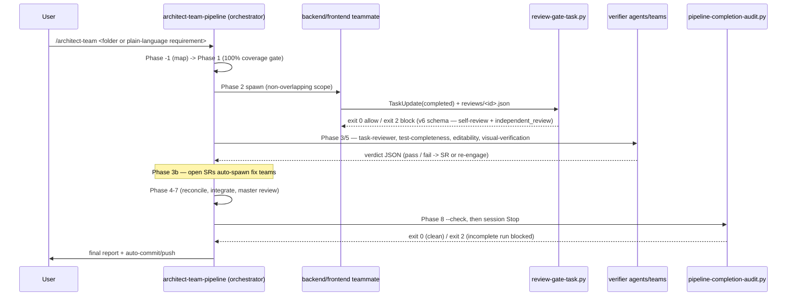

# Codebase Map

> The `architect-team` Claude Code plugin. **v3.8.0 (2026-06-09) — unbounded solving + Code & Data Lineage Graph (CDLG) foundation:** all run / iteration limits removed (the dev loop loops until success; the `pipeline-completion-audit` Stop hook is now a non-halting worklist) + the deterministic CDLG core lands — NEW `hooks/lineage_graph.py` (graph schema + `func://`/`asset://` IDs + runtime-witness reconciliation + freshness + cost), NEW `hooks/run_metrics.py` (per-run instrumentation + frozen-bug benchmark), NEW skills `endpoint-trace-mapping` + `data-lineage-mapping`, NEW agent `endpoint-tracer`, NEW `hooks/locks.py::cdlg_overlap` (shared-hot-callee detection), + `scripts/setup/worktree_lifecycle.py` opt-in squash-merge detection + task-aware heuristic. Honest boundary: P1 live polyglot call-graph extraction is the agent's runtime job, NOT claimed proven (kill-gated); the deterministic pieces are real + unit-tested. Inventory **41 skills / 37 agents / 20 commands**; tests **4415 passing + 5 skipped** (current as of v3.13.2 — the phenotype subsystem now seeds **4** phenotypes: `user-management`, `config-management`, `ai-management`, `code-wiki`). **v3.9.2 (2026-06-10)** wires a deterministic `openspec validate --all --strict` gate into the master-review Stop hook (`hooks/pipeline-completion-audit.py::_audit_openspec_validation`, fired once a `master-review/audit-*.json` verdict exists; blocks the commit on any invalid change), and **v3.9.1** fixed a VAO review-evidence operator-precedence bug + archived 5 orphaned openspec change folders. **v3.1.0 (2026-06-06) — rule-source consolidation + Windows test portability:** NEW `hooks/shared_rule_constants.py` is the single CODE source of truth for `FORBIDDEN_GIT_OPERATIONS` / `TEST_FAILURE_ORIGINS` / `PARITY_VERBS` / `ACTION_KIND_VALUES` (imported by `hooks/vao_tools.py` + `hooks/pipeline-completion-audit.py`); NEW `scripts/setup/agent_boilerplate_blocks.py` + `scripts/setup/sync_agent_boilerplate.py` single-source the 3 byte-identical agent blocks (`## Forbidden git operations` / `## Checkpoint discipline` / `## Operating context`) with a `tests/test_agent_boilerplate_sync.py` drift guard; encoding + `_find_workspace` + `_in_progress_is_fresh` portability fixes make the full suite green under both cp1252 and `PYTHONUTF8=1` (3419 passed + 5 skipped). Additive, zero behavior change. _NOTE: the per-version inventory headers + tables in the sections below were last fully refreshed at v2.8.0 (29 skills / 30 agents / 14 commands) and predate v3.0.0–v3.8.0 — the frontmatter `note:` field is the authoritative running ledger for every release after v2.8.0. The v3.8.0 additions (2 skills, 1 agent, 2 hook modules, `cdlg_overlap`) are documented in §4 below._
>
> _(Historical refresh, v2.8.0, 2026-06-01T18:00 — No standing-red discipline; v2.7.0 pattern propagation / v2.6.0 live-data wiring / v2.5.0 in-flight clarification / v2.4.0 external-state assertion refreshes earlier the same day.)_

## 1. System Overview

The `architect-team` Claude Code plugin (current: v3.11.0) is a spec-to-production multi-agent coding pipeline. It accepts EITHER a requirements folder (OpenSpec, Superpowers, or plain markdown) OR a plain-language requirement typed directly as prose (v0.9.17), and drives it end-to-end through a Phase −2 → 8 sequence: **Phase −2** (Triage & Routing, v0.9.22 — the `bug-classifier` agent dispatches the requirement as `bug` / `feature` / `mixed` / `unclear`; pure-bug routes to the sibling `bug-fix-pipeline` skill, pure-feature continues to the existing flow, `mixed` spawns BOTH in parallel with a `triage_done` recursion-prevention flag, `unclear` emits a structured question), intake & mapping (Phase −1, with the v0.9.21 sub-section D producing per-frontend `INTERACTION_INTUITION_MAP.md` and firing a bulk-verify gate), detection & normalization (Phase 0), the 100%-coverage planning-validation gate (Phase 1), parallel team decomposition & spawn (Phase 2), hook-enforced per-team review gates (Phase 3), continuous solution-requirement intake (Phase 3b), reconciliation (Phase 4), cross-layer integration (Phase 5), the outer task-group loop (Phase 6), master review (Phase 7), and the final report + auto-commit (Phase 8). The v0.9.20 `## Default mode of operation` rule (gates are opt-in for *process* gates) and the v0.9.21 *domain-gate* carve-out coexist in the same section. **v0.9.23 promoted the Phase 8 documentation-currency update step from "orchestrator performs the updates" to a dedicated `doc-updater` agent** (opus, bounded `Write` only to the inventory paths, NO `Edit`) — wired into BOTH the main pipeline Phase 8 AND the bug-fix-pipeline Phase B8, so doc currency is structurally automatic for both feature work and bug fixes.

**v0.9.22 ships a sibling `bug-fix-pipeline` skill** with phases B−1 → B8 — replicate-first (Playwright for frontend / backend script for backend / ambiguity-escalation when unclear); reproduction-is-the-regression-test (frontend bugs also author a backend diagnostic); generalized-fix (the `system-architect` Bug-Fix Generalization Audit mode rejects symptom patches unless explicitly authorized); QA-replay-against-live-dev (the `qa-replayer` agent re-runs the reproduction artifacts against the deployed dev fix; pass criterion is symptom-gone-end-to-end); live-dev-environment-by-default (production is an opt-in escalation). Reached via `/architect-team:bug-fix` (explicit) OR the main pipeline's Phase −2 triage. **At Phase B8 the bug-fix pipeline runs the same documentation-currency gate as the main pipeline** (v0.9.23 dispatch parity).

As of **v3.13.0** the plugin ships **41 skills + the v2.3.0 phenotype subsystem (now FOUR seeded phenotypes: `user-management`, `config-management`, `ai-management`, `code-wiki`), 37 named agent definitions, 20 slash commands, 4 enforcement hooks + the `hooks/vao_tools.py` Layer-3 verification module (20 CLI tools) + the `hooks/skill_invocation_audit.py` Layer-6 Stop-hook auditor + the v3.8.0 `hooks/lineage_graph.py` CDLG core + `hooks/run_metrics.py` instrumentation** (plus a shared schema module + the v1.0.0 `hooks/locks.py` cross-session lock layer — extended in v3.8.0 with `cdlg_overlap` — + the `hooks/override_markers.py` helper), **9 setup/support scripts** (`setup.py` + `install_mempalace.py` installers, `scripts/notify/notify.py` email notifier from v0.9.18, v1.0.0's `scripts/setup/teams_mode.py` mode-detection helper extended in v1.5.0 with `format_dispatch_banner()`, v1.1.0's `scripts/setup/worktree_paths.py` worktree-aware state-resolution helper, **v1.2.0+v1.3.0's `scripts/setup/worktree_lifecycle.py` worktree-lifecycle helper**, **v1.8.0's `scripts/setup/agent_resume.py` resume + checkpoint helper**, and **v3.1.0's `scripts/setup/agent_boilerplate_blocks.py` + `sync_agent_boilerplate.py` canonical-boilerplate pair**), and **4415 pytest self-tests + 5 skipped** across 176 test files that validate every structural artifact and guard against cross-component drift. Earlier inventory (when this map was first synthesized at v1.2.0): 26 skills, 27 agents, 12 commands, 1744 tests. **v1.3.0 makes auto-cleanup of merged worktrees the default for every `/architect-team` family invocation** — `/architect-team`, `/architect-team:bug-fix`, and `/architect-team:mini` each fire `cleanup_merged_worktrees()` as their FIRST action (before argument parsing, before refinement, before the v1.2.0 auto-worktree creation). Trigger 1 sweeps merged-and-forgotten worktrees from prior runs at the start of each new run; trigger 2 fires at the end of mini Phase M7 after the auto-merge to main and removes the mini's own worktree. The `exclude_current=True` safeguard means the cwd is never auto-removed (even on re-entry from a merged-branch worktree). The new `/architect-team:cleanup-worktrees` command (12th) exposes the same helper for on-demand invocation with `--dry-run` and `--against <ref>` flags. Merged-branch detection uses `git merge-base --is-ancestor`; squash-merged branches are NOT auto-detected. Best-effort: cleanup failures NEVER block the new run. **v1.2.0 makes auto-worktree creation the default for every `/architect-team` family invocation** — `/architect-team`, `/architect-team:bug-fix`, and `/architect-team:mini` auto-create a fresh worktree at `<parent-of-repo>/<repo-name>-<slug>/` on branch `architect-team/<slug>` before invoking the pipeline skill; the user's main checkout stays on whatever branch they were on; each run is filesystem-isolated; concurrent runs work without any manual `git worktree add` setup. Re-entry detection (`current_worktree_is_run()`) prevents nested worktrees; the `--no-worktree` flag reverts to v1.1.0 single-tree behavior verbatim; cleanup is NOW automatic in v1.3.0 (the v1.2.0 manual recommendation at Phase 8 / B8 / M7 success still appears, but the next run sweeps merged worktrees without user action). **v1.1.0 closes the cross-session coordination gap for git-worktree-based parallel runs** via a 3-layer model: filesystem isolation via git worktrees, architectural coordination via the v1.0.0 lock layer resolved to the main worktree, context sharing via MemPalace resolved to the main worktree. The `scripts/setup/worktree_paths.py` helper exposes `shared_state_dir()` / `run_state_dir()` / `is_worktree()` — used by the lock layer's default resolution and (per skill docs) by the MemPalace integration's palace-path resolution. Single-session users (no worktrees, OR with `--no-worktree`) see ZERO behavior change because both resolvers degenerate to `cwd / '.architect-team'` in non-worktree clones. **v1.0.0 makes Claude Code's experimental Agent Teams primitive the default dispatch mode** — long-lived named teammates with their own 1M context windows, a shared task list, direct `SendMessage`, and a Lead that owns coordination. Teams mode engages when `CLAUDE_CODE_EXPERIMENTAL_AGENT_TEAMS=1` (env or `~/.claude/settings.json`) AND Claude Code ≥ 2.1.32 AND `--no-teams` was not passed; otherwise the pipeline falls back to subagents mode (the v0.10.0 behavior, unchanged). The `hooks/locks.py` primitive lets two concurrent `/architect-team` invocations in separate Claude Code sessions claim disjoint file scopes and run truly parallel — overlapping scopes queue based on a path-glob intersection check (4h TTL stale detection by default). The two evidence hooks now handle both `PostToolUse(TaskUpdate)` / `SubagentStop` AND the teams-mode `TaskCompleted` / `TeammateIdle` triggers, dispatching internally to the same enforcement code path. Its enforcement is layered: Python hooks gate teammate task-completion, teammate idle, and the orchestrator's terminal state; independent verifier agents and teams re-check test-completeness, editability, interactive-element-and-page genuineness, visual fidelity, and (v0.9.23) documentation currency against reality; and the discipline skills are pressure-written to resist rationalization. A run optionally emits per-project email notifications (v0.9.18) when the target project supplies a `.architect-team-notify.json`.

## 2. Architecture Diagram

```mermaid
graph TB
    subgraph "Entry points (22 commands)"
        CMD_AT["/architect-team"]
        CMD_BUG["/architect-team:bug-fix"]
        CMD_UX["/architect-team:ux-test"]
        CMD_REFINE["/architect-team:refine-prompt"]
        CMD_SETUP["/architect-team-setup"]
        CMD_VQA["/architect-team:visual-qa"]
        CMD_MEM["/architect-team:memory"]
        CMD_MEMINST["/architect-team:mempalace-install"]
        CMD_EDIT["/architect-team:editability-audit"]
        CMD_CLEAN["/architect-team:cleanup-worktrees"]
        CMD_OPT["/architect-team:optimize-structure (v3.11.0)"]
    end

    subgraph "Orchestrator"
        SK_PIPELINE["skill: architect-team-pipeline (Phase -2 -> 8)"]
        SK_BUGFIX["skill: bug-fix-pipeline (Phase B-1 -> B8)"]
        SK_UXTEST["skill: ux-test-builder (Phase U0 -> U9)"]
    end

    subgraph "Skills (41)"
        SK_INTAKE["intake-and-mapping"]
        SK_PLAN["coverage-mapping / reuse-first-design"]
        SK_MAP["frontend-route-mapping / design-fidelity-mapping"]
        SK_TEST["playwright-user-flows / dev-api-integration-testing"]
        SK_TEAM["team-spawning-and-review-gates"]
        SK_RCA["root-cause-test-failures / expensive-verification-debugging"]
        SK_DRT["diagnostic-research-team"]
        SK_VFR["visual-fidelity-reconciliation / visual-verification-team"]
        SK_EDIT["editability-completeness / interaction-completeness"]
        SK_DVD["dynamic-value-discovery / interaction-intuition"]
        SK_MEMP["mempalace-integration"]
        SK_README["readme-styling / documentation-currency"]
        SK_REFINE["proposal-refiner"]
        SK_EMAIL["email-testing"]
        SK_STRUCT["structure-optimization (S0->S8, v3.11.0)"]
    end

    subgraph "Agents (39)"
        AG_IMPL["frontend / backend (opus implementers)"]
        AG_FLOW["reconciler / integration"]
        AG_MAP["codebase-map-reviewer x3 / route-mapper / integration-explorer x3 / master-synthesizer / interaction-intuiter"]
        AG_ARCH["system-architect (8 audit modes)"]
        AG_VERIF["task-reviewer / test-completeness-verifier / editability-reviewer x3 / interaction-reviewer x3 / diagnostic-researcher x3"]
        AG_VIS["visual-capture xN / visual-analyzer xN"]
        AG_BUG["bug-classifier / bug-replicator / qa-replayer / fix-sensibility-checker"]
        AG_UX["flow-explorer x3 / flow-executor x3"]
        AG_DOC["doc-updater / prompt-refiner / scaffold-agent"]
        AG_STRUCT["structure-analyst x3 / reference-tracer xN / structure-adversary x3 (v3.11.0)"]
    end

    subgraph "Hooks (4 + shared module)"
        H_GATE["PostToolUse(TaskUpdate) -> review-gate-task.py"]
        H_IDLE["SubagentStop -> teammate-idle-check.py"]
        H_STOP["Stop -> pipeline-completion-audit.py"]
        H_SCHEMA["review_evidence_schema.py (shared, imported by both evidence hooks)"]
    end

    subgraph "External"
        EXT["superpowers / cartographer / ralph-loop / openspec CLI / pytest+httpx / Playwright+chromium / MemPalace (optional) / Gmail SMTP + SendGrid API (opt-in notifier)"]
    end

    CMD_AT --> SK_PIPELINE
    CMD_BUG --> SK_BUGFIX
    CMD_UX --> SK_UXTEST
    CMD_REFINE --> SK_REFINE
    CMD_OPT --> SK_STRUCT
    SK_STRUCT --> AG_STRUCT & AG_ARCH
    SK_PIPELINE --> SK_INTAKE & SK_PLAN & SK_TEAM & SK_RCA & SK_DRT & SK_VFR & SK_EDIT & SK_DVD & SK_MEMP & SK_EMAIL
    SK_INTAKE --> AG_MAP
    SK_PIPELINE --> AG_IMPL & AG_FLOW & AG_ARCH & AG_VERIF & AG_VIS & AG_DOC
    SK_BUGFIX --> AG_BUG & AG_ARCH
    SK_UXTEST --> AG_UX
    AG_IMPL --> H_GATE & H_IDLE
    SK_PIPELINE --> H_STOP
    H_GATE --> H_SCHEMA
    H_IDLE --> H_SCHEMA
    SK_PIPELINE --> EXT
```



## 3. Directory Structure

```
claude_skill_lib/
├── .claude/                 # OpenSpec-installed workspace commands + skills (opsx/* commands + openspec-* skills; tracked)
├── .claude-plugin/          # Plugin identity: plugin.json + marketplace.json (v0.9.19)
├── agents/                  # 39 named subagent definitions (.md with frontmatter)
├── commands/                # 22 slash-command bodies (.md with frontmatter)
├── hooks/                   # hooks.json wiring + 6 enforcement scripts + shared modules + lock-layer module
│   ├── hooks.json           #   wires PreToolUse[*] (skill-gate, v3.15.0), PreToolUse(Edit/Write/NotebookEdit), PostToolUse(TaskUpdate), SubagentStop, Stop, TaskCompleted (v1.0.0), TeammateIdle (v1.0.0), PreCompact (v3.18.0 closeout) — detect-once command strings (v3.9.3)
│   ├── review_evidence_schema.py   # shared single-source-of-truth evidence schema (v0.9.9) + _detect_trigger_mode (v1.0.0)
│   ├── vao/                 #   the 20 Layer-3 verification tools split per discipline family (v3.10.0 R2)
│   ├── vao_tools.py         #   the facade over hooks/vao/ (byte-identical CLI)
│   ├── shared_util.py       #   load_json / _utc_now_iso / unified JSONL reader (v3.10.0 R1)
│   ├── closeout_check.py    #   deterministic closeout staleness engine (v3.18.0)
│   ├── locks.py             # cross-session lock layer (v1.0.0) — acquire_lock / release_lock / detect_stale / globs_intersect
│   ├── override_markers.py  # marker constants + detection helpers for the unilateral-override guard
│   ├── pretool_unilateral_override_guard.py # PreToolUse(Edit/Write/NotebookEdit) unilateral-override guard
│   ├── pretool_skill_gate.py        # PreToolUse[*] real-time skill-invocation hard-gate (v3.15.0); reuses skill_invocation_audit detection
│   ├── precompact-closeout.py       # PreCompact closeout doc-currency reminder (v3.18.0); runs closeout_check.py
│   ├── review-gate-task.py         # PostToolUse(TaskUpdate) OR TaskCompleted gate (v1.0.0 trigger split)
│   ├── teammate-idle-check.py      # SubagentStop OR TeammateIdle gate (v1.0.0 trigger split)
│   └── pipeline-completion-audit.py # Stop gate + standalone --check pre-commit gate (unchanged in v1.0.0)
├── scripts/
│   ├── setup/               # setup.py + install_mempalace.py + teams_mode.py (v1.0.0) + worktree_paths.py (v1.1.0) + worktree_lifecycle.py (v1.2.0) + agent_resume.py (v1.8.0) + agent_boilerplate_blocks.py + sync_agent_boilerplate.py (v3.1.0)
│   ├── notify/              # notify.py — best-effort per-project email notifier (v0.9.18)
│   ├── phenotypes/          # phenotypes.py — the deterministic phenotype engine (v2.3.0)
│   ├── data_dictionary/     # data_dictionary.py — the deterministic Data Dictionary engine (v3.17.0)
│   ├── claude_md/           # claude_md_efficiency.py — the deterministic Claude.md-efficiency engine (v3.19.0)
│   ├── mcp_design/          # output_contract.py — the deterministic MCP output-contract engine (v3.20.0)
│   ├── helpdesk/            # logit.py — the deterministic Logit / Helpdesk triage-submission engine (v3.21.0)
│   └── token_compression/   # caveman.py — the deterministic "caveman" token-compression engine (v3.22.0)
├── skills/                  # 47 skill directories, each containing SKILL.md
├── services/                # CT6-6 service/server tier (v3.23.0+, separable per REPO-3); common/ = Ed25519 SEC handshake + BG runtime + same-Anthropic-key config; librarian/ = topic-research curation (v3.24.0; sqlite reference index + LIB-10 conceptual search); triage/ = evaluator + tally/quarantine + Ed25519-handshake submission server (v3.25.0; EVAL-1…17 + SEC) (stdlib-only core; DESIGN + tests, NOT live-deployed)
├── openspec/                # OpenSpec workspace (tracked); config.yaml + changes/ (archive/ nested inside) + specs/
├── docs/
│   ├── CODEBASE_MAP.md      # this file
│   ├── INTEGRATION_MAP.md   # external-integration synthesis (single-codebase degenerate)
│   ├── LINEAGE_UPGRADE_REQUIREMENTS.md  # the v3.8.0 CDLG requirements source (REQ-*)
│   └── superpowers/         # design docs + plans (incl. the v3.11.0 structure-optimization spec + plan)
├── tests/                   # 4719 pytest self-tests + 5 skipped (188 test files + conftest + helpers/)
├── .scratch/                # working notes (tracked; not part of the installed surface)
├── .architect-team-notify.example.json   # template per-project email-notification config (v0.9.18)
├── CLAUDE.md  CHANGELOG.md  README.md  LICENSE  pytest.ini  .gitignore
```

Runtime state is written under `<workspace>/.architect-team/` (gitignored) and `<workspace>/.mempalace/` (gitignored) — see §6.

## 4. Module Guide

> **Currency note (2026-06-09):** the inventory tables below were authored at v2.8.0 (29 skills / 13 commands / 2635 tests). Subsequent v2.9.0 → v3.13.0 disciplines have shipped additional skills, commands, agents, and `hooks/` modules. **As of v3.13.2 the live inventory is 41 skills / 37 agents / 20 commands / 4415 tests + 5 skipped (176 test files).** The v3.11.0 additions explicitly rowed below: skill `structure-optimization`; agents `structure-analyst` / `reference-tracer` / `structure-adversary`; command `optimize-structure`; the `system-architect` eighth audit mode (ninth mode overall, counting the default architectural-recommendation mode) (Restructure Plan Audit). The cascading `note:` field in the frontmatter is the authoritative running ledger for every shipped release after v2.8.0. **Affordance inventory (v2.13.0 discipline): none detected** — this is a no-UI plugin repo; the only `_AFFORDANCE_SIGNATURES` occurrences on disk are the detector's own pattern definitions (`hooks/vao/persona.py`) and the canonical test fixtures, which are signature SOURCES, not affordances of this codebase. The v3.8.0 additions explicitly documented in the tables below: skills `endpoint-trace-mapping` + `data-lineage-mapping`; agent `endpoint-tracer`; hook modules `lineage_graph.py` + `run_metrics.py`; the `cdlg_overlap` function added to `hooks/locks.py`; and the iteration-limit removal in `hooks/pipeline-completion-audit.py`. (Other post-v2.8.0 additions — `visual-to-api-design`, `test-prod-safety-classifier`, `test-run-monitor`, `cartographer-team`, `domain-research-team`, `api-design-from-frontend`, `data-engineering-exploration` skills; `domain-researcher`, `test-run-watcher`, `monitor-synthesizer` agents; `visual-to-api`, `classify-test-prod-safety`, `discipline-status`, `inject`, `monitor-tests` commands; `discipline_registry.py`, `inflight_inbox.py`, `shared_rule_constants.py` hook modules — are tracked in the frontmatter ledger.)

### Skills (47)

> The table below is the v2.8.0 snapshot extended with the v3.8.0 lineage skills (`endpoint-trace-mapping` + `data-lineage-mapping`). Skills shipped between v2.8.0 and v3.8.0 not individually rowed here — `visual-to-api-design`, `test-prod-safety-classifier`, `test-run-monitor`, `cartographer-team`, `domain-research-team`, `api-design-from-frontend`, `data-engineering-exploration` — are tracked in the frontmatter ledger. The live skill count is **47**.

**v2.1.0 — `interactive-mockup-discovery` joins**: the canonical home of the two-pass mechanism for interactive HTML mockup oracles (Pass 1 = observation via `interaction-observer`; Pass 2 = intent inference via `interaction-intuiter`'s INTENT-INFERENCE mode; Layer 3 = `verify-interactions-honored`). Documents the 7-value `action_kind` vocabulary and the 10-pattern semantic-vs-observed mismatch matrix. v2.0.0 added `verified-agent-output`.

| Skill | Role |
|---|---|
| `phenotypes` | (v2.3.0) Discover/match/emit pre-made generalized deployable architectures (blueprint + scaffold + metadata under `phenotypes/`); proposed reuse-first or via `--phenotype`, never silent. Engine: `scripts/phenotypes/phenotypes.py`. Seeded with `user-management` + `config-management` + `ai-management` + `code-wiki` (v3.13.0; a self-hosted Next.js documentation wiki absorbed from deepwiki-open, LLM-stripped, ingesting `*_MAP.md`). |
| `phenotype-absorption` | (v2.3.0) The absorb playbook — ingest any arbitrary codebase into a new labeled phenotype (analyze → generalize → scaffold → validate → index). Reached via `/architect-team:absorb-phenotype <path> --label <name>`. |
| `architect-team-pipeline` | The orchestrator playbook — Phase −1 → 8. Run-state rules: unbounded solving (loop until success — no iteration ceiling as of v3.8.0; oscillation continues from a different angle rather than aborting), the shared-state concurrency model, the required-input escalation marker. |
| `intake-and-mapping` | Phase −1 codebase discovery + the per-codebase / integration ralph loops. Map-invalidation flag forces re-validation of a wrong-but-fresh map. |
| `reuse-first-design` | The extend > compose > reuse > build-new ladder; the Reuse Decision Log. |
| `frontend-route-mapping` | ROUTE_MAP.md schema + completeness rubric. |
| `design-fidelity-mapping` | Conditional DESIGN_MAP.md (design tokens, asset registry, per-screen specs). `design_baseline` frontmatter; a baseline migration forces a full re-derive. |
| `visual-fidelity-reconciliation` | Strict QA vs DESIGN_MAP. Phase 0 live-app precondition; zero-tolerance; the design-migration "unchanged inverts" rule; verify-against-the-Oracle-not-a-classification. |
| `visual-verification-team` | Independent live-app verification — `visual-capture` → `visual-analyzer` → `system-architect` synthesis. The verdict is measured data, not eyeballed images. |
| `playwright-user-flows` | White-box Playwright methodology; real-backend-by-default for `both`-layer features. |
| `dev-api-integration-testing` | Live-dev-API testing — real DB / queue / cache, side-effect verification. |
| `coverage-mapping` | `coverage-map.json` schema + lifecycle (Phase 1 / 3 / 7 / 8). |
| `team-spawning-and-review-gates` | Teammate manifests; the v6 review-gate evidence schema (12 self-review fields incl. `ui_interaction_review` + the independent `task-reviewer` verdict); the independent-review dispatch; the SR schema. |
| `root-cause-test-failures` | Predict → 3-pass RCA (forward / backward / falsify) → evidence-backed verdict; multiple-simultaneous-causes. |
| `diagnostic-research-team` | 3 `diagnostic-researcher` agents + `system-architect` robustness review before a test-failure fix team spawns. |
| `expensive-verification-debugging` | When a verify cycle is expensive (deploy / rebuild / slow CI), audit the whole failure pathway and batch the fixes. |
| `editability-completeness` | 3 `editability-reviewer` agents enumerate every attribute, classify editability, trace UI→DB; architect robustness review; multi-pass. |
| `interaction-completeness` | The judgment-heavy VERIFICATION gate that `playwright-user-flows` was followed (v0.9.19) — 3 `interaction-reviewer` agents independently re-enumerate every interactive element AND every page/screen/route, classify element wiring + page `live`/`placeholder`/`confirmed-stub`, audit Playwright test authenticity, trace element→endpoint, flag hardcoded-should-be-dynamic values; architect Round-3; bounded multi-pass; gaps → SRs. The sibling of `editability-completeness` at the granularity of controls and pages. |
| `dynamic-value-discovery` | A cross-role discipline (v0.9.19) for telling a genuine static literal from sample data standing in for a dynamic, data-bound value — classify every displayed value `static`/`dynamic` FROM CONTEXT, bind every dynamic one to a named data source, escalate genuine ambiguity. Modeled on `reuse-first-design`; consulted by the architect, the developers, and the evaluator. |
| `mempalace-integration` | Per-workspace MemPalace store — `--wing` mining (rooms are `init`-detected from directory structure, not a `mine` flag), auto-mine on artifact write, search before output. |
| `readme-styling` | The bitmap house style for READMEs — canvas/centering, pipe-table + ASCII-graph alignment, banner / dividers / panels / flowcharts / logic maps, the GitHub-safe + ANSI color model, and the theming engine (6 preset themes + an interactive picker + the `readme-theme` marker). |
| `documentation-currency` | The Phase 8 docs-reflect-the-code gate — the doc inventory (maps + README + CHANGELOG + CLAUDE.md), what "current" means, the orchestrator-updates-then-system-architect-audits flow. |
| `bug-fix-pipeline` | The sibling `Phase B−1 → B8` pipeline — replicate-first, reproduction-is-the-regression-test, generalized-fix, QA-replay-against-live-dev. Reached via `/architect-team:bug-fix` or the main pipeline's Phase −2 triage. (v0.9.22) |
| `interaction-intuition` | Per-frontend codebase intuition map — enumerates every interactive element, intuits each element's action and candidate endpoints, assigns confidence, authors ambiguity questions for low-confidence items. Produces `INTERACTION_INTUITION_MAP.md`. (v0.9.21) |
| `ux-test-builder` | UX test builder pipeline `Phase U0 → U9` — persona + objectives + target site → literal flow → 3 flow-explorer agents propose 10-15 adjacent flows each → distilled → one `.spec.ts` per flow → 3 flow-executor agents run in parallel → consensus → bug routing. Reached via `/architect-team:ux-test`. (v0.9.29) |
| `proposal-refiner` | Conversational pre-pipeline prompt refinement — grades a free-text prompt on 5 axes (clarity, scope, acceptance, grounding, conflict), asks clarifying questions, iterates up to 5 times. Runs BEFORE Phase −2 when input is prose. Reached standalone via `/architect-team:refine-prompt`. (v0.9.33) |
| `email-testing` | Cross-cutting email-testing discipline — 4 phases (E1 detect, E2 Mailpit provision, E3 capture+analyze, E4 link-follow+flow-complete). Consumed by `bug-replicator`, `flow-executor`, `integration` agents. Mailpit by default; template-first analysis; every link tested; mandatory teardown. (v0.9.34) |
| `mini-architect-team-pipeline` | Mini variant orchestrator (Phase M0 → M8) — single architect, single `mini-qa` agent, working branch `mini/<slug>`, auto-merge to main on green; M8 cycle 4 (three red verdicts on the same proposal) writes `.architect-team/mini/<slug>/escalation/` and re-spawns `/architect-team` with that folder as REQ_DIR. Heavyweight review is batched via the `Mini-Run:` trailer + the `/architect-team:mini-review-sweep` command. Reached via `/architect-team:mini`. (v0.10.0) |
| `endpoint-trace-mapping` | **(v3.8.0 — lineage P1)** Per-endpoint internal call-trace mapping that produces the Code & Data Lineage Graph (CDLG). The agent does the live, polyglot, LLM-and-LSP-driven extraction at runtime; the deterministic core (schema + validator, `func://`/`asset://` IDs, runtime-witness reconciliation, freshness, cost ceiling) lives in `hooks/lineage_graph.py`. Two-layer extraction contract + witness-verification (every asserted edge is reconciled against the existing `code-path-witness.json` ground truth via `witness_gate`). Dispatches the `endpoint-tracer` agent. |
| `structure-optimization` | **(v3.11.0)** Codebase-restructure PLANNING pipeline (stages S0-S8): maps via `cartographer-team` (freshness-checked; produced when missing), ×3 `structure-analyst` drafts converge under a deterministic every-file partition check (git ls-files = movement table ∪ stays; zero orphans/duplicates), sharded `reference-tracer` closure (file:line evidence + mandatory search_log) assembled into `movements.json` v1.0, ×3 `structure-adversary` rounds until two consecutive all-clean, `system-architect` Restructure Plan Audit, then `RESTRUCTURE_PLAN.md` + an `openspec-propose`-authored strict-validated change. Plan-only — execution is `/architect-team` driving the produced change. |
| `data-lineage-mapping` | **(v3.8.0 — lineage P3)** Asset-lineage mapping over the CDLG `asset://` nodes (`reads` / `writes` / `modifies` / `originates` edges). Carries an explicit Reuse Decision vs `data-engineering-exploration` (lineage-mapping is the per-asset trace; data-engineering-exploration is the 7-stage data-plane design pipeline). |
| `data-dictionary` | **(v3.17.0 — CT6-6 component 1, DD-1…DD-18)** Self-contextualizing data-dictionary builder: derive the data model from code/docs/direct input, define every field, record provenance (`direct-user-input`/`direct-code-comment`/`inference`/`live-data`) + value-level corroboration against live data. Engine: `scripts/data_dictionary/data_dictionary.py` (SQLite introspect + ~100-row sample + grain/field inference + reference/relational maps + `DATA_DICTIONARY_MAP.md` serializer). Complementary to `data-lineage-mapping` (this defines the FIELDS + provenance; that traces who reads/writes the assets). Sequenced after codebase+integration mapping; honest no-DB path (never fabricates `live-data`). |
| `closeout` | **(v3.18.0 — CT6-6 component 2, CO-1…CO-3)** Session-end documentation-currency double-check: fires before compaction (the `PreCompact` hook), reviews the changes against the requirement, and updates any stale doc itself rather than flagging it. Engine: `hooks/closeout_check.py` (deterministic staleness signals over the working-tree diff); worker: `agents/closeout-agent`; manual trigger: `/architect-team:closeout`. Reuses `documentation-currency` + the `doc-updater` whole-file pattern; works OUTSIDE a pipeline run (no coverage-map needed). |
| `claude-md-efficiency` | **(v3.19.0 — CT6-6 component 3, CMD-1…CMD-4)** When (and only when) MemPalace is installed, `CLAUDE.md` becomes a thin POINTER (tells the agent where to find things, loaded on demand) not a container, kept very small, with standards→reference-MemPalace + toggleable customizations. Engine: `scripts/claude_md/claude_md_efficiency.py` (pointer-shape + byte-budget assessor + minimal-pointer generator). Reuses `mempalace-integration` (the availability check + the mine/wake-up flow it points INTO). |
| `mcp-output-contract-design` | **(v3.20.0 — CT6-6 component 4, MCP-1…MCP-3)** Best-in-class output standardization for an LLM agent embedded in an application: a closed output contract (JSON Schema) + a forced structured-output mechanism + validation + retry-on-mismatch, so the agent's output is guaranteed consistent to parse. Engine: `scripts/mcp_design/output_contract.py` (`build_output_contract` + `validate_against_contract` + `assess_contract`); worker: `agents/mcp-design-agent`. Outward-facing counterpart to `verified-agent-output` (which verifies CT6's own agents). |
| `helpdesk` | **(v3.21.0 — CT6-6 component 5, HD-1…HD-3)** Logit — the user-run MANUAL counterpart to the automatic issue logging: after a bad session, file a triage report with consent + a privacy level (`full` / `summary` allow-list / `off`); the submission carries the version + `source: manual-helpdesk` so the same triage process consumes it. Engine: `scripts/helpdesk/logit.py` (consent-gated builder + privacy redaction + validator); command: `/architect-team:logit`. Honest boundary — the actual send to the triage server is the server-tier (SEC + EVAL), not in-repo. |
| `token-compression` | **(v3.22.0 — CT6-6 component 6, TC-1…TC-3)** "Caveman" compression of agents' INTERNAL communication to lower token cost, WITHOUT touching external output (hard internal-only boundary). Engine: `scripts/token_compression/caveman.py` (`compress` drops filler + wordy phrases, preserves content/identifiers/numbers/line-structure/code verbatim; `compression_stats` measures the saving). A lossy-of-filler stdlib floor; a heavier ML package (LLMLingua-style) is a documented 3rd-party app-layer option. |

### Agents (39)

**v2.1.0 — `interaction-observer` joins** (opus, color: green): dispatched by oracle-deriver when `spec_shape: interactive-mockup` triggers; runs the mockup in headless Chrome (or reads a pre-captured snapshot for stdlib-only contexts); enumerates every interactive element; simulates each interaction; records observed_effect into the oracle spec's `interactions[]`. Bounded Write to `.architect-team/oracle-spec/<change>/interaction-evidence/`. v2.0.0 added `oracle-deriver` (Layer 1 — spec_shape walks; v2.1.0 extends with the 6th `interactive-mockup` shape and the dispatch contract for the observer) and `adversarial-reviewer` (Layer 2 — 5 role-paired shapes). The `interaction-intuiter` agent body (existing) gains the new INTENT-INFERENCE mode + the canonical 10-pattern mismatch matrix in v2.1.0.

| Agent | Model | Color | One-line purpose |
|---|---|---|---|
| system-architect | opus | blue | On-demand architecture; + 8 audit modes (Diagnostic Plan, Editability Map, Interaction Map, Visual Gap Synthesis, Master Review Audit, Documentation Currency Audit, Bug-Fix Generalization, Restructure Plan Audit — v3.11.0). Analysis-only. |
| frontend | opus | cyan | Phase 2 frontend implementer; Playwright + visual-fidelity workflow. |
| backend | opus | green | Phase 2 backend implementer; live dev-API integration tests. |
| reconciler | opus | orange | Phase 4 conflict resolution; no feature code. |
| integration | sonnet | pink | Phase 5 cross-layer; live dev API + Playwright + the visual-fidelity sweep. (v3.10.0 R4d: magenta→pink.) |
| scaffold-agent | sonnet | purple | **On-demand utility (not pipeline-dispatched).** Generates new role-specialized agent `.md` files into `agents/` (e.g. `ml-engineer`, `mobile-ios`, `data-pipeline`) — reads existing agents as templates, validates the generated frontmatter (valid tools per the R4a vocabulary: no retired `LS`/`NotebookRead`/`Task`; valid colours; valid model incl. `inherit`). Invoke it when you need a new domain agent; it is never spawned automatically by a pipeline phase. |
| codebase-map-reviewer | sonnet | red | Spawned ×3 per codebase in Phase −1B; read-only verdict. |
| integration-explorer | opus | blue | Spawned ×3 in Phase −1C; round-robin convergence. |
| master-synthesizer | opus | purple | Phase −1C final; merges the 3 integration drafts. |
| route-mapper | opus | cyan | Per frontend codebase in Phase −1B; ROUTE_MAP.md always, DESIGN_MAP.md conditionally. |
| test-completeness-verifier | sonnet | red | Phase 3 + 5; confirms unit/integration/Playwright kinds ran + the real-backend audit. |
| task-reviewer | opus | red | Phase 3; independent per-task review of a teammate's diff vs the acceptance criteria; writes the `independent_review` block. Read-only on source. |
| diagnostic-researcher | opus | red | Spawned ×3 for a test-failure SR; full-pathway trace + ranked hypotheses. |
| editability-reviewer | opus | yellow | Spawned ×3; enumerate + classify + trace every attribute UI→DB. |
| visual-capture | sonnet | cyan | Spawned ×N; starts the live app, captures screenshots + computed-style data. Mechanical; no verdicts. |
| visual-analyzer | opus | red | Spawned ×N; the objective data diff + pixel diff + code cross-check. |
| interaction-reviewer | opus | yellow | Spawned ×3 (v0.9.19); independently enumerates every interactive element AND page, classifies element wiring + page genuineness, traces element→endpoint, audits Playwright test authenticity, flags hardcoded-dynamic values; round-robin convergence. Analysis-only — read-only on source, no `Edit` of feature code. |
| interaction-intuiter | opus | green | Spawned per frontend codebase at Phase −1B (v0.9.21). Reads route + design + integration maps, enumerates interactive elements, intuits actions + candidate endpoints, assigns confidence, authors ambiguity questions. Produces `INTERACTION_INTUITION_MAP.md`. |
| bug-classifier | sonnet | red | Spawned at Phase −2 (v0.9.22). Triages the incoming requirement as `bug` / `feature` / `mixed` / `unclear`. Lightweight analysis-only. |
| bug-replicator | opus | orange | Spawned per affected codebase at Phase B1 (v0.9.22). Writes + runs Playwright or backend scripts that reproduce the bug against live dev. The artifact IS the regression test. |
| qa-replayer | opus | green | Spawned at Phase B6 (v0.9.22). Re-runs reproduction artifacts against live dev after the fix is deployed. Returns `bug-resolved` / `bug-still-present` / `test-did-not-exercise-fix` (v0.9.31) / `env-failure`. |
| doc-updater | opus | blue | Spawned at Phase 8 / Phase B8 (v0.9.23). Reads git diff + coverage map + doc inventory, updates all stale docs. Bounded Write to inventory paths only. |
| closeout-agent | opus | cyan | **(v3.18.0 — CT6-6 closeout)** Session-end doc-currency worker. Reviews the working-tree diff against the requirement, runs `hooks/closeout_check.py`, and updates any stale doc itself (whole-file rewrites; bounded Write to the inventory; no Edit). Works OUTSIDE a pipeline run (no coverage-map/run-ledger), unlike doc-updater. Spawned by the `closeout` skill / PreCompact reminder / `/architect-team:closeout`. |
| mcp-design-agent | opus | purple | **(v3.20.0 — CT6-6 MCP design)** Designs a best-in-class output contract for an LLM agent embedded in an application (MCP-1…3). Enumerates the app's producer points; builds a closed contract per point via `scripts/mcp_design/output_contract.py`; binds a forced structured-output mechanism + validate-and-retry. Bounded Write to `.architect-team/mcp-design/`; never writes the app's code. |
| fix-sensibility-checker | opus | yellow | Spawned at Phase B6b (v0.9.29). Computes impact set from fix's git diff, authors + runs minimal Playwright sensibility flows, routes nonsensical items as fresh SRs with `origin.kind: fix-regression`. |
| flow-explorer | opus | cyan | Spawned ×3 at Phase U3 (v0.9.29). Reads persona + site maps + literal flow, proposes 10-15 additional Playwright user-flow specs exercising adjacent capabilities. |
| flow-executor | opus | magenta | Spawned ×3 at Phase U6 (v0.9.29). Runs every distilled Playwright flow against live target, documents per-flow outcome. |
| prompt-refiner | opus | blue | Spawned at Phase R2 (v0.9.33). Grades a free-text prompt on 5 axes, generates codebase-grounded clarifying questions. |
| mini-qa | opus | red | Single QA agent for the mini variant (v0.10.0). Spawned at Phase M5; reads the architect's `## QA Guidance` contract; runs unit + integration + ≤3 Playwright on the live dev URL; emits a `qa-verdict.json` with green/red and a per-criterion table. Read-only on source. |
| structure-analyst | opus | blue | **(v3.11.0)** Spawned ×3 at structure-optimization S2; independent restructure drafts carrying a FULL file partition (movement table + stays, self-checked vs git ls-files). Bounded Write to the run drafts dir. |
| reference-tracer | sonnet | orange | **(v3.11.0)** Spawned ×N (non-overlapping shards) at S4; mechanically closes each movement's reference set (imports/config/build/ci/docs/string-path/test + outbound relative imports + forced refactors) with file:line evidence + a mandatory search_log. |
| structure-adversary | opus | red | **(v3.11.0)** Spawned ×3 per S5 round; refutation-only (modalities the tracers did not log, partition re-run from scratch, migration-order/tooling/runtime-reference attacks, delete-dead alive-checks); exit = two consecutive all-clean rounds. |
| endpoint-tracer | opus | — | **(v3.8.0 — lineage P1)** Spawned by `endpoint-trace-mapping`. Produces the per-endpoint internal call-trace + the CDLG via a two-layer extraction contract; reconciles every asserted edge against the existing `code-path-witness.json` runtime witness (`witness_gate`). Emits the graph that `hooks/lineage_graph.py` validates. The live polyglot extraction is the runtime job (kill-gated, NOT claimed proven); the deterministic schema/ID/witness/freshness/cost machinery it targets is unit-tested. |

> **Note (v3.8.0):** three further agents shipped between v2.8.0 and v3.8.0 and are tracked in the frontmatter ledger — `domain-researcher` (opus, v3.4.0 — outside-research mandate, `WebFetch` + `WebSearch`), `test-run-watcher` (sonnet, v3.3.0) and `monitor-synthesizer` (opus, v3.3.0 — the passive test-run monitor team). The table above is the v2.8.0 snapshot + the v3.8.0 `endpoint-tracer` addition; the live agent count is **37** (v3.11.0 added `structure-analyst` / `reference-tracer` / `structure-adversary`, rowed above).

### Commands (20)

- `architect-team` — runs the Phase −2 → 8 pipeline against EITHER a requirements folder OR a plain-language requirement typed directly as prose (v0.9.17). Flags: `--no-commit` / `--no-push` / `--no-compact` / `--allow-push-to-default` / `--proposal-first` / `--bug-fix` / `--feature-only` / `--no-refine`.
- `bug-fix` — faster bug-focused variant (v0.9.22). Drives through replicate → reproduce-test → propose → fix → QA-replay loop. Equivalent to `--bug-fix` flag on the main command.
- `ux-test` — UX test builder (v0.9.29). Takes persona + objectives + target site + credentials env-var. Drives through site mapping → literal flow → 3 explorers → distillation → 3 executors → consensus → bug routing.
- `refine-prompt` — standalone prompt refinement (v0.9.33). Grades and iteratively refines a free-text prompt without running the pipeline.
- `architect-team-setup` — installs openspec CLI, pytest+httpx, Playwright+chromium.
- `visual-qa` — on-demand visual-fidelity audit → the visual-verification-team gate.
- `mempalace-install` — installs the MemPalace CLI + prints the MCP wire-up.
- `memory` — ad-hoc MemPalace `search` / `mine` / `status` / `wake-up` / `sweep`.
- `editability-audit` — on-demand editability-completeness audit.
- `mini` — entry point for the mini variant (v0.10.0). Runs `mini-architect-team-pipeline` (Phase M0 → M8) on the live dev environment with a single architect, a single `mini-qa` agent, and auto-merge to main on green.
- `mini-review-sweep` — batched heavyweight review (v0.10.0). Consumes commit messages tagged with the `Mini-Run:` trailer and dispatches the full architect-team review surface (visual / editability / interaction / docs-currency) across the batch, decoupled from the inner mini loop.
- `optimize-structure` — **(v3.11.0)** produce an adversarially-verified codebase-restructure PLAN via the `structure-optimization` skill (`[codebase-path | --all] [--objective] [--execute] [--no-commit] [--no-push] [--no-compact]`); plan-only (never moves a source file); `--execute` hands the strict-validated change to the implementing pipeline.
- `cleanup-worktrees` — explicit on-demand cleanup of merged `architect-team/*` worktrees (v1.3.0). Walks `git worktree list`, identifies any whose branch is merged into `origin/main`, and removes them (worktree + branch). Excludes the current worktree by default (safety). Flags: `--dry-run` (preview without filesystem changes), `--against <ref>` (override the default `origin/main` comparison). Invokes the same `cleanup_merged_worktrees()` helper that the 3 pipeline-driving slash commands auto-fire as their first action.

### Hooks (4) + shared schema module + cross-session lock module

- **`hooks/hooks.json`** — wires `PreToolUse[*]` → `pretool_skill_gate.py` (v3.15.0), `PreToolUse[Edit|Write|NotebookEdit]` → `pretool_unilateral_override_guard.py`, `PostToolUse[TaskUpdate]` → `review-gate-task.py`, `SubagentStop[*]` → `teammate-idle-check.py`, `Stop[*]` → `pipeline-completion-audit.py`. **v1.0.0** adds `TaskCompleted[*]` → `review-gate-task.py` and `TeammateIdle[*]` → `teammate-idle-check.py` for teams-mode dispatch. All `async: false`. Every command string uses the v2.16.0 detect-once form `$(command -v python3 || command -v python) "…"` (v3.9.3 — A1: the interpreter is selected once so a BLOCKing hook runs exactly once and a `python3`-only host never drops the block). Both evidence hooks branch internally on payload shape.
- **`hooks/review_evidence_schema.py`** — NOT a hook; the shared single source of truth for the evidence contract (`SCHEMA_VERSION` = 7, `REQUIRED_EVIDENCE_FIELDS` = the 17 teammate self-review fields incl. `ui_interaction_review` (v0.9.19) + the 5 v2.0.0 Verified Agent Output fields, `OPTIONAL_VAO_FIELDS` (2 — `interactions_honored_review` + `live_verification_review`), `REQUIRED_INDEPENDENT_REVIEW_FIELDS` for the v5 `independent_review` block, the `VALID_*` value sets incl. `VALID_UI_INTERACTION_VALUES`, `safe_id()`, `validate_evidence()`, plus **v1.0.0's `_detect_trigger_mode(payload)`** that classifies an incoming hook payload as `"subagents"` (PostToolUse(TaskUpdate) / SubagentStop) or `"teams"` (TaskCompleted / TeammateIdle) by event-type / tool-name inspection). `validate_evidence()` rejects evidence missing the `independent_review` block or whose `independent_review.reviewer == teammate`, blocks a `*_review` field set to `fail`, and requires the `_note` on an `n/a`. Both evidence hooks import it (added v0.9.9 — before that the two hooks carried drifted copies).
- **`hooks/locks.py`** — NOT a hook; the **v1.0.0 cross-session lock layer**. Four stdlib-only functions: `acquire_lock(scope_glob, ttl_seconds, run_id)` writes a `{holder, scope_glob, acquired_at, ttl_seconds, run_id}` JSON lock at `.architect-team/locks/<scope-hash>.json` (returns the lock id, or `blocked: <existing-lock-id>` when an existing non-stale lock's scope intersects the requested one); `release_lock(lock_id)` removes the lock file (idempotent); `detect_stale()` returns the ids of locks whose `acquired_at + ttl_seconds` is in the past or whose JSON is malformed / missing required fields (auto-released on the next intersecting acquire); `globs_intersect(a, b)` returns True when two path-globs could match a common path. Used by every pipeline Lead to claim its file scope before dispatching teammates — two concurrent `/architect-team` invocations in separate Claude Code sessions queue (overlapping scope) or proceed truly parallel (disjoint scope). **v3.8.0 (lineage P4)** adds `cdlg_overlap(...)` — a call-graph-closure-intersection check that flags two slices touching a shared HOT CALLEE (a function both call-closures reach), not just a shared file; the parallel-dispatch decision can now serialize work that collides at the function level even when the edited file sets are disjoint.
- **`hooks/review-gate-task.py`** — `PostToolUse(TaskUpdate)` (subagents mode) OR `TaskCompleted` (teams mode, **v1.0.0**). Blocks a teammate task flipping to `completed` without valid review-gate evidence. Reads the same `.architect-team/reviews/<task-id>.json` path in both modes; same v7 validation; same exit 0 = allow / 2 = block semantics. **v3.9.3 (A8/A9):** decodes stdin via `sys.stdin.buffer.read().decode("utf-8","replace")` (UTF-8-safe on cp1252) and treats an `OSError` on the evidence read as a blocking gap (fails closed, never tracebacks-and-skips).
- **`hooks/teammate-idle-check.py`** — `SubagentStop` (subagents mode) OR `TeammateIdle` (teams mode, **v1.0.0**). On a teammate going idle, validates every `expected_review_evidence` task. Same enforcement in both modes. Blocks on a corrupt matched manifest (v0.9.9 — was fail-open).
- **`hooks/pipeline-completion-audit.py`** — `Stop` hook + standalone `--check`. Trigger is unchanged in v1.0.0 — same Stop event in both modes. Gates the orchestrator's terminal state: blocks a stop while `.architect-team/` shows an incomplete run (open SRs, a test-failure SR with no diagnostic plan, an unsatisfied editability loop, a test-completeness debt, an unverified visual reconciliation, a failing Phase 7 master-review audit verdict, a failing Phase 8 documentation-currency audit verdict). Escalation-marker- and `stop_hook_active`-aware; fails open on any error. **v3.8.0 (unbounded solving):** the global iteration ceiling (`ITERATION_CEILING` / `_audit_iteration_ceiling`) was REMOVED — the audit no longer halts a run for exceeding a loop count. Its remaining checks now act as a **non-halting worklist**: they still define "not yet success" (so the run keeps iterating until everything is green), but they never abort. The ONLY terminal pause is the `escalation-pending.md` marker, written exclusively for required owner-input. **v3.9.2 (deterministic openspec gate):** NEW `_audit_openspec_validation(root, at)` — once a Phase-7 `master-review/audit-*.json` verdict exists, the hook **independently re-runs** `openspec validate --all --strict --json` from the repo root and BLOCKS the commit on any invalid active change (the gate no longer trusts the orchestrator's self-reported `openspec_validate` field); best-effort no-op when there is no `openspec/` workspace, no `openspec` CLI on `PATH`, or on subprocess error. Wired into `audit()`. **v3.9.3 (A8):** decodes stdin via `sys.stdin.buffer.read().decode("utf-8","replace")` (UTF-8-safe on cp1252); **A7:** every text-mode subprocess call carries `encoding="utf-8", errors="replace"`.
- **`hooks/pretool_unilateral_override_guard.py`** — the **PreToolUse** hook (fires on `Edit` / `Write` / `NotebookEdit`). Guards against a teammate unilaterally overriding a marker / protected file without the sanctioned override path. Decodes stdin via `sys.stdin.buffer.read().decode("utf-8","replace")` (v3.9.3 A8). Exit 0 = allow / 2 = block. Exercised by `tests/test_pretool_unilateral_override_guard.py`.
- **`hooks/pretool_skill_gate.py`** — the **PreToolUse[*]** hook (v3.15.0, narrowed v3.15.1), fires before EVERY tool call. Real-time skill-invocation hard-gate: when the session transcript's most-recent GENUINE user prompt is an unsatisfied pipeline-command request (a `/architect-team:<pipeline-cmd>` slash invocation or prose), it BLOCKS (exit 2) the first BUILD/DISPATCH tool call (`_BLOCKED_TOOLS` = `Edit`/`Write`/`NotebookEdit`/`Agent`/`Task`/`TaskCreate`/`TaskUpdate`/`TaskStop`) until a pipeline skill is engaged — read-only investigation + the command wrapper's own `Bash` setup (banner/cleanup/worktree) are NOT blocked (the v3.15.1 narrowing, after the v3.15.0 all-non-`Skill` block over-fired on the wrapper) — converting the after-the-fact Layer-6 `skill_invocation_audit.py` from DETECTION to PREVENTION. Reuses `find_skill_requests` + `COMMAND_TO_SKILLS` from `skill_invocation_audit.py` (dual-form import); scoped to the 5 pipeline-driving commands; anchor excludes injected/meta records (`isMeta` body-echoes, `promptSource:"system"`, `isSidechain`); satisfaction = engaging ANY pipeline skill (ts-ordered for user-precedence); the `Skill` tool is always allowed; fails open on any error; tail-capped transcript read for latency. Universal — no codebase-specific strings. Exercised by `tests/test_pretool_skill_gate.py` (incl. an end-to-end subprocess run + cp1252 fail-open).
- **`hooks/override_markers.py`** — NOT a hook; the stdlib-only helper module backing the unilateral-override guard (the marker constants + detection helpers `pretool_unilateral_override_guard.py` and `vao_tools.py::verify-no-unilateral-override` both consume). Exercised by `tests/test_override_markers.py`.

**v3.10.0 — the Layer 3 verification surface is now a package behind a facade (R2):**

- **`hooks/vao/`** — NOT a hook; the **`hooks/vao/` package (v3.10.0 R2)** holding the 20 deterministic Layer 3 verification tools, split by discipline family into per-family modules (each ≤900 lines): `core.py` (verdict-write + the shared `{tool, valid, gaps, verdict_at}` output helpers + `_is_test_path` / `_looks_like_test_path`), `oracle.py`, `fake_data.py`, `live_verification.py`, `persona.py`, `scope.py`, `deferral.py`, `prod_safety.py`, `registry_inflight.py`, `deploy_pipeline.py` (+ a `_b` split where a family exceeded the ceiling). Each module uses the dual-form `try: from hooks.vao.X / except ImportError: from vao.X` import so it runs both as a package and as a bare-module script.
- **`hooks/vao_tools.py`** — NOT a hook; the **≤400-line facade (v3.10.0 R2)** over the `hooks/vao/` package. Re-exports every test-referenced name (20 `verify_*` functions + 42 UPPER constants + 62 underscore helpers + 1 alias) so `vao_tools.<name>` / `from hooks.vao_tools import <name>` resolve unchanged, and keeps the `if __name__ == "__main__":` argparse dispatch byte-identical (the same 20 `verify-*` subcommands, exit codes, and verdict-file writes). ZERO behavior change — every existing VAO fixture + the real-subprocess `tests/test_vao_glue_execution.py` stay green. `tests/test_vao_facade_reexports.py` is the mechanical safety net (identity-checks all 125 re-exports).
- **`hooks/shared_util.py`** — NOT a hook; the **v3.10.0 (R1a) shared-function home**: `load_json(path, *, missing_ok)` (the unified `_load_json` — `missing_ok=True` returns the default for the fail-open call sites, `missing_ok=False` raises for the fail-closed ones), `_utc_now_iso`, and the unified JSONL reader. Eliminates the prior 3–4 duplicate definitions across `hooks/vao/*` / `inflight_inbox.py` / `discipline_registry.py` / `skill_invocation_audit.py` / `pipeline-completion-audit.py`, each now importing dual-form. (`scripts/phenotypes/phenotypes.py` keeps its own helper by design — independent subsystem, not a hook gate.)

**v3.8.0 lineage modules (NOT hooks — stdlib-only support modules under `hooks/`):**

- **`hooks/lineage_graph.py`** — **the deterministic Code & Data Lineage Graph (CDLG) core (lineage roadmap P1).** Stdlib-only (`hashlib` + `re`), NO import-time side effects, every function pure given its inputs. The *machine half* of the `endpoint-trace-mapping` skill: the agent does the live polyglot extraction at runtime; this module owns the testable pieces. Provides: the graph schema + validator (`schema_version` 1; nodes of `kind` ∈ {function, endpoint, data_asset}; edges of `kind` ∈ {calls, reads, writes, modifies, serves, originates, serves_route}; `serves_route` FE→BE seam edges MUST carry a `match_basis` + confidence); the `func://` / `asset://` ID nomenclature (rename-stable via a content fingerprint — the load-bearing join key for MemPalace dedup + graph diffing); **runtime-witness reconciliation** (`reconcile_with_witness` — edge recall / hallucination metrics + the `witness_gate` trust gate that *consumes* the existing `code-path-witness.json` from v0.9.31/0.9.32 as ground truth, never re-implementing execution capture); transitive freshness (`transitive_stale_nodes` — O(V+E) single reverse-BFS after the v3.8.0 adversarial-review rewrite); and the cost-ceiling / truncation. Source of truth: `docs/LINEAGE_UPGRADE_REQUIREMENTS.md` §4 + REQ-DOC-01/04/06/08 + REQ-MEM-02. Exercised in isolation by `tests/test_lineage_graph.py`.
- **`hooks/run_metrics.py`** — **per-run metric instrumentation (lineage P0.5; REQ-CDL-02 / REQ-SAFE-02).** Stdlib-only, no import side effects. Writes a per-run metrics JSON at `<workspace>/.architect-team/run-metrics/<run_id>.json` recording the §6 success metrics so a bug-fix run's before/after is measurable on the frozen bug benchmark: `dev_loop_iterations`, `first_pass_fix`, `oscillation_count`, `bug_still_present_count`, `fix_regression_count`, `fe_api_verdict` (the REQ-DIAG-02 discriminant: frontend-bug / api-bug / inconclusive), `layer_fixed`, the derived `wrong_layer`, `cdlg_edge_recall`, `cdlg_hallucination_rate`. Exposes `METRIC_KEYS` / `record_run_metrics` (merge semantics — partial subsets allowed) / `read_run_metrics` / `compute_wrong_layer`. Mirrored to MemPalace run-history per `common-pipeline-conventions ## Run metrics + success measurement (v3.8.0)`. **v3.10.0 (R6c)** adds `heartbeat_snapshot(workspace, run_id)` — returns `{run-id, phase, elapsed-since-start, qa-cycle-count, agents-dispatched}` from the existing metrics + intake-state for the unbounded-run heartbeat (the `heartbeat` notify event; see `## Unbounded solving discipline (v3.8.0)` `### Heartbeat discipline (v3.10.0)`).

### Setup & support scripts (9)

- **`scripts/setup/setup.py`** — checks Python ≥ 3.10 / Node ≥ 20.19; installs openspec CLI, pytest+pytest-asyncio+httpx, Playwright+chromium. **v3.9.0 (hard prerequisites):** a missing REQUIRED plugin (`REQUIRED_PLUGINS` = superpowers@claude-plugins-official, cartographer@cartographer-marketplace, ralph-loop@claude-plugins-official) is now an **exit-1 HARD block** (not a warning); NEW `ensure_openspec_propose_skill()` is a 4th HARD-gated prerequisite that verifies the vendored `.claude/skills/openspec-propose/SKILL.md` (or an opsx/openspec plugin id) resolves — "missing" → exit 1. **v1.0.0** extends with `claude --version` ≥ 2.1.32 check + `CLAUDE_CODE_EXPERIMENTAL_AGENT_TEAMS=1` check (env OR `~/.claude/settings.json`); offers to add the flag to `~/.claude/settings.json` with user consent; honors `--check-only` (report-only, never modifies user files, exits non-zero on unsatisfied checks) and `--no-prompt` (skip the settings.json write even when missing).
- **`scripts/setup/teams_mode.py`** — **v1.0.0 mode-detection helper.** Exposes `is_teams_mode_available(env=None, settings_path=None, claude_cmd="claude", flag_no_teams=False) -> bool` and `detect_no_teams_flag(argv) -> bool`. The pipeline calls it once at startup to decide between teams mode and subagents mode; records the decision in `intake-state.json`. Falsy / malformed / missing inputs degrade gracefully to subagents mode. Imported by the three pipeline skills via the orchestrator's Bash dispatch (the polyglot `python3 X.py || python X.py` pattern from v0.9.30 applies).
- **`scripts/setup/worktree_paths.py`** — **v1.1.0 worktree-aware state-resolution helper.** Three stdlib-only functions: `shared_state_dir() -> Path` returns the MAIN worktree's `.architect-team/` path (used for `locks/`, `.mempalace/`, `run-history/` — anything two concurrent sessions need to coordinate on); `run_state_dir() -> Path` returns the CURRENT worktree's `.architect-team/` (used for `reviews/`, `teammates/`, `handoffs/`, this-run's `openspec/changes/<slug>/`, this-run's findings + refined-prompts — anything per-run); `is_worktree() -> bool` returns True iff the cwd is inside a `git worktree add`-created worktree (uses `git rev-parse --git-dir` vs `--git-common-dir`). All three are best-effort — any git subprocess failure falls back to `Path.cwd() / '.architect-team'`, never raises. Consumed by `hooks/locks.py`'s default `locks_dir` resolution (lazy import inside `_default_locks_dir()` via `importlib.util.spec_from_file_location`, so the lock layer remains usable even if the helper is unreachable) and documented as the palace-path resolver in `skills/mempalace-integration/SKILL.md`. The 3-layer model the helper enables (filesystem isolation = worktrees / architectural coordination = locks / context sharing = MemPalace) is documented in `skills/common-pipeline-conventions/SKILL.md` `## Running in parallel sessions`.
- **`scripts/setup/worktree_lifecycle.py`** — **v1.2.0 worktree-lifecycle helper, extended in v1.3.0 with auto-cleanup.** Six stdlib-only functions (4 v1.2.0 + 2 v1.3.0). v1.2.0: `create_run_worktree(slug, base_branch="main", parent_dir=None) -> Path` creates `<parent>/<repo-name>-<slug>/` on a fresh branch `architect-team/<slug>` via `git worktree add -b`, with collision handling that appends `-2`, `-3`, ... when either path or branch is taken (bounded at 999 attempts), and raises `RuntimeError` with an actionable message on parent-dir-not-writable / base-branch-missing / `git worktree add` failure; `cleanup_run_worktree(worktree_path, remove_branch=False) -> None` runs `git worktree remove <path>` (idempotent on already-gone worktrees — catches the `is not a working tree` / `is not a registered` markers) with optional `git branch -d architect-team/<slug>`, falling back to `--force` removal once before raising on unexpected failures; `current_worktree_is_run() -> bool` is True iff `git rev-parse --abbrev-ref HEAD` starts with `architect-team/` — used by the slash commands' re-entry detection to skip nested worktree creation; `current_run_slug() -> str | None` extracts the slug from `architect-team/<slug>` or returns None on non-run branches. v1.3.0: `list_merged_architect_team_worktrees(against="origin/main", exclude_current=True) -> list[Path]` walks `git worktree list --porcelain` to get (path, branch) pairs, then for each `architect-team/*` branch runs `git merge-base --is-ancestor <branch> <against>` — exit 0 = merged → include; default excludes the current worktree (safety: don't auto-remove the cwd even if its branch is merged); non-architect-team branches are NEVER considered; `cleanup_merged_worktrees(against="origin/main", dry_run=False) -> list[Path]` calls the list helper and (when not `dry_run`) invokes `cleanup_run_worktree(path, remove_branch=True)` on each; idempotent on a worktree that disappears between list and remove. Consumed by the 3 pipeline-driving slash commands (`commands/architect-team.md`, `commands/bug-fix.md`, `commands/mini.md`) via the polyglot `python3 -c '...' || python -c '...'` invocation pattern in each command's `## Auto-worktree creation (v1.2.0)` AND `## Auto-cleanup of merged worktrees (v1.3.0) — runs first` sections, plus the new explicit `commands/cleanup-worktrees.md` command, plus mini Phase M7's post-merge cleanup. The split from v1.1.0's `worktree_paths.py` is intentional — paths is read-only resolution; lifecycle is side-effecting subprocess work. Full rules in `skills/common-pipeline-conventions/SKILL.md` `## Auto-worktree lifecycle` (the `### Auto-cleanup (v1.3.0)` sub-section is the canonical home of the auto-cleanup rule including the two trigger points, `exclude_current` safeguard, merged-branch detection mechanism, squash-merge limitation, `--dry-run` capability, and best-effort discipline). **Subsequent additions** (tracked in the frontmatter ledger): v3.6.0 added `finalize_run_worktree()` (end-of-run merge check — removes the worktree + branch when merged into `origin/main`, LEAVES it with a persistence warning when unmerged; unmerged work is NEVER auto-deleted) + the hidden per-project container layout `<parent>/.<repo>-worktrees/<slug>/` (dual-layout sweep keeps recognizing old flat worktrees); v3.7.0 added `list_run_branches()` + `merge_branch_to_main_and_prune()` (the auto-merge-to-main + prune default; never `--force`; branch protection wins). **v3.8.0 (lineage P6)** adds opt-in squash-merge detection — an `include_squash_merged` flag on `list_merged_architect_team_worktrees` / `cleanup_merged_worktrees` / `list_run_branches` backed by the conservative `_branch_is_squash_merged` / `_branch_is_merged_or_squash_merged` predicates (a branch counts as squash-merged only when its net diff is already fully present on `<against>`; default `False` keeps the safe false-negative, never a false-positive auto-delete) — plus a task-aware worktree heuristic, and unifies `list_run_branches`'s default to `against='origin/main'` so its "already-merged?" judgment agrees with the v1.3.0 sweep (catching a branch landed on `origin/main` via a GitHub PR while local `main` is stale).
- **`scripts/setup/agent_resume.py`** — **v1.8.0 agent dispatch result-wrapping + resume helper.** Three stdlib-only functions: `is_truncated(result) -> bool` detects empty / sub-50-char / rate-limit-marker / missing-report-format-marker dispatch results (case-insensitive for both marker sets); `wrap_agent_result(result, agent_id, send_message=None, max_attempts=2, resume_prompt=DEFAULT_RESUME_PROMPT) -> dict` wraps every background Agent dispatch result; on truncation invokes the dependency-injected `send_message(to=agent_id, prompt=resume_prompt)` to ask the SAME agent for its final verdict from already-loaded context, merges the resumed output with the original via a `[resumed via wrap_agent_result]` seam-marker, caps retries at `max_attempts`, surfaces `resumed_failed=True` + `resume_error` on cap-exhaustion without raising so the orchestrator can route on-disk artifacts to the user; `read_checkpoint(agent_id, checkpoints_dir=None) -> dict | None` reads `.architect-team/agent-checkpoints/<agent_id>.json` with default-dir resolved via the v1.1.0 `shared_state_dir()` lazy-import pattern (so checkpoints live in the main worktree, visible across worktrees during the same run); returns None for absent / unreadable / malformed; never raises. `DEFAULT_RESUME_PROMPT` is the canonical follow-up: explains the stream-timeout context, asks for the standard `Status:` / `DONE` / `BLOCKED` / `NEEDS_CONTEXT` markers, directs the resumed agent to read its own checkpoint FIRST and skip already-completed steps. Consumed by all 3 pipeline orchestrators at every background Agent dispatch (architect-team-pipeline Phases −2 / −1 / 2 / 3 / 3b / 4 / 5 / 7 / 8; bug-fix-pipeline Phases B−1 / B1 / B2 / B3 / B4 / B5 / B6 / B6b / B8; mini-architect-team-pipeline Phases M2 / M3 / M4 / M5 / M7) per `common-pipeline-conventions ## Background-agent resume discipline`. Stdlib-only matching the convention used by `scripts/setup/teams_mode.py` and `scripts/setup/worktree_paths.py`. The dependency-injected `send_message` keeps the helper testable without harness coupling — the orchestrator binds the harness's real `SendMessage` tool at call time; `tests/test_agent_resume_discipline.py` passes a mock callable.
- **`scripts/setup/agent_boilerplate_blocks.py`** — **(v3.1.0)** the single CODE source of truth for the 3 canonical agent boilerplate blocks (`## Operating context (v1.0.0)` / `## Forbidden git operations` / `## Checkpoint discipline`): canonical texts, the `BLOCKS` registry with per-block `standard_agents` / `variant_agents` partitions (baked lists extended whenever a release ships a new agent), and `extract_block` / `classify_agents` helpers. Stdlib-only, no import side effects.
- **`scripts/setup/sync_agent_boilerplate.py`** — **(v3.1.0)** the idempotent regenerator that rewrites every *standard* agent's three boilerplate blocks byte-identical to the canonical texts (equals-mode for git/checkpoint; prefix-mode for operating-context); `--check` reports drift and exits non-zero (`tests/test_agent_boilerplate_sync.py` is the drift guard); the 3 VAO variant agents are never modified; preserves each file's line-ending style.
- **`scripts/setup/install_mempalace.py`** — uv-first (pip fallback) MemPalace install; prints the `claude mcp add` + `mempalace init` commands; never auto-runs them.
- **`scripts/notify/notify.py`** — the **best-effort per-project email notifier** (v0.9.18). A path-addressed CLI (invoked exactly like `setup.py`) that the orchestrator runs at six pipeline moments — `phase_start`, `phase_complete`, `issue_discovered`, `git_commit`, `deploy`, and the v3.10.0 `heartbeat`. Single stdlib-only module: config loader, two interchangeable providers (`GmailProvider` over `smtp.gmail.com:587` STARTTLS via `smtplib`; `SendGridProvider` POSTing to `https://api.sendgrid.com/v3/mail/send` via `urllib.request`), per-recipient event filtering, an `argparse` CLI. Opt-in (a `.architect-team-notify.json` at the target project root) and best-effort by construction — every failure path (missing config, missing secret, provider/network error, bad arguments) exits 0, so a notification can never block, fail, or alter a run. Provider secrets are read only from the env var named in config, never committed, never logged.

### Config files

- **`.architect-team-notify.json`** (in a *target* project's repo root — NOT in this plugin) — the opt-in per-project email-notification config (v0.9.18) consumed by `scripts/notify/notify.py`: `provider` (`gmail`/`sendgrid`), `from_address`, optional `from_name`, the provider-settings object naming the secret env var, and a non-empty `recipients[]` (each with `email` + an `events[]` subscription list, or the `"all"` shorthand). Absent config ⇒ the notifier is a silent no-op.
- **`.architect-team-notify.example.json`** (this repo's root) — the documented, schema-valid template a project copies to enable notifications.

### Tests (4415 PASS + 5 SKIPPED)

> The per-version test breakdown below is the v2.2.0-era snapshot. The live total as of **v3.13.2 is 4415 passing + 5 skipped** (176 test files; v3.13.0 added `tests/test_code_wiki_phenotype.py` (22 cases for the new code-wiki phenotype) + 4 regression tests for the upstream `hooks/discipline_registry.py` reference-clone fix, and v3.12.0 added 29 in-place guards to the three v3.11.0 structure-optimization test files — `tests/test_structure_optimization_skill.py` + `tests/test_structure_optimization_agents.py` + `tests/test_optimize_structure_command.py` — for the partition-snippet fixes, the warm-start / front-loading / dedup / shard-policy / convergence optimizations, and the `## Optimization guardrails` section) (now green under BOTH cp1252 and `PYTHONUTF8=1`) (v3.8.0 added `tests/test_lineage_graph.py`, `tests/test_run_metrics.py`, `tests/test_unbounded_solving.py`, `tests/test_endpoint_trace_mapping.py`, `tests/test_cdlg_consumers.py`, and `tests/test_worktree_squash_merge.py` among others; the frontmatter ledger tracks the per-release deltas).

**v2.2.0 adds 2 new test files + 3 new fixtures**:
- `tests/test_vao_live_verification_claim.py` (49 tests) — empty-input handling; positive + negative for each of 6 severities (`gesture-substitution` / `self-verification-loop` / `prefill-masking` / `missing-screenshot` / `missing-deployed-url` / `missing-semantic-assertion`); determinism (sorted-keys + indent=2); fixture round-trips (both negative misverification AND positive `_corrected_verification_artifact`); CLI exit codes (0 on valid / 2 on invalid); optional schema v7 field semantics (absent / pass / n/a-with-note / fail / dict-shape-with-verdict_path / dict-shape-missing-verdict_path / REQUIRED_EVIDENCE_FIELDS stays at 17 / OPTIONAL_VAO_FIELDS now has 2 entries).
- `tests/test_verified_live_discipline.py` (27 tests) — canonical-section presence + 3-failure-modes verbatim assertions + 4-attestations assertions + 3-anti-patterns assertions + qa-replayer extension section + 3 self-checks named + new verdict documented + bug-fix-pipeline Phase B6 wiring + schema field registration + 3 canonical fixture existence + coverage-map consistency.

**v2.2.0 adds 3 new canonical fixtures** under `tests/fixtures/vao/`:
- `gesture-substitution-corner-click.json` — verbatim heirship-app-v2 R4 case (Affiant dropdown won't close; agent's "test" clicked (8,8) on backdrop)
- `self-authored-unit-test-loop.json` — heirship-app-v2 R17/R18 case (still-living gate; agent wrote `expect(checkpointBtn.isDisabled()).toBe(true)` and called it verified)
- `prefill-masking-demo-matter.json` — heirship-app-v2 R15/R16 case (blank popup + tally; agent tested Carter demo with 12/12 pre-populated)

Each carries `_corrected_verification_artifact` showing what a valid verification looks like.

**v3.14.0 OPTIONAL schema v7 field**: `appearance_scope_review` joins `OPTIONAL_VAO_FIELDS` as its THIRD member (the v2.1.0 / v2.2.0 extension shape, third application). Required when the slice's diff touches frontend presentation surface; `VALID_APPEARANCE_SCOPE_VALUES = {"pass", "n/a", "fail"}`; string OR `{verdict, verdict_path}` dict; the hook BLOCKS `fail`; `REQUIRED_EVIDENCE_FIELDS` stays at 17 and pre-v3.14.0 evidence files continue to validate. Enforces `common-pipeline-conventions` `## Appearance-change policy discipline (v3.14.0)` (NO new Layer 3 tool in v3.14.0 — `tests/test_appearance_change_policy.py` pins the contract).

**v2.2.0 OPTIONAL schema v7 field**: `live_verification_review` in `OPTIONAL_VAO_FIELDS` alongside v2.1.0's `interactions_honored_review`. `VALID_LIVE_VERIFICATION_VALUES = {"pass", "n/a", "fail"}`. v2.0.0 + v2.1.0 evidence files continue to validate.

**v2.1.0 adds 2 new test files**:
- `tests/test_vao_interactions_honored.py` (38 tests) — positive + negative for each of the 3 severities (`missing-handler` / `intent-violated` / `action-kind-mismatch`); determinism contract (sorted-keys + indent=2); mixed honored-and-gaps scenarios; multi-handler-per-selector; `resolved_intent` accepted as either `"action_kind:target"` string OR `{action_kind, target}` dict; full synthetic-fixture round-trip; the OPTIONAL schema v7 field semantics (absent → no gap; pass/n/a-with-note/fail string-shape; dict-shape with `verdict_path`); CLI subcommand exit codes.
- `tests/test_interactive_mockup_discovery.py` (23 tests) — canonical skill body assertions (frontmatter, two passes, all 7 action_kind values, interactions[] schema fields, `interaction_intent_gap`, Phase −1D integration, `verify-interactions-honored` citation); interaction-observer agent frontmatter + uniform discipline sections (`## Operating context` / `## Forbidden git operations` / `## Checkpoint discipline`) + 4-step protocol + bounded Write scope; oracle-deriver extension (names `interactive-mockup` spec_shape + documents dispatch to observer); interaction-intuiter extension (INTENT-INFERENCE mode section + 10-pattern mismatch matrix + emits `interaction_intent_gap`); OpenSpec change-folder-or-archive glob helper resolves either pre- or post-archive location; coverage-map JSON has ≥ 9 requirements; skill + agent registration in `tests/test_skills.py` + `tests/test_agents.py`.

**v2.1.0 adds 1 new fixture**: `tests/fixtures/vao/interactive-mockup-logout-misroute.json` (the canonical "mockup lies" pattern — Logout → /dashboard observed + resolved_intent: navigate:/sign-in; plus Save Draft no-op → resolved: submit:/api/drafts; plus the negative-control Cancel button that honors the mockup's literal reveal: modal-close).

**v2.1.0 OPTIONAL schema v7 field** (in `hooks/review_evidence_schema.py`): `interactions_honored_review` lives in the new `OPTIONAL_VAO_FIELDS` tuple, NOT in `REQUIRED_EVIDENCE_FIELDS` (which stays at 17). `VALID_INTERACTIONS_HONORED_VALUES = {"pass", "n/a", "fail"}`. v2.0.0 evidence files (which lack the field entirely) continue to validate — the field's optional-ness is the v2.1.0 backwards-compat guarantee.

175 test files under `tests/` (discovered via `test_*.py`), plus `conftest.py` (session fixtures) and helper modules under `tests/helpers/` (`frontmatter.py`, `hook_runner.py`, v0.10.0's `qa_guidance.py` and `mini_run_trailer.py`; note `test_teams_mode.py` / `test_setup_teams_checks.py` load `scripts/setup/teams_mode.py` directly via importlib — there is no tests/helpers/teams_mode.py). Coverage spans v0.9.0 → v1.4.0: plugin/marketplace JSON; all 26 skill + 27 agent + 12 command frontmatters; hooks.json wiring for all 5 trigger events (PostToolUse + SubagentStop + Stop + the v1.0.0 TaskCompleted + TeammateIdle); the three hooks' script logic; setup + MemPalace install scripts; the notifier module (`test_notify.py` + `test_notify_wiring.py`); the ui-interaction-fidelity discipline; **cross-component consistency** (`test_cross_consistency.py`); the v0.9.22 bug-fix pipeline; the v0.9.29 ux-test-builder; the v0.9.31 code-path witness; the v0.9.33 proposal-refiner; the v0.9.34 email-testing skill; the v0.10.0 mini-architect-team-pipeline; and **v1.0.0's seven new test files** (`test_teams_mode.py`, `test_locks.py`, `test_setup_teams_checks.py`, `test_hooks_trigger_split.py`, `test_dispatch_mode_section.py`, `test_no_nested_teams_in_skills.py`, `test_agent_teammate_framing.py`); plus **v1.1.0's `tests/test_worktree_state_resolution.py`** (6 cases — `is_worktree` True/False against a real `git worktree add`-created worktree, `shared_state_dir` resolves to main from both main and worktree, `run_state_dir` per-worktree differentiation, cross-worktree lock integration check that acquire-from-worktree with default `locks_dir` blocks an intersecting acquire-from-main). **v1.2.0 adds `tests/test_worktree_lifecycle.py`** (8 cases — `create_run_worktree` happy path builds the expected path + branch, collision handling appends `-2` when `architect-team/<slug>` already exists, `current_worktree_is_run` returns True from inside a `git worktree add`-created run worktree and False from main, `current_run_slug` extracts the slug from `architect-team/<slug>` and returns None on main, `cleanup_run_worktree` removes the worktree from disk + the registry and is idempotent, `cleanup_run_worktree(remove_branch=True)` also deletes the run branch). **v1.3.0 adds `tests/test_worktree_auto_cleanup.py`** (6 cases — `list_merged_architect_team_worktrees` identifies merged vs un-merged `architect-team/*` branches; the `exclude_current` flag flips inclusion of the cwd's worktree; non-architect-team branches are NEVER included regardless of merge state; `cleanup_merged_worktrees` removes the merged worktree's filesystem entry; `cleanup_merged_worktrees(dry_run=True)` returns the candidate list but leaves the filesystem untouched; end-to-end — create 2 worktrees, merge only one, call cleanup, assert only the merged one is gone). All 14 v1.2.0+v1.3.0 worktree-lifecycle cases exercise real `git init` + `git worktree add` subprocesses with no git mocks (same discipline as the v1.1.0 state-resolution tests). **v1.4.0 adds `tests/test_scope_discipline.py`** (35 tests parametrized across the 6 parity-implying verbs and the 3 pipeline bodies) — audits the canonical `## Scope discipline` section in `common-pipeline-conventions/SKILL.md` (exists exactly once, names the anti-pattern, contrasts with v0.9.36, lists each of the 6 verbs, documents visual + structural + behavioral parity, references the `AskUserQuestion` surfacing pattern, calls scope-narrowing a domain gate, forbids the documented deferral patterns); each of the 3 pipeline bodies references the canonical section and stamps with v1.4.0; `prompt-refiner` documents the `scope-fidelity` axis + grade-schema + domain-gate language; `proposal-refiner` Phase R2 documents the 6th axis + new weight; `bug-classifier` has the `## Action-verb interpretation (v1.4.0)` section + lists each verb + documents `unclear` routing; `system-architect` Master Review Audit references the scope-discipline check + has `scope_fidelity_finding` in the verdict schema + the Phase 2 brief documents the `Scope check`. Total now **1744 passing + 1 skipped** across **76 test files**. **v1.5.0 adds `tests/test_dispatch_banner.py`** (20 tests covering banner shapes / fallback reasons / pipeline-command structural assertions / status-command frontmatter + body / version pinning). **v1.6.0 adds `tests/test_teammate_git_discipline.py`** (265 parametrized + singleton tests across 6 forbidden ops × canonical section + 3 pipelines × 2 assertions + 27 agents × 4 per-agent assertions + 27 agents × 5 outside-section op audits). **v1.7.0 adds `tests/test_frontend_missing_api_discipline.py`** (26 parametrized + singleton tests across 4 anti-patterns × frontend agent body + canonical section + singletons for each layer's section-exists-once + SR origin-kind verbatim + routing + cross-layer consistency). **v1.8.0 adds `tests/test_agent_resume_discipline.py`** (42 tests covering: 10 `is_truncated` cases — positive + negative + parametrized rate-limit markers + case-insensitive; 10 `wrap_agent_result` cases — passthrough on well-formed, no-send-message detection, resume-invocation, merge-with-marker, max-attempts cap, max-attempts=1, early-stop on success, send-message-exception tolerance, extra-keys preservation, None-input tolerance; 5 `read_checkpoint` cases — absent / parsed / malformed / non-dict-payload / default-dir-resolution; 4 canonical-section structural tests; 3 per-agent fan-out tests; 3 parametrized pipeline-reference tests; 2 helper-surface tests — exports + stdlib-only audit). Total now **2098 passing + 1 skipped** across **80 test files**.

## 5. Data Flow (abridged)



## 6. Conventions

**Skill frontmatter:** required `name` (matches dir) + `description` (≥ 20 chars). Quote the `description` (or avoid `: `) — an unquoted colon-space breaks the YAML parser.

**Agent frontmatter:** 5 required keys — `name`, `description`, `tools` (from a 13-tool valid set), `model` (`opus`/`sonnet`/`haiku`), `color`. Model pattern: opus for synthesis/judgment + implementers, sonnet for mechanical reviewers/capture.

**Command frontmatter:** required `description`; optional `argument-hint`, `allowed-tools`.

**Map artifacts:** `<codebase>/docs/CODEBASE_MAP.md` (`last_mapped`), `ROUTE_MAP.md` (`last_routed`), `DESIGN_MAP.md` (`last_designed` + `design_baseline`), `<workspace>/docs/INTEGRATION_MAP.md` (`last_synthesized`).

**Runtime state (gitignored under `.architect-team/`):** `intake-state.json` (re-entry + `dev_loop_iterations` + `map_invalidated`), `reviews/<task-id>.json` (evidence), `teammates/<name>.json` (manifests), `handoffs/`, `solution-requirements/SR-*.json`, `diagnostic-research/`, `editability/`, `master-review/`, `documentation-currency/`, `failure-pathway/`, `test-completeness/`, `visual-fidelity/` (`capture/` + `analysis/` + `verification-verdict-*.json`), `runs/`, `escalation-pending.md` (the Stop-hook stand-down marker). MemPalace store at `<workspace>/.mempalace/palace`.

**Review-gate evidence schema (v6 — defined once in `hooks/review_evidence_schema.py`):** the 12 teammate self-review fields — `task_id`, `spec_review`, `quality_review`, `real_not_stubbed`, `tests`, `demo_artifact`, `files_changed`, `reuse_compliance`, `visual_fidelity_review`, `test_completeness_review`, `integration_testing_review`, `ui_interaction_review` (v0.9.19) — PLUS the required `independent_review` block (v0.9.13). The four `*_review` fields take `pass`/`n/a`/`fail` — `fail` blocks; `n/a` needs a `_note`. `ui_interaction_review` gates the genuineness of a shipped UI — every interactive element genuinely user-flow-tested, every page live not a placeholder, every displayed value correctly static or dynamically bound, or a confirmed stub. The `independent_review` block is the verdict of an independent `task-reviewer` agent: it carries `reviewer` / `verdict` / `spec_review` / `quality_review` / `real_not_stubbed` / `reuse_compliance` / `reviewed_at`, and `validate_evidence()` rejects it when `reviewer == teammate` — the producer cannot be its own checker.

## 7. Gotchas (cross-cutting)

- **Hook exit codes:** 2 blocks, 0 allows; never return 1 for an intentional block. A malformed hook *payload* fails open (exit 0); a malformed *evidence file* blocks.
- **The two evidence hooks must not drift.** They import one shared `review_evidence_schema.py`; before v0.9.9 they carried separate copies and `teammate-idle-check.py` had drifted to an 8-field schema. `test_cross_consistency.py` guards this.
- **Teams mode vs. subagents mode is decided ONCE at startup.** The pipeline calls `scripts/setup/teams_mode.py::is_teams_mode_available()` at intake and records the decision in `intake-state.json`. Every subsequent dispatch uses the recorded mode. The decision is NOT re-checked mid-run — a mid-run env-var change does not switch modes. Re-running the pipeline picks up the new state.
- **Lock-file hashes are scope-glob-derived; not run-id-derived.** Two leads claiming the same scope glob write to the same lock-file path; the `holder` field distinguishes them and the existing-lock's TTL governs queueing. A lead releases by lock id, not by scope.
- **Hook trigger split is internal.** `hooks.json` registers the new TaskCompleted / TeammateIdle triggers alongside the existing PostToolUse / SubagentStop ones; the hook scripts branch on payload shape via `_detect_trigger_mode` in the shared schema module. Adding a new hook script that handles both modes must use the same helper — not its own ad-hoc detection.
- **The `Stop` hook can block a session.** `pipeline-completion-audit.py` is deliberately conservative — it acts only on a real architect-team run, stands down on a `.architect-team/escalation-pending.md` marker or `stop_hook_active`, and fails open on any error. To finish an intentionally-parked run, write the escalation marker or remove `.architect-team/`.
- **The orchestrator cannot be hooked mid-run.** Every phase discipline is trust-based Markdown; the `Stop` hook + the Phase 8 `--check` gate enforce only the *terminal* state.
- **A classification is not a verdict.** "Unchanged" / "untouched" from an intake recon answers *what changed*, not *what is design-compliant* — and during a design-baseline migration "unchanged" inverts to "drifted." Verification re-checks against the Oracle / the live app, never skips on a classification.
- **Visual fidelity is verified against the LIVE app.** The `visual-verification-team` renders the running app itself; a self-reported reconciliation does not gate the run.
- **No arbitrary wakeups.** The pipeline runs synchronously; `ScheduleWakeup` / `CronCreate` / timer tools are forbidden inside a pipeline phase (v0.9.2).
- **`$ARGUMENTS` does not propagate** from a command into the skill it invokes — `commands/architect-team.md` binds `$REQ_DIR` explicitly.
- **Scaffold-agent does not update `EXPECTED_AGENTS`** — `test_cross_consistency.py::test_no_unregistered_agents` catches an unregistered agent.
- **Plugin-cache vs. source-on-disk lag (operational reality, v0.9.28 note).** The Claude Code plugin cache lives at `~/.claude/plugins/cache/architect-team-marketplace/architect-team/<version>/`. When `/architect-team` or `/architect-team:bug-fix` is invoked, the harness loads the cached version's skill bodies — NOT the source-on-disk in the development repo. After a `git pull` (or after a dogfood `git push` to main), consumers must run `/plugin marketplace update` → `/plugin update architect-team` → `/reload-plugins` to pick up the new skills/agents/commands. The repo never validates "the cached skill matches the source" — it can't, by design. For dogfood runs: the orchestrator reads source-on-disk via the `Read` tool (so the LATEST skill bodies are honored during the build) but the harness's Skill-tool dispatch uses the cached version's body for the orchestrator's own behavior. This explains why some dogfood-shipped features only take effect on the NEXT consumer run after their release commit lands. Closes cohesion-review issue #10.
- **One-time v0.9.23 dogfood asymmetry (historical, v0.9.28 note).** v0.9.23 shipped the `doc-updater` agent, but the agent didn't yet exist in the cached plugin when its own Phase 8 doc-currency gate ran — the orchestrator typed the v0.9.23 doc updates manually as a transition step. From v0.9.24 onward, every Phase 8 / Phase B8 dispatches the agent automatically. Closes cohesion-review issue #6.

## 8. Navigation Guide

- **Add a skill:** `skills/<name>/SKILL.md` (quote the description) → add to `EXPECTED_SKILLS` in `tests/test_skills.py` → reference from `architect-team-pipeline` if pipeline-participating.
- **Add an agent:** `agents/<name>.md` (5 frontmatter keys) → add to `EXPECTED_AGENTS` in `tests/test_agents.py`.
- **Add a command:** `commands/<name>.md` → add to `EXPECTED_COMMANDS` in `tests/test_commands.py`.
- **Add a hook:** write `hooks/<name>.py` (read stdin JSON, exit 0/2, fail open on its own errors) → register in `hooks/hooks.json` → add `tests/test_<name>.py` + a wiring assertion in `tests/test_hooks_structure.py`.
- **Touch the evidence schema:** edit `hooks/review_evidence_schema.py` ONLY — both hooks import it. Update `tests/test_review_gate_task.py` + `tests/test_teammate_idle_check.py` helpers in lockstep.
- **Bump version & release:** update `.claude-plugin/plugin.json` + `marketplace.json` → add a `## [x.y.z]` CHANGELOG entry → refresh `README.md` per `skills/readme-styling` (banner, badges, inventory counts, NEW IN, timeline) → commit with the author override → push. Consumers update via `/plugin marketplace update` → `/plugin update` → `/reload-plugins`.
