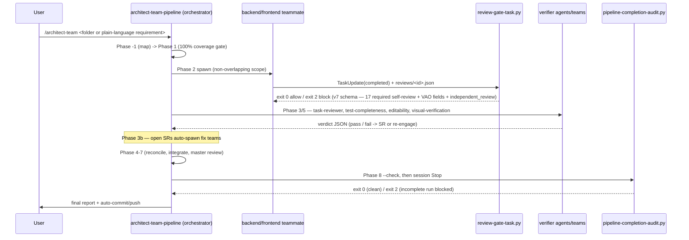

# Codebase Map

> The `architect-team` Claude Code plugin. **v3.42.1 (2026-07-21) — docs-currency-v3-42-1** (documentation-currency PATCH; docs-only): a full sweep of the 207-doc walked surface — 202 verified current, 4 frozen-feature, exactly ONE updated (`commands/architect-team-setup.md`); zero dead pointers across 500+ citations verified by three independent checkers; independent widened-surface audit PASS with zero findings. Inventory **48 skills / 39 agents / 23 commands**; suite **5891 passing + 16 skipped** across 209 test files (unchanged from v3.42.0). Prior: **v3.42.0 (2026-07-21) — quality-upgrades-v3-42** (twelve self-improvements to CT6's own instruction machinery; NO new skill / agent / command / hook / Layer-3 tool): new `docs/ETHOS.md` (seven operating principles, each with its anti-pattern) compiled into all 39 agents + the 6 pipeline-driving skills via the NEW `scripts/setup/compile_skills.py` marker-fence compiler; a recall data-envelope (`scripts/memory/recall_hygiene.py`) marking every MemPalace-rendered block as data at both render boundaries + an optional allowlist + a budgeted TTL digest cache; generated instruction-surface tooling (`scripts/docs_tooling/` → the freshness-gated `docs/CAPABILITY_INDEX.md` + the `docs/CHANGELOG_RUBRIC.md` version/suite-line gate) plus this map's `## 9. What's intentionally NOT here` non-goals section; opt-in self-removing installer guidance (`scripts/setup/guidance_blocks.py`, the three installers' `--claude-md` flag); and the first opt-in behavioral eval tier (`scripts/evals/` + `tests/evals/`, behind `CT6_EVALS=1`, the default suite key-free — a live 4/4 smoke this release). Inventory **48 skills / 39 agents / 23 commands**; living specs 62 → 68; suite **5891 passing + 16 skipped** across 209 test files (macOS-without-PyYAML basis — 14 PyYAML-gated + 2 archived-coverage-map skips; identical under the default env and `PYTHONUTF8=1`). Prior: **v3.41.1 (2026-07-19) — gateway-activation-drift** (a recorded-consent flag is never ground truth): the `gateway.json.activated` flag is no longer trusted as ground truth for the client-side wiring it merely remembers — `status` names activation drift loudly (summary `activated=False (DRIFTED)` + a dedicated `activation-drift` row + a drifted footer + a first-class `--json` field, with a clean machine's output byte-identical), the install carry-forward VERIFIES `activation_fully_applied` against the SERVED port before trusting the flag and HEALS from the persisted master key (corrupt settings.json aborts first; unhealable emits a FAIL row, never a green carried-forward), and the new `maybe_heal_activation()` in `hooks/sessionstart-run-continuity.py` self-heals at SessionStart behind a TCP liveness guard, never clobbering a user-customized `ANTHROPIC_BASE_URL`. **REQ-004 — the root clobberer was this repo's own test suite**: `tests/test_install_gateway.py::test_uninstall_purge_removes_state_dir` ran a REAL `uninstall` with no `--settings-path`, so every full `pytest` run stripped the env block from the developer's real `~/.claude/settings.json` (a silent no-op on CI, which is why it survived) — the actual cause of BOTH observed drift incidents. Closed in three layers: the leaker now names `--settings-path`; a module-wide autouse `_sandbox_default_settings_path` fixture redirects `_setup.DEFAULT_USER_SETTINGS_PATH` to a per-test sentinel; and a session-scoped `_real_state_tripwire` in `tests/conftest.py` SHA-256-digests the real `settings.json` + `gateway.json` + `gateway.env` and fails the suite LOUDLY on any mutation (verified to actually fire). Inventory **48 skills / 39 agents / 23 commands**; suite **5689 passing + 4 skipped** across 202 test files. Prior: **v3.41.0 (2026-07-18) — glm-secondary-route-fix** (the GLM secondary made real): registry route dialects — each `SECONDARY_PROVIDERS` entry carries the REQUIRED `route_dialect` and the gateway route is derived `<route_dialect>/<model>` (`zai` → `hosted_vllm/glm-5.2`; the hard-coded `openai/` prefix that 404'd every call is gone, `route_model` removed); the role split writes the harness-spawnable `SPAWN_ALIAS_MODEL_ID` `claude-haiku-4-5`, gateway-impersonated to the chosen secondary (disclosed in `gateway.json`/`status`/README; `ct6-secondary` stays served for direct callers); “CONFIRMED live” requires a spawn-alias-MANDATORY `/v1/messages` completion with the serving deployment verified against the registry-derived route via `/model/info` plus an auth-enforcement rung; and the install keeps exactly ONE tree-aware owned instance, judges staleness by served-state route-contradiction, restarts bind-verified through the port-holder stop, and deploys never-dark verify-then-swap with the launcher port guard + masked key log. Inventory **48 skills / 39 agents / 23 commands**; suite **5646 passing + 4 skipped** across 199 test files (+ the pytest-collected replication artifact at `tests/bug-fix-glm-secondary-route-fix/`). Prior: **v3.40.1 (2026-07-17) — context-token-optimization** (instruction-surface token-efficiency PATCH; docs/instruction files only, zero behavior change): CLAUDE.md rewritten 95,221 → 25,331 B (`## Recent releases` bounded to the 3 most recent entries + the CHANGELOG pointer; `What this repo is` + `Stack` rewritten current-state; the Conventions `.mempalace` location corrected to disk truth), the three pipeline `## Dispatch mode` residual digests trimmed to their `common-pipeline-conventions` citations (all pinned anchors retained), two consistency fixes (a data-engineering-exploration Stage 6 CPC citation; the mempalace-integration palace-path sentence), and the new living capability spec `context-surface-efficiency` (59 → 60). Inventory **48 skills / 39 agents / 23 commands**; suite **5542 passing + 4 skipped** across 199 test files (IDENTICAL to v3.40.0). Prior: **v3.40.0 (2026-07-17) — secondary-provider registry** (a selectable secondary API + the provider-neutral alias): the gateway's secondary model slot is selectable — OpenAI Codex (`gpt-5.6-sol`) or Z.ai GLM 5.2 (`glm-5.2`) — via the `SECONDARY_PROVIDERS` registry single-sourced in `scripts/setup/set_default_model.py` (one dict entry per future provider); the choice is asked once (wrapper AskUserQuestion / installer TTY prompt / `--secondary` / `CT6_SECONDARY_PROVIDER`), remembered in `gateway.json` (pre-v3.40 installs grandfathered as openai; `--re-ask-provider` re-opens), and the role split's written id becomes the provider-neutral `ct6-secondary` under policy `secondary-split` (the legacy `codex-5.6-sol` / `codex-split` still read, never written; heal-to-recorded-alias + migration-on-every-config-regenerating-install + provider-switch key retention out of a 3-round adversarial review). Inventory **48 skills / 39 agents / 23 commands**; suite **5542 passing + 4 skipped** across 199 test files. Prior: **v3.39.1 (2026-07-16) — living-docs current-state refresh** (on v3.39.0 — one-call external-LLM setup: runtime split targeting + live /v1/models confirmation + SessionStart self-heal): the living current-state assertions now consistently report the shipped version, inventory, and suite totals — 48 skills / 39 agents / 23 commands; 5494 passing + 4 skipped across 199 test files. Prior: **v3.35.0 (2026-07-14) — Codex 5.6 model role split:** availability-gated — with Codex 5.6 in the harness, `fable` keeps all 18 architecture/control/design agents and `codex-5.6-sol` takes all 21 development/code-checking/testing agents (`scripts/setup/set_default_model.py` `AGENT_ROLES` + `apply_policy` + `--split codex`/`--auto`/policy-state `--check`/`--codex-model`); without it the current operating model stays (uniform fable + the Opus fallback lever). Deploy is ONE flag, managed by setup (`/architect-team:architect-team-setup --codex`, or `CT6_CODEX_56_AVAILABLE=1`; `--no-codex` restores; NO signal leaves the model state untouched; lever failure degrades to a warn row, never gates). Unclassified agents fail safe to fable; availability is an INPUT, never probed; ship state still uniform `model: fable`. Prior: **v3.34.0 (2026-07-13) — informative run notifications:** `scripts/notify/notify.py` `EVENT_TYPES` 6 → 10 — the plan-carrying `run_start` kickoff email (repeatable `--plan-file` embeds proposal/design/tasks in ONE email; 20k-char/file + 8-file caps), the `waiting_on_agents`/`agents_complete` dispatch-wait pair (`--agents` roster: missions when dispatched, outcomes when returned), the final `run_complete`, and universal `--details`/`--progress`/`--next-step` body blocks on every event per the new CPC 'Informative, not just status' content contract — wired into all FOUR pipelines (ux-test-builder previously had ZERO wiring; its `deploy` exclusion documented). Opt-in / best-effort / always-exit-0 / stdlib-only / secrets-via-env preserved verbatim. Prior: **v3.33.0 (2026-07-08) — Claude Design MCP native import:** NEW `claude-design-import` skill + `scripts/claude_design/claude_design_import.py` engine (detect a Claude Design offer via a `claude.ai/design/p/<id>` URL and/or a `claude_design` MCP mention, parse the `?file=`/`Implement:` focus, fetch the whole project through the injected `claude_design` MCP adapter, materialize path-safely, instruct-then-fallback when the MCP is unavailable) wired into the EXISTING `oracle-deriver` `interactive-mockup` path via `intake-and-mapping` + `design-fidelity-mapping` + the 3 design-consuming commands (bodies only). Inventory **48 skills / 39 agents / 23 commands**; tests **5263 passing + 5 skipped** (199 test files). **v3.32.0 (2026-07-06) — Fable 5 default + first-install setup hardening + two SR fixes:** all 39 `agents/*.md` → `model: fable` (Fable 5) with an implemented Opus 4.8 fallback (`services/common/service_config.py::resolve_model` + the new `scripts/setup/set_default_model.py` lever); `scripts/setup/setup.py` first-install hardening (cartographer marketplace provenance `kingbootoshi/cartographer`, npm EACCES `--prefix ~/.local` retry, the PEP-668 `uv`→`pip --user`→`--break-system-packages` ladder + `tiktoken`, `--yes`/`CT6_SETUP_ASSUME_YES` consent); two SR fixes — `hooks/pretool_skill_gate.py` arm-1 worker-session standdown + `<teammate-message>` anchor exclusion (SR-gate-teammate-false-block), `hooks/locks.py` atomic `os.link` publish closing the ~20% multi-winner race (SR-locks-flake). Inventory **47 skills / 39 agents / 23 commands / 7 enforcement hook scripts / 8 wired events / 20 Layer-3 tools**; tests **5212 passing + 5 skipped** (198 test files). **v3.31.0 (2026-07-03) — instruction-compliance standard:** a written rubric (`docs/INSTRUCTION_COMPLIANCE_RUBRIC.md`) + a deterministic lint (`scripts/compliance/instruction_compliance.py`) + an ENFORCED zero-findings suite gate (`tests/test_instruction_compliance.py`, 199 cases) over every AI-facing instruction surface (skills / agents / commands / `CLAUDE.md` / the 2 maps — 112 files); 17 files remediated in place (6 skills / 9 agents / 2 commands, incl. 7 over-cap descriptions rewritten to ≤ 1024); REQ-004 named no text-unenforceable gap → NO new hook; suite 4851 → 5159 passing + 5 skipped (196 files); counts unchanged 47 / 39 / 23. **v3.30.0 (2026-07-03) — run continuity (autonomous continuation + sticky resume-via-Skill):** NEW `hooks/run_continuity.py` (the `active-run.json` lifecycle marker `active`/`complete`/`stood-down` + the progress fingerprint + engagement/teammate transcript analysis + the `--status`/`--engage`/`--set`/`--mark-complete`/`--stand-down` CLI; kill-switch `CT6_RUN_CONTINUITY_DISABLED`) + NEW `hooks/sessionstart-run-continuity.py` (the FIRST `SessionStart` wiring — the resume directive on startup/resume/clear/compact); `pretool_skill_gate.py` gains the sticky run arm (an ACTIVE marker => build/dispatch tools require the pipeline Skill re-engaged) + the `PostToolUse(Skill)` engagement recorder; `pipeline-completion-audit.py` gains the Stop-hook continuation guard (an active marker blocks a clean-worklist Stop; engaged sessions get bounded no-progress persistence + auto-escalation). Inventory **47 skills / 39 agents / 23 commands / 7 enforcement hook scripts / 8 wired events / 20 Layer-3 tools**; tests **5212 passing + 5 skipped** (198 test files, current). The full v3.15.1 → v3.32.0 per-release cascade lives in the frontmatter `note:` ledger. Prior: **v3.8.0 (2026-06-09) — unbounded solving + Code & Data Lineage Graph (CDLG) foundation:** all run / iteration limits removed (the dev loop loops until success; the `pipeline-completion-audit` Stop hook is now a non-halting worklist) + the deterministic CDLG core lands — NEW `hooks/lineage_graph.py` (graph schema + `func://`/`asset://` IDs + runtime-witness reconciliation + freshness + cost), NEW `hooks/run_metrics.py` (per-run instrumentation + frozen-bug benchmark), NEW skills `endpoint-trace-mapping` + `data-lineage-mapping`, NEW agent `endpoint-tracer`, NEW `hooks/locks.py::cdlg_overlap` (shared-hot-callee detection), + `scripts/setup/worktree_lifecycle.py` opt-in squash-merge detection + task-aware heuristic. Honest boundary: P1 live polyglot call-graph extraction is the agent's runtime job, NOT claimed proven (kill-gated); the deterministic pieces are real + unit-tested. Inventory (v3.8.0 era) **41 skills / 37 agents / 20 commands**; tests **4415 passing + 5 skipped** (as of v3.13.2 — the phenotype subsystem now seeds **4** phenotypes: `user-management`, `config-management`, `ai-management`, `code-wiki`). **v3.9.2 (2026-06-10)** wires a deterministic `openspec validate --all --strict` gate into the master-review Stop hook (`hooks/pipeline-completion-audit.py::_audit_openspec_validation`, fired once a `master-review/audit-*.json` verdict exists; blocks the commit on any invalid change), and **v3.9.1** fixed a VAO review-evidence operator-precedence bug + archived 5 orphaned openspec change folders. **v3.1.0 (2026-06-06) — rule-source consolidation + Windows test portability:** NEW `hooks/shared_rule_constants.py` is the single CODE source of truth for `FORBIDDEN_GIT_OPERATIONS` / `TEST_FAILURE_ORIGINS` / `PARITY_VERBS` / `ACTION_KIND_VALUES` (imported by `hooks/vao_tools.py` + `hooks/pipeline-completion-audit.py`); NEW `scripts/setup/agent_boilerplate_blocks.py` + `scripts/setup/sync_agent_boilerplate.py` single-source the 3 byte-identical agent blocks (`## Forbidden git operations` / `## Checkpoint discipline` / `## Operating context`) with a `tests/test_agent_boilerplate_sync.py` drift guard; encoding + `_find_workspace` + `_in_progress_is_fresh` portability fixes make the full suite green under both cp1252 and `PYTHONUTF8=1` (3419 passed + 5 skipped). Additive, zero behavior change. _NOTE: the per-version inventory headers + tables in the sections below were last fully refreshed at v2.8.0 (29 skills / 30 agents / 14 commands) and predate v3.0.0–v3.8.0 — the frontmatter `note:` field is the authoritative running ledger for every release after v2.8.0. The v3.8.0 additions (2 skills, 1 agent, 2 hook modules, `cdlg_overlap`) are documented in §4 below._
>
> _(Historical refresh, v2.8.0, 2026-06-01T18:00 — No standing-red discipline; v2.7.0 pattern propagation / v2.6.0 live-data wiring / v2.5.0 in-flight clarification / v2.4.0 external-state assertion refreshes earlier the same day.)_

## 1. System Overview

The `architect-team` Claude Code plugin (current: v3.56.0) is a spec-to-production multi-agent coding pipeline. It accepts EITHER a requirements folder (OpenSpec, Superpowers, or plain markdown) OR a plain-language requirement typed directly as prose (v0.9.17), and drives it end-to-end through a Phase −2 → 8 sequence: **Phase −2** (Triage & Routing, v0.9.22 — the `bug-classifier` agent dispatches the requirement as `bug` / `feature` / `data-eng` / `mixed` / `unclear` (the fifth `data-eng` kind added in v3.50.0 routes to the `data-eng-pipeline` sibling lane); pure-bug routes to the sibling `bug-fix-pipeline` skill, pure-feature continues to the existing flow, `mixed` spawns BOTH in parallel with a `triage_done` recursion-prevention flag, `unclear` emits a structured question), intake & mapping (Phase −1, with the v0.9.21 sub-section D producing per-frontend `INTERACTION_INTUITION_MAP.md` and firing a bulk-verify gate), detection & normalization (Phase 0), the 100%-coverage planning-validation gate (Phase 1), parallel team decomposition & spawn (Phase 2), hook-enforced per-team review gates (Phase 3), continuous solution-requirement intake (Phase 3b), reconciliation (Phase 4), cross-layer integration (Phase 5), the outer task-group loop (Phase 6), master review (Phase 7), and the final report + auto-commit (Phase 8). The v0.9.20 `## Default mode of operation` rule (gates are opt-in for *process* gates) and the v0.9.21 *domain-gate* carve-out coexist in the same section. **v0.9.23 promoted the Phase 8 documentation-currency update step from "orchestrator performs the updates" to a dedicated `doc-updater` agent** (fable, bounded `Write` only to the inventory paths, NO `Edit`) — wired into BOTH the main pipeline Phase 8 AND the bug-fix-pipeline Phase B8, so doc currency is structurally automatic for both feature work and bug fixes.

**v0.9.22 ships a sibling `bug-fix-pipeline` skill** with phases B−1 → B8 — replicate-first (Playwright for frontend / backend script for backend / ambiguity-escalation when unclear); reproduction-is-the-regression-test (frontend bugs also author a backend diagnostic); generalized-fix (the `system-architect` Bug-Fix Generalization Audit mode rejects symptom patches unless explicitly authorized); QA-replay-against-live-dev (the `qa-replayer` agent re-runs the reproduction artifacts against the deployed dev fix; pass criterion is symptom-gone-end-to-end); live-dev-environment-by-default (production is an opt-in escalation). Reached via `/architect-team:bug-fix` (explicit) OR the main pipeline's Phase −2 triage. **At Phase B8 the bug-fix pipeline runs the same documentation-currency gate as the main pipeline** (v0.9.23 dispatch parity).

As of **v3.56.0** the plugin ships **53 skills + the v2.3.0 phenotype subsystem (now FOUR seeded phenotypes: `user-management`, `config-management`, `ai-management`, `code-wiki`), 39 named agent definitions, 25 slash commands, 7 enforcement hook scripts (across 8 wired hook events, incl. the v3.30.0 `SessionStart` + `PostToolUse(Skill)` wirings) + the `hooks/vao_tools.py` Layer-3 verification module (22 CLI tools; v3.47.0 adds `verify-check-can-fail`, v3.55.0 adds `verify-frontend-e2e-loop-exit`) + the `hooks/skill_invocation_audit.py` Layer-6 Stop-hook auditor + the v3.8.0 `hooks/lineage_graph.py` CDLG core + `hooks/run_metrics.py` instrumentation** (plus a shared schema module + the v1.0.0 `hooks/locks.py` cross-session lock layer — extended in v3.8.0 with `cdlg_overlap` — + the `hooks/override_markers.py` helper, + the v3.30.0 `hooks/run_continuity.py` substrate + the v3.56.0 `hooks/open_work.py` open-work substrate behind the turn-boundary completion lock), **15 setup/support scripts** (`setup.py` (v3.32.0 first-install hardening) + `install_mempalace.py` + `install_librarian.py` (v3.29.0) + `install_gateway.py` (v3.36.0 — the external-LLM gateway installer) + `install_knowledge_server.py` (v3.49.0 — the knowledge-server installer + CLI behind `/architect-team:knowledge-install`: provisions `~/.architect-team/knowledge/`, PRINTS the portable `server.py --repo-root <repo>` MCP registration, and confirms serving only after a real `tools/call` round trip) installers, `scripts/notify/notify.py` email notifier from v0.9.18, v1.0.0's `scripts/setup/teams_mode.py` mode-detection helper extended in v1.5.0 with `format_dispatch_banner()`, v1.1.0's `scripts/setup/worktree_paths.py` worktree-aware state-resolution helper, **v1.2.0+v1.3.0's `scripts/setup/worktree_lifecycle.py` worktree-lifecycle helper**, **v1.8.0's `scripts/setup/agent_resume.py` resume + checkpoint helper**, **v3.1.0's `scripts/setup/agent_boilerplate_blocks.py` + `sync_agent_boilerplate.py` canonical-boilerplate pair**, **v3.42.0's `scripts/setup/compile_skills.py` + `guidance_blocks.py`**, and **v3.32.0's `scripts/setup/set_default_model.py` agent-model lever** — the deterministic `--model fable|opus|sonnet|haiku` uniform frontmatter rewrite that is also the implemented Opus fallback for a harness predating the `fable` alias, plus the v3.35.0 availability-gated Codex 5.6 role split: `AGENT_ROLES` classifies all 39 agents, `--split codex` / the tri-state `--auto` on `CT6_CODEX_56_AVAILABLE` put the 21 development/code-checking/testing agents on the secondary alias while the 18 architecture/control/design agents stay on `fable`; v3.40.0 — the split writes the provider-neutral `ct6-secondary` under policy `secondary-split` (legacy `codex-5.6-sol` / `codex-split` still read), `--split secondary` canonical, backed by the `SECONDARY_PROVIDERS` registry — OpenAI Codex `gpt-5.6-sol` or Z.ai GLM 5.2 `glm-5.2`; v3.41.0 — the registry entries carry the REQUIRED `route_dialect` (the gateway route is derived `<route_dialect>/<model>`; `route_model` removed) and the split's written frontmatter id becomes the harness-spawnable spawn alias `claude-haiku-4-5`, gateway-impersonated to the chosen secondary, disclosed), the agent model policy at the v3.43.0 delivery-adversarial split (the 12 delivery + adversarial agents on `model: opus`, the 27 planning / validation / review agents on `model: fable`), and **7024 pytest self-tests + 6 skipped, 0 failed** (Windows-measured basis; see the Tests-section environment note) across 239 top-level test files that validate every structural artifact and guard against cross-component drift. Earlier inventory (when this map was first synthesized at v1.2.0): 26 skills, 27 agents, 12 commands, 1744 tests. **v1.3.0 makes auto-cleanup of merged worktrees the default for every `/architect-team` family invocation** — `/architect-team`, `/architect-team:bug-fix`, and `/architect-team:mini` each fire `cleanup_merged_worktrees()` as their FIRST action (before argument parsing, before refinement, before the v1.2.0 auto-worktree creation). Trigger 1 sweeps merged-and-forgotten worktrees from prior runs at the start of each new run; trigger 2 fires at the end of mini Phase M7 after the auto-merge to main and removes the mini's own worktree. The `exclude_current=True` safeguard means the cwd is never auto-removed (even on re-entry from a merged-branch worktree). The new `/architect-team:cleanup-worktrees` command (12th) exposes the same helper for on-demand invocation with `--dry-run` and `--against <ref>` flags. Merged-branch detection uses `git merge-base --is-ancestor`; squash-merged branches are NOT auto-detected. Best-effort: cleanup failures NEVER block the new run. **v1.2.0 makes auto-worktree creation the default for every `/architect-team` family invocation** — `/architect-team`, `/architect-team:bug-fix`, and `/architect-team:mini` auto-create a fresh worktree at `<parent-of-repo>/<repo-name>-<slug>/` on branch `architect-team/<slug>` before invoking the pipeline skill; the user's main checkout stays on whatever branch they were on; each run is filesystem-isolated; concurrent runs work without any manual `git worktree add` setup. Re-entry detection (`current_worktree_is_run()`) prevents nested worktrees; the `--no-worktree` flag reverts to v1.1.0 single-tree behavior verbatim; cleanup is NOW automatic in v1.3.0 (the v1.2.0 manual recommendation at Phase 8 / B8 / M7 success still appears, but the next run sweeps merged worktrees without user action). **v1.1.0 closes the cross-session coordination gap for git-worktree-based parallel runs** via a 3-layer model: filesystem isolation via git worktrees, architectural coordination via the v1.0.0 lock layer resolved to the main worktree, context sharing via MemPalace resolved to the main worktree. The `scripts/setup/worktree_paths.py` helper exposes `shared_state_dir()` / `run_state_dir()` / `is_worktree()` — used by the lock layer's default resolution and (per skill docs) by the MemPalace integration's palace-path resolution. Single-session users (no worktrees, OR with `--no-worktree`) see ZERO behavior change because both resolvers degenerate to `cwd / '.architect-team'` in non-worktree clones. **v1.0.0 makes Claude Code's experimental Agent Teams primitive the default dispatch mode** — long-lived named teammates with their own 1M context windows, a shared task list, direct `SendMessage`, and a Lead that owns coordination. Teams mode engages when `CLAUDE_CODE_EXPERIMENTAL_AGENT_TEAMS=1` (env or `~/.claude/settings.json`) AND Claude Code ≥ 2.1.32 AND `--no-teams` was not passed; otherwise the pipeline falls back to subagents mode (the v0.10.0 behavior, unchanged). The `hooks/locks.py` primitive lets two concurrent `/architect-team` invocations in separate Claude Code sessions claim disjoint file scopes and run truly parallel — overlapping scopes queue based on a path-glob intersection check (4h TTL stale detection by default). The two evidence hooks now handle both `PostToolUse(TaskUpdate)` / `SubagentStop` AND the teams-mode `TaskCompleted` / `TeammateIdle` triggers, dispatching internally to the same enforcement code path. Its enforcement is layered: Python hooks gate teammate task-completion, teammate idle, and the orchestrator's terminal state; independent verifier agents and teams re-check test-completeness, editability, interactive-element-and-page genuineness, visual fidelity, and (v0.9.23) documentation currency against reality; and the discipline skills are pressure-written to resist rationalization. A run optionally emits per-project email notifications (v0.9.18) when the target project supplies a `.architect-team-notify.json`.

## 2. Architecture Diagram


```mermaid
graph TB
    subgraph "Entry points (25 commands)"
        CMD_AT["/architect-team"]
        CMD_BUG["/architect-team:bug-fix"]
        CMD_UX["/architect-team:ux-test"]
        CMD_REFINE["/architect-team:refine-prompt"]
        CMD_SETUP["/architect-team:architect-team-setup"]
        CMD_VQA["/architect-team:visual-qa"]
        CMD_MEM["/architect-team:memory"]
        CMD_MEMINST["/architect-team:mempalace-install"]
        CMD_EDIT["/architect-team:editability-audit"]
        CMD_CLEAN["/architect-team:cleanup-worktrees"]
        CMD_OPT["/architect-team:optimize-structure (v3.11.0)"]
    end

    subgraph "Orchestrator"
        SK_PIPELINE["skill: architect-team-pipeline (Phase -2 -> 8)"]
        SK_BUGFIX["skill: bug-fix-pipeline (Phase B-1 -> B8)"]
        SK_UXTEST["skill: ux-test-builder (Phase U0 -> U9)"]
    end

    subgraph "Skills (53)"
        SK_INTAKE["intake-and-mapping"]
        SK_PLAN["coverage-mapping / reuse-first-design"]
        SK_MAP["frontend-route-mapping / design-fidelity-mapping"]
        SK_TEST["playwright-user-flows / dev-api-integration-testing"]
        SK_TEAM["team-spawning-and-review-gates"]
        SK_RCA["root-cause-test-failures / expensive-verification-debugging"]
        SK_DRT["diagnostic-research-team"]
        SK_VFR["visual-fidelity-reconciliation / visual-verification-team"]
        SK_EDIT["editability-completeness / interaction-completeness"]
        SK_DVD["dynamic-value-discovery / interaction-intuition"]
        SK_MEMP["mempalace-integration"]
        SK_README["readme-styling / documentation-currency"]
        SK_REFINE["proposal-refiner"]
        SK_EMAIL["email-testing"]
        SK_STRUCT["structure-optimization (S0->S8, v3.11.0)"]
    end

    subgraph "Agents (39)"
        AG_IMPL["frontend / backend (fable implementers)"]
        AG_FLOW["reconciler / integration"]
        AG_MAP["codebase-map-reviewer x3 / route-mapper / integration-explorer x3 / master-synthesizer / interaction-intuiter"]
        AG_ARCH["system-architect (8 audit modes)"]
        AG_VERIF["task-reviewer / test-completeness-verifier / editability-reviewer x3 / interaction-reviewer x3 / diagnostic-researcher x3"]
        AG_VIS["visual-capture xN / visual-analyzer xN"]
        AG_BUG["bug-classifier / bug-replicator / qa-replayer / fix-sensibility-checker"]
        AG_UX["flow-explorer x3 / flow-executor x3"]
        AG_DOC["doc-updater / prompt-refiner / scaffold-agent"]
        AG_STRUCT["structure-analyst x3 / reference-tracer xN / structure-adversary x3 (v3.11.0)"]
    end

    subgraph "Hooks (7 scripts + shared modules)"
        H_SKILLGATE["PreToolUse(*) -> pretool_skill_gate.py (v3.15.0 + v3.30.0 sticky run arm)"]
        H_OVERRIDE["PreToolUse(Edit/Write/NotebookEdit) -> pretool_unilateral_override_guard.py"]
        H_GATE["PostToolUse(TaskUpdate) / TaskCompleted -> review-gate-task.py"]
        H_IDLE["SubagentStop / TeammateIdle -> teammate-idle-check.py"]
        H_STOP["Stop -> pipeline-completion-audit.py (+ v3.30.0 continuation guard)"]
        H_COMPACT["PreCompact -> precompact-closeout.py (v3.18.0)"]
        H_SESS["SessionStart -> sessionstart-run-continuity.py (v3.30.0)"]
        H_SCHEMA["review_evidence_schema.py / run_continuity.py / open_work.py (shared modules)"]
    end

    subgraph "External"
        EXT["superpowers / cartographer / ralph-loop / openspec CLI / pytest+httpx / Playwright+chromium / MemPalace (optional) / Gmail SMTP + SendGrid API (opt-in notifier)"]
    end

    CMD_AT --> SK_PIPELINE
    CMD_BUG --> SK_BUGFIX
    CMD_UX --> SK_UXTEST
    CMD_REFINE --> SK_REFINE
    CMD_OPT --> SK_STRUCT
    SK_STRUCT --> AG_STRUCT & AG_ARCH
    SK_PIPELINE --> SK_INTAKE & SK_PLAN & SK_TEAM & SK_RCA & SK_DRT & SK_VFR & SK_EDIT & SK_DVD & SK_MEMP & SK_EMAIL
    SK_INTAKE --> AG_MAP
    SK_PIPELINE --> AG_IMPL & AG_FLOW & AG_ARCH & AG_VERIF & AG_VIS & AG_DOC
    SK_BUGFIX --> AG_BUG & AG_ARCH
    SK_UXTEST --> AG_UX
    AG_IMPL --> H_GATE & H_IDLE
    SK_PIPELINE --> H_STOP
    H_GATE --> H_SCHEMA
    H_IDLE --> H_SCHEMA
    SK_PIPELINE --> EXT
```

## 3. Directory Structure

```
claude_skill_lib/
├── .claude/                 # OpenSpec-installed workspace commands + skills (opsx/* commands + openspec-* skills; tracked)
├── .claude-plugin/          # Plugin identity: plugin.json + marketplace.json (v0.9.19)
├── agents/                  # 39 named subagent definitions (.md with frontmatter)
├── commands/                # 25 slash-command bodies (.md with frontmatter)
├── hooks/                   # hooks.json wiring + 7 enforcement scripts + shared modules + lock-layer module
│   ├── hooks.json           #   wires PreToolUse[*] (skill-gate, v3.15.0), PreToolUse(Edit/Write/NotebookEdit), PostToolUse(TaskUpdate), SubagentStop, Stop, TaskCompleted (v1.0.0), TeammateIdle (v1.0.0), PreCompact (v3.18.0 closeout), SessionStart (v3.30.0 run-continuity resume directive), PostToolUse(Skill) (v3.30.0 engagement recorder -> pretool_skill_gate.py) — detect-once command strings (v3.9.3)
│   ├── review_evidence_schema.py   # shared single-source-of-truth evidence schema (v0.9.9) + _detect_trigger_mode (v1.0.0); v3.47.0 — OPTIONAL_VAO_FIELDS x4 (adds check_integrity_review) + normalize_task_id + isinstance guards
│   ├── vao/                 #   the 23 Layer-3 verification tools split per discipline family across 16 modules (v3.10.0 R2; v3.47.0 adds check_integrity.py + the deferral_b.py / mention_context.py claims-citation splits; v3.55.0 adds frontend_e2e.py — verify-frontend-e2e-loop-exit; v3.59.0 adds claim_binding.py — verify-claim-instrument-binding)
│   ├── vao_tools.py         #   the facade over hooks/vao/ (byte-identical CLI)
│   ├── shared_util.py       #   load_json / _utc_now_iso / unified JSONL reader (v3.10.0 R1)
│   ├── frontend_impact.py   #   (v3.44.0) canonical frontend-file extensions + detect_frontend_impact (either-signal: frontend files OR a changed backend endpoint consumed by a frontend route); feeds the review-gate's conditionally-required frontend_impact_e2e_review
│   ├── deploy_config.py     #   (v3.44.0) fail-safe reader for .architect-team-deploy.json (the human-authored dev→test→prod opt-in); once it exists the override guard blocks any agent edit — immutable to agents
│   ├── closeout_check.py    #   deterministic closeout staleness engine (v3.18.0)
│   ├── open_work.py        #   (v3.56.0) the completion-lock open-work substrate — reads the HARNESS task list (~/.claude/tasks/session-<first-8>/<id>.json; unreadable files returned as DATA, not raised) + the transcript-DERIVED accumulating ask-ledger (.architect-team/ask-ledger.json) + classify_turn_output + teammate owner-scoping -> evaluate_completion_lock; 4 kill-switches; operator list/resolve CLI; NOT a wired hook
│   ├── run_continuity.py    #   run-continuity substrate (v3.30.0): active-run.json lifecycle marker + progress fingerprint + engagement/teammate transcript analysis + CLI (--status / --engage [--session-id] / --set / --mark-complete / --stand-down; v3.47.0 records the engaging session id)
│   ├── spec_fingerprint.py  #   (v3.47.0) SHA-256 spec fingerprint of the active openspec change dir (spec_files / compute_spec_fingerprint / fingerprints_match) — stamped into teammate manifests at dispatch; audited by _audit_spec_currency
│   ├── locks.py             # cross-session lock layer (v1.0.0) — acquire_lock / release_lock / detect_stale / globs_intersect
│   ├── override_markers.py  # marker constants + detection helpers for the unilateral-override guard
│   ├── pretool_unilateral_override_guard.py # PreToolUse(Edit/Write/NotebookEdit) unilateral-override guard
│   ├── pretool_skill_gate.py        # PreToolUse[*] real-time skill-invocation hard-gate (v3.15.0) + the v3.30.0 sticky run arm (active-run marker => build/dispatch tools require the pipeline Skill re-engaged) + deterministic marker engagement on Skill(run-driving) via the PostToolUse(Skill) wiring (trigger split; a denied call never engages); reuses skill_invocation_audit detection
│   ├── precompact-closeout.py       # PreCompact closeout doc-currency reminder (v3.18.0); runs closeout_check.py
│   ├── sessionstart-run-continuity.py # SessionStart (startup/resume/clear/compact) resume directive (v3.30.0): an ACTIVE active-run.json injects "re-invoke Skill(<skill>) first, then resume the run"
│   ├── review-gate-task.py         # PostToolUse(TaskUpdate) OR TaskCompleted gate (v1.0.0 trigger split; v3.47.0 adds the active-run unmanifested-task completion gate — kill-switch CT6_TASK_GATE_DISABLED)
│   ├── teammate-idle-check.py      # SubagentStop OR TeammateIdle gate (v1.0.0 trigger split)
│   └── pipeline-completion-audit.py # Stop gate + standalone --check pre-commit gate + the v3.30.0 continuation guard (active-run lifecycle check + bounded no-progress persistence for engaged sessions + auto-escalation) + the three v3.47.0 evidence-integrity arms (_audit_check_integrity / _audit_declared_gates / _audit_spec_currency) + the v3.55.0 _audit_frontend_e2e frontend-E2E loop-exit arm
├── scripts/
│   ├── setup/               # setup.py + install_mempalace.py + install_librarian.py (v3.29.0 — the Librarian installer + CLI) + install_gateway.py (v3.36.0 — the external-LLM gateway installer: LiteLLM proxy + api-key/subscription auth modes; v3.37.0 — executes the user-level boot registration itself, --no-register opt-out; v3.39.0 — runtime split targeting + the live /v1/models confirmation; v3.40.0 — the selectable secondary provider (openai → gpt-5.6-sol | zai → glm-5.2) behind the provider-neutral ct6-secondary alias, choice remembered in gateway.json + grandfathered + the legacy-alias migration; v3.41.0 — registry-derived route dialects (zai → hosted_vllm/glm-5.2), the DISCLOSED spawn-alias impersonation route claude-haiku-4-5, the spawn-mandatory upstream-verified auth-enforced /v1/messages confirm, served-state route-contradiction staleness, exactly-one tree-aware instances, the bind-verified port-holder restart, the never-dark verify-then-swap deploy + the launcher port guard) + set_default_model.py (v3.32.0/v3.35.0 — the uniform model lever + the role split; v3.40.0 — the SECONDARY_PROVIDERS registry + the provider-neutral ct6-secondary alias / secondary-split policy, --split secondary canonical; v3.41.0 — route_dialect REQUIRED in the registry (route derived <route_dialect>/<model>, route_model removed) + the split writes the spawn alias SPAWN_ALIAS_MODEL_ID claude-haiku-4-5) + (v3.41.1) activation-drift integrity: activation_fully_applied (BASE_URL equal to the gateway URL AND the auth token present, so token-only half-drift counts) drives BOTH the status drift report and the carry-forward verification; _cmd_status computes report.activation_drift and names it on the summary + a dedicated activation-drift row + the footer + a first-class --json field, observing only (status never writes); the carry-forward branch verifies against args.port (the port THIS install serves, never a stale prior-state port), aborts on a corrupt settings.json via _settings_corrupt (only an explicit --activate may overwrite one), heals via apply_claude_env from the served port + the PERSISTED master key in gateway.env, and emits a FAIL row when the key cannot be resolved rather than a green carried-forward) + teams_mode.py (v1.0.0) + worktree_paths.py (v1.1.0) + worktree_lifecycle.py (v1.2.0) + agent_resume.py (v1.8.0) + agent_boilerplate_blocks.py + sync_agent_boilerplate.py (v3.1.0) + install_knowledge_server.py (v3.49.0 — the knowledge-server installer on the librarian template: provisions ~/.architect-team/knowledge/, PRINTS the portable server.py --repo-root MCP registration, confirms serving only after a real tools/call round trip — never "deployed") + compile_skills.py + guidance_blocks.py (v3.42.0 — the skills-tier boilerplate compiler + the opt-in --claude-md installer-guidance helper)
│   ├── notify/              # notify.py — best-effort per-project email notifier (v0.9.18)
│   ├── phenotypes/          # phenotypes.py — the deterministic phenotype engine (v2.3.0)
│   ├── data_dictionary/     # data_dictionary.py (Data Dictionary engine, v3.17.0; v3.53.0 adds the injected UsageStatsSource usage block + the generate-review/apply-review round-trip) + annotations.py (per-user annotation store, corroborate-on-ingest, v3.52.0) + jsonld_export.py (the JSON-LD emitter — schema.org/DCAT + PROV-O, v3.54.0)
│   ├── claude_md/           # claude_md_efficiency.py — the deterministic Claude.md-efficiency engine (v3.19.0)
│   ├── mcp_design/          # output_contract.py — the deterministic MCP output-contract engine (v3.20.0)
│   ├── helpdesk/            # logit.py — the deterministic Logit / Helpdesk triage-submission engine (v3.21.0)
│   ├── token_compression/   # caveman.py — the deterministic "caveman" token-compression engine (v3.22.0)
│   ├── claude_design/       # claude_design_import.py — the deterministic Claude Design import engine (v3.33.0)
│   ├── compliance/          # instruction_compliance.py — the deterministic instruction-compliance lint engine (v3.31.0; contract = docs/INSTRUCTION_COMPLIANCE_RUBRIC.md)
│   ├── memory/              # recall_hygiene.py — the deterministic recall-hygiene engine (the do-not-interpret data envelope + allowlist + TTL digest cache, v3.42.0)
│   ├── docs_tooling/        # capability_index.py (generates docs/CAPABILITY_INDEX.md) + changelog_check.py (the docs/CHANGELOG_RUBRIC.md gate) (v3.42.0)
│   ├── evals/               # the opt-in behavioral eval tier — runner.py / judge.py / collector.py / budget.py (behind CT6_EVALS=1, v3.42.0)
│   ├── delivery/            # delivery_manifest.py — the deterministic delivery-manifest engine (v3.46.0; v3.47.0 adds the ERROR-severity citation findings)
│   ├── contract/            # interface_contract.py — the deterministic interface-contract engine (v3.48.0, hardened v3.48.1 — fail-closed ledger + the declared-gates wiring)
│   └── sql_mining/          # sql_mining.py — the deterministic T-SQL shape-mining engine (v3.51.0; NO sqlglot per D6; parse-coverage-honest, corroboration-gated)
├── skills/                  # 53 skill directories, each containing SKILL.md
├── services/                # CT6-6 service/server tier (v3.23.0+, separable per REPO-3; the CT6-6 program is COMPLETE as of v3.28.0); common/ = Ed25519 SEC handshake + BG runtime + same-Anthropic-key config; librarian/ = topic-research curation (v3.24.0; sqlite reference index + LIB-10 conceptual search) + daemon.py (v3.29.0 — the daemon entry point + UrlSource urllib fetcher; now INSTALLABLE via /architect-team:librarian-install + scripts/setup/install_librarian.py); triage/ = evaluator + tally/quarantine + Ed25519-handshake submission server (v3.25.0; EVAL-1…17 + SEC); session_review/ = session-level review + summary push + unsolved-issue capture (v3.26.0; SR-1…3); seeded_mempalace/ = authenticated seeded-MemPalace download + phenotype catalog (v3.27.0; SMP-1…5); knowledge_server/ = the standing repo-knowledge MCP server (v3.49.0; JSON-RPC 2.0 over stdio, no mcp SDK, no LLM — DictionarySource + MapSource over the run-produced sidecars with freshness on EVERY response; installable via /architect-team:knowledge-install); separation.py + SEPARATION_MANIFEST.md = the REPO-1…4 separation manifest + the import-clean separability invariant (v3.28.0) (stdlib-only core; DESIGN + tests, NOT live-deployed — the v3.29.0 Librarian install is opt-in + a self-managed local daemon)
├── openspec/                # OpenSpec workspace (tracked); config.yaml + changes/ (archive/ nested inside) + specs/
├── docs/
│   ├── CODEBASE_MAP.md      # this file
│   ├── INTEGRATION_MAP.md   # external-integration synthesis (single-codebase degenerate)
│   ├── INSTRUCTION_COMPLIANCE_RUBRIC.md  # the v3.31.0 instruction-compliance standard (contract for scripts/compliance/instruction_compliance.py)
│   ├── LINEAGE_UPGRADE_REQUIREMENTS.md  # the v3.8.0 CDLG requirements source (REQ-*)
│   ├── RELEASE_HISTORY.md   # the complete per-release narrative (v3.47.1 — moved out of README.md byte-identical; the README keeps the current spotlight + a pointer, pinned by tests/test_release_history.py)
│   ├── proposals/           # design proposals (incl. DATA_ENG_LANE_AND_CROSS_POLLINATION.md — the data-eng lane + cross-pollination blueprint whose §7.1 Run A the v3.49.0 knowledge server executes; and DEBUGGING_MULTI_BUG_ENHANCEMENT.md — the v3.55.3-recorded debugging-skill review + the queued multi-bug orchestration build plan, E1–E9)
│   ├── analysis/            # standing architectural analyses (the deng-toolkit vs CT6 comparison feeding the data-eng proposal)
│   ├── archive/            # archive/INDEX.md — the never-delete registry for docs dispositioned out of the living set (created v3.31.1; honestly-empty flat-docs table at creation)
│   └── superpowers/         # design docs + plans (incl. the v3.11.0 structure-optimization spec + plan)
├── tests/                   # 7024 pytest self-tests + 6 skipped, 0 failed (239 top-level test files + conftest + helpers/ + evals/ + the collected bug-fix-*/ replication dirs; Windows-measured basis — see Tests-section environment note)
├── .scratch/                # working notes (tracked; not part of the installed surface)
├── .architect-team-notify.example.json   # template per-project email-notification config (v0.9.18)
├── CLAUDE.md  CHANGELOG.md  README.md  LICENSE  pytest.ini  .gitignore
```

Runtime state is written under `<workspace>/.architect-team/` (gitignored) and `<workspace>/.mempalace/` (gitignored) — see §6.

## 4. Module Guide

> **Currency note (2026-08-09):** the inventory tables below were authored at v2.8.0 (29 skills / 30 agents / 14 commands / 2635 tests — per this map's intro blockquote). Subsequent v2.9.0 → v3.31.0 disciplines have shipped additional skills, commands, agents, `hooks/` modules, the `services/` server tier, and the v3.31.0 instruction-compliance lint engine (`scripts/compliance/instruction_compliance.py` + `docs/INSTRUCTION_COMPLIANCE_RUBRIC.md`). **As of v3.55.4 the live inventory is 53 skills / 39 agents / 25 commands / 7 enforcement hook scripts + 8 wired events / 22 Layer-3 verification tools / 7024 tests + 6 skipped, 0 failed (239 top-level test files, disk-anchored via `git ls-files 'tests/test_*.py'` — the v3.53.0–v3.55.0 release notes' carried "235" undercounts this basis; Windows-measured — see the Tests-section environment note); the agent model policy is the v3.43.0 delivery-adversarial split (12 `model: opus` / 27 `model: fable`).** **Post-v3.49.0 the data-engineering lane shipped end-to-end (Runs A–F, v3.49.0–v3.54.0) and v3.55.0 added the frontend-E2E loop-exit gate: the `data-eng-pipeline` skill + the 25th command `data-eng` (v3.50.0, Run B), the `warehouse-sql-mining` skill + the `scripts/sql_mining/sql_mining.py` engine (v3.51.0, Run C), the `data-annotations` skill + `scripts/data_dictionary/annotations.py` (v3.52.0, Run D), the usage/review round-trip inside `scripts/data_dictionary/data_dictionary.py` (v3.53.0, Run E), the JSON-LD emitter `scripts/data_dictionary/jsonld_export.py` (v3.54.0, Run F), and the 22nd Layer-3 tool `verify-frontend-e2e-loop-exit` (`hooks/vao/frontend_e2e.py`) + the `_audit_frontend_e2e` completion-audit arm (v3.55.0) — the three post-v3.49.0 skills are rowed below.** **v3.49.0 adds the `services/knowledge_server/` server-tier member (6 modules — the stdlib-only MCP knowledge server over the run-produced sidecars) + `scripts/setup/install_knowledge_server.py` + the 24th command `knowledge-install` + 8 new test files — NO new skill / agent / hook / Layer-3 tool.** **v3.36.0 adds `scripts/setup/install_gateway.py` (the external-LLM gateway installer — LiteLLM proxy, the codex-5.6-sol → OpenAI route, api-key vs subscription auth modes) + the setup.py `--external-llm` wiring + `tests/test_install_gateway.py` (35 offline tests) — NO new skill / agent / command / hook / Layer-3 tool.** **v3.33.0 adds the `claude-design-import` skill (the 48th) + the `scripts/claude_design/claude_design_import.py` engine + `tests/test_claude_design_import.py` (47 offline tests); a Claude Design link is materialized and fed into the EXISTING interactive-mockup oracle path — NO new agent / command / hook / Layer-3 tool.** The v3.11.0 additions explicitly rowed below: skill `structure-optimization`; agents `structure-analyst` / `reference-tracer` / `structure-adversary`; command `optimize-structure`; the `system-architect` eighth audit mode (ninth mode overall, counting the default architectural-recommendation mode) (Restructure Plan Audit). The cascading `note:` field in the frontmatter is the authoritative running ledger for every shipped release after v2.8.0. **Affordance inventory (v2.13.0 discipline): none detected** — this is a no-UI plugin repo; the only `_AFFORDANCE_SIGNATURES` occurrences on disk are the detector's own pattern definitions (`hooks/vao/persona.py`) and the canonical test fixtures, which are signature SOURCES, not affordances of this codebase. The v3.8.0 additions explicitly documented in the tables below: skills `endpoint-trace-mapping` + `data-lineage-mapping`; agent `endpoint-tracer`; hook modules `lineage_graph.py` + `run_metrics.py`; the `cdlg_overlap` function added to `hooks/locks.py`; and the iteration-limit removal in `hooks/pipeline-completion-audit.py`. (Other post-v2.8.0 additions are now each individually rowed / bulleted in their subsections below — the `visual-to-api-design`, `test-prod-safety-classifier`, `test-run-monitor`, `cartographer-team`, `domain-research-team`, `api-design-from-frontend`, `data-engineering-exploration` skills; the `visual-to-api`, `classify-test-prod-safety`, `discipline-status`, `inject`, `monitor-tests` commands; and the `discipline_registry.py`, `inflight_inbox.py`, `shared_rule_constants.py` hook modules — while the `domain-researcher`, `test-run-watcher`, `monitor-synthesizer` agents are disclosed in the Agents note below; all of them also remain tracked in the frontmatter ledger.)

### Skills (53)

> Every one of the **53** skills is rowed below — no skill is disclosed-only. The table is the v2.8.0 snapshot (its original rows) + the v3.8.0 lineage skills (`endpoint-trace-mapping` + `data-lineage-mapping`) + the 10 skills that were previously disclosed only in the ledger / footnotes, now promoted to first-class rows: `common-pipeline-conventions`, `verified-agent-output`, `interactive-mockup-discovery`, `visual-to-api-design`, `test-prod-safety-classifier`, `test-run-monitor`, `cartographer-team`, `domain-research-team`, `api-design-from-frontend`, `data-engineering-exploration` — plus the v3.46.0 `delivery-manifest`, promoted to its first-class row in the v3.47.0 refresh, the v3.52.0 `data-annotations` (rowed at its release), and the v3.48.0 `contract-first-parallelism` + v3.50.0 `data-eng-pipeline` + v3.51.0 `warehouse-sql-mining`, promoted to first-class rows in the v3.55.1 doc-currency sweep (they had been ledger-disclosed only). **Arithmetic: 53 rows + 0 disclosed-not-rowed = 53.**

**v2.1.0 — `interactive-mockup-discovery` joins**: the canonical home of the two-pass mechanism for interactive HTML mockup oracles (Pass 1 = observation via `interaction-observer`; Pass 2 = intent inference via `interaction-intuiter`'s INTENT-INFERENCE mode; Layer 3 = `verify-interactions-honored`). Documents the 7-value `action_kind` vocabulary and the 10-pattern semantic-vs-observed mismatch matrix. v2.0.0 added `verified-agent-output`.

| Skill | Role |
|---|---|
| `phenotypes` | (v2.3.0) Discover/match/emit pre-made generalized deployable architectures (blueprint + scaffold + metadata under `phenotypes/`); proposed reuse-first or via `--phenotype`, never silent. Engine: `scripts/phenotypes/phenotypes.py`. Seeded with `user-management` + `config-management` + `ai-management` + `code-wiki` (v3.13.0; a self-hosted Next.js documentation wiki absorbed from deepwiki-open, LLM-stripped, ingesting `*_MAP.md`). |
| `phenotype-absorption` | (v2.3.0) The absorb playbook — ingest any arbitrary codebase into a new labeled phenotype (analyze → generalize → scaffold → validate → index). Reached via `/architect-team:absorb-phenotype <path> --label <name>`. |
| `architect-team-pipeline` | The orchestrator playbook — Phase −1 → 8. Run-state rules: unbounded solving (loop until success — no iteration ceiling as of v3.8.0; oscillation continues from a different angle rather than aborting), the shared-state concurrency model, the required-input escalation marker. |
| `intake-and-mapping` | Phase −1 codebase discovery + the per-codebase / integration ralph loops. Map-invalidation flag forces re-validation of a wrong-but-fresh map. |
| `reuse-first-design` | The extend > compose > reuse > build-new ladder; the Reuse Decision Log. |
| `frontend-route-mapping` | ROUTE_MAP.md schema + completeness rubric. |
| `design-fidelity-mapping` | Conditional DESIGN_MAP.md (design tokens, asset registry, per-screen specs). `design_baseline` frontmatter; a baseline migration forces a full re-derive. |
| `visual-fidelity-reconciliation` | Strict QA vs DESIGN_MAP. Phase 0 live-app precondition; zero-tolerance; the design-migration "unchanged inverts" rule; verify-against-the-Oracle-not-a-classification. |
| `visual-verification-team` | Independent live-app verification — `visual-capture` → `visual-analyzer` → `system-architect` synthesis. The verdict is measured data, not eyeballed images. |
| `playwright-user-flows` | White-box Playwright methodology; real-backend-by-default for `both`-layer features. |
| `dev-api-integration-testing` | Live-dev-API testing — real DB / queue / cache, side-effect verification. |
| `coverage-mapping` | `coverage-map.json` schema + lifecycle (Phase 1 / 3 / 7 / 8). |
| `team-spawning-and-review-gates` | Teammate manifests; the v7 review-gate evidence schema (17 required fields = 12 base self-review incl. `ui_interaction_review` + the 5 VAO fields `oracle_match_review` / `baseline_clean_review` / `no_fake_data_review` / `adversarial_review` / `skill_invocation_audit`, plus the 4 optional `interactions_honored_review` / `live_verification_review` / `appearance_scope_review` / `check_integrity_review` (v3.47.0), and the independent `task-reviewer` verdict); the independent-review dispatch; the SR schema; **v3.47.0** adds the `spec_fingerprint` manifest field, the `spec-drift` SR origin (direct-dispatch), red-first's three sources, and `## Reading teammate state` (the three knowable states). Source of truth: `hooks/review_evidence_schema.py`. |
| `root-cause-test-failures` | Predict → 3-pass RCA (forward / backward / falsify) → evidence-backed verdict; multiple-simultaneous-causes. |
| `diagnostic-research-team` | 3 `diagnostic-researcher` agents + `system-architect` robustness review before a test-failure fix team spawns. |
| `expensive-verification-debugging` | When a verify cycle is expensive (deploy / rebuild / slow CI), audit the whole failure pathway and batch the fixes. |
| `editability-completeness` | 3 `editability-reviewer` agents enumerate every attribute, classify editability, trace UI→DB; architect robustness review; multi-pass. |
| `interaction-completeness` | The judgment-heavy VERIFICATION gate that `playwright-user-flows` was followed (v0.9.19) — 3 `interaction-reviewer` agents independently re-enumerate every interactive element AND every page/screen/route, classify element wiring + page `live`/`placeholder`/`confirmed-stub`, audit Playwright test authenticity, trace element→endpoint, flag hardcoded-should-be-dynamic values; architect Round-3; bounded multi-pass; gaps → SRs. The sibling of `editability-completeness` at the granularity of controls and pages. |
| `dynamic-value-discovery` | A cross-role discipline (v0.9.19) for telling a genuine static literal from sample data standing in for a dynamic, data-bound value — classify every displayed value `static`/`dynamic` FROM CONTEXT, bind every dynamic one to a named data source, escalate genuine ambiguity. Modeled on `reuse-first-design`; consulted by the architect, the developers, and the evaluator. |
| `mempalace-integration` | Per-workspace MemPalace store — `--wing` mining (rooms are `init`-detected from directory structure, not a `mine` flag), auto-mine on artifact write, search before output. |
| `readme-styling` | The bitmap house style for READMEs — canvas/centering, pipe-table + ASCII-graph alignment, banner / dividers / panels / flowcharts / logic maps, the GitHub-safe + ANSI color model, and the theming engine (6 preset themes + an interactive picker + the `readme-theme` marker). |
| `documentation-currency` | The Phase 8 docs-reflect-the-code gate — the doc inventory (maps + README + CHANGELOG + CLAUDE.md), what "current" means, the orchestrator-updates-then-system-architect-audits flow. |
| `bug-fix-pipeline` | The sibling `Phase B−1 → B8` pipeline — replicate-first, reproduction-is-the-regression-test, generalized-fix, QA-replay-against-live-dev. Reached via `/architect-team:bug-fix` or the main pipeline's Phase −2 triage. (v0.9.22) |
| `interaction-intuition` | Per-frontend codebase intuition map — enumerates every interactive element, intuits each element's action and candidate endpoints, assigns confidence, authors ambiguity questions for low-confidence items. Produces `INTERACTION_INTUITION_MAP.md`. (v0.9.21) |
| `ux-test-builder` | UX test builder pipeline `Phase U0 → U9` — persona + objectives + target site → literal flow → 3 flow-explorer agents propose 10-15 adjacent flows each → distilled → one `.spec.ts` per flow → 3 flow-executor agents run in parallel → consensus → bug routing. Reached via `/architect-team:ux-test`. (v0.9.29) |
| `proposal-refiner` | Conversational pre-pipeline prompt refinement — grades a free-text prompt on 5 axes (clarity, scope, acceptance, grounding, conflict), asks clarifying questions, iterates up to 5 times. Runs BEFORE Phase −2 when input is prose. Reached standalone via `/architect-team:refine-prompt`. (v0.9.33) |
| `email-testing` | Cross-cutting email-testing discipline — 4 phases (E1 detect, E2 Mailpit provision, E3 capture+analyze, E4 link-follow+flow-complete). Consumed by `bug-replicator`, `flow-executor`, `integration` agents. Mailpit by default; template-first analysis; every link tested; mandatory teardown. (v0.9.34) |
| `mini-architect-team-pipeline` | Mini variant orchestrator (Phase M0 → M8) — single architect, single `mini-qa` agent, working branch `mini/<slug>`, auto-merge to main on green; M8 cycle 4 (three red verdicts on the same proposal) writes `.architect-team/mini/<slug>/escalation/` and re-spawns `/architect-team` with that folder as REQ_DIR. Heavyweight review is batched via the `Mini-Run:` trailer + the `/architect-team:mini-review-sweep` command. Reached via `/architect-team:mini`. (v0.10.0) |
| `endpoint-trace-mapping` | **(v3.8.0 — lineage P1)** Per-endpoint internal call-trace mapping that produces the Code & Data Lineage Graph (CDLG). The agent does the live, polyglot, LLM-and-LSP-driven extraction at runtime; the deterministic core (schema + validator, `func://`/`asset://` IDs, runtime-witness reconciliation, freshness, cost ceiling) lives in `hooks/lineage_graph.py`. Two-layer extraction contract + witness-verification (every asserted edge is reconciled against the existing `code-path-witness.json` ground truth via `witness_gate`). Dispatches the `endpoint-tracer` agent. |
| `structure-optimization` | **(v3.11.0)** Codebase-restructure PLANNING pipeline (stages S0-S8): maps via `cartographer-team` (freshness-checked; produced when missing), ×3 `structure-analyst` drafts converge under a deterministic every-file partition check (git ls-files = movement table ∪ stays; zero orphans/duplicates), sharded `reference-tracer` closure (file:line evidence + mandatory search_log) assembled into `movements.json` v1.0, ×3 `structure-adversary` rounds until two consecutive all-clean, `system-architect` Restructure Plan Audit, then `RESTRUCTURE_PLAN.md` + an `openspec-propose`-authored strict-validated change. Plan-only — execution is `/architect-team` driving the produced change. |
| `data-lineage-mapping` | **(v3.8.0 — lineage P3)** Asset-lineage mapping over the CDLG `asset://` nodes (`reads` / `writes` / `modifies` / `originates` edges). Carries an explicit Reuse Decision vs `data-engineering-exploration` (lineage-mapping is the per-asset trace; data-engineering-exploration is the 7-stage data-plane design pipeline). |
| `data-dictionary` | **(v3.17.0 — CT6-6 component 1, DD-1…DD-18)** Self-contextualizing data-dictionary builder: derive the data model from code/docs/direct input, define every field, record provenance (`direct-user-input`/`direct-code-comment`/`inference`/`live-data`) + value-level corroboration against live data. Engine: `scripts/data_dictionary/data_dictionary.py` (SQLite introspect + ~100-row sample + grain/field inference + reference/relational maps + `DATA_DICTIONARY_MAP.md` serializer). Complementary to `data-lineage-mapping` (this defines the FIELDS + provenance; that traces who reads/writes the assets). Sequenced after codebase+integration mapping; honest no-DB path (never fabricates `live-data`). |
| `data-annotations` | **(v3.52.0 — Run D, the data-eng lane's team memory)** A per-user, git-shared annotation store on data objects: `scripts/data_dictionary/annotations.py` manages `docs/data-annotations/<user>.json` (note/quality_flag/deprecation vocab anchored to table/table.field; validate-on-write + atomic; injective username validation). Corroborate-on-ingest PER-FIELD — factual claims route through `data_dictionary.py::corroborate_definition` and a field absent from every source is served `uncorroborated`, never truth (opinions stored as-authored). Gate-integrity: annotation memory INFORMS a per-run gate, never skips/auto-satisfies it. The knowledge server merges annotations at query time (ADDITIVE in `services/knowledge_server/dictionary_source.py`; a no-annotations response is byte-unchanged). Complementary to `data-dictionary` (that defines the fields; this is the team's durable notes on them). |
| `warehouse-sql-mining` | **(v3.51.0 — Run C, the data-eng lane's evidence miner)** T-SQL shape mining over stored-procedure / view TEXT — joins / filters / aggregate-ratio metrics + table read/write relationships — via the vendored stdlib extractor `scripts/sql_mining/sql_mining.py` (NO sqlglot, decision D6). Parse-coverage-honest (`{parsed, skipped, failed}` with reasons; undecodable / malformed land in failed, never dropped, never crash); corroboration-gated (candidates enter at provenance `inference` and pass `corroborate_definition`; relationships emitted as lineage `data_asset`/`reads`/`writes`, existing kinds only). Mines SQL TEXT, not a live warehouse. Feeds the dictionary / lineage maps / `data-engineering-exploration`. |
| `data-eng-pipeline` | **(v3.50.0 — Run B, the data-engineering lane)** The lane orchestrator (phases D−1…D8 on the bug-fix-pipeline structure), reached via `/architect-team:data-eng` / the `--data-eng` flag / the Phase −2 classifier's fifth kind `data-eng`. D0 dispatches `data-engineering-exploration` VERBATIM (the lane is its third caller — compose-not-fork); D1/D2–D6/D8 reuse Phases 1/2–6/8; two knowledge-server-wired disciplines — D−1 warm-catalog-first (query `get_dictionary_status` BEFORE a rebuild; the server informs, the per-run gate decides) + D7 catalog-refresh (rebuild the dictionary → re-index the knowledge server → mine to MemPalace). |
| `closeout` | **(v3.18.0 — CT6-6 component 2, CO-1…CO-3)** Session-end documentation-currency double-check: fires before compaction (the `PreCompact` hook), reviews the changes against the requirement, and updates any stale doc itself rather than flagging it. Engine: `hooks/closeout_check.py` (deterministic staleness signals over the working-tree diff); worker: `agents/closeout-agent`; manual trigger: `/architect-team:closeout`. Reuses `documentation-currency` + the `doc-updater` whole-file pattern; works OUTSIDE a pipeline run (no coverage-map needed). |
| `claude-md-efficiency` | **(v3.19.0 — CT6-6 component 3, CMD-1…CMD-4)** When (and only when) MemPalace is installed, `CLAUDE.md` becomes a thin POINTER (tells the agent where to find things, loaded on demand) not a container, kept very small, with standards→reference-MemPalace + toggleable customizations. Engine: `scripts/claude_md/claude_md_efficiency.py` (pointer-shape + byte-budget assessor + minimal-pointer generator). Reuses `mempalace-integration` (the availability check + the mine/wake-up flow it points INTO). |
| `mcp-output-contract-design` | **(v3.20.0 — CT6-6 component 4, MCP-1…MCP-3)** Best-in-class output standardization for an LLM agent embedded in an application: a closed output contract (JSON Schema) + a forced structured-output mechanism + validation + retry-on-mismatch, so the agent's output is guaranteed consistent to parse. Engine: `scripts/mcp_design/output_contract.py` (`build_output_contract` + `validate_against_contract` + `assess_contract`); worker: `agents/mcp-design-agent`. Outward-facing counterpart to `verified-agent-output` (which verifies CT6's own agents). |
| `helpdesk` | **(v3.21.0 — CT6-6 component 5, HD-1…HD-3)** Logit — the user-run MANUAL counterpart to the automatic issue logging: after a bad session, file a triage report with consent + a privacy level (`full` / `summary` allow-list / `off`); the submission carries the version + `source: manual-helpdesk` so the same triage process consumes it. Engine: `scripts/helpdesk/logit.py` (consent-gated builder + privacy redaction + validator); command: `/architect-team:logit`. Honest boundary — the actual send to the triage server is the server-tier (SEC + EVAL), not in-repo. |
| `token-compression` | **(v3.22.0 — CT6-6 component 6, TC-1…TC-3)** "Caveman" compression of agents' INTERNAL communication to lower token cost, WITHOUT touching external output (hard internal-only boundary). Engine: `scripts/token_compression/caveman.py` (`compress` drops filler + wordy phrases, preserves content/identifiers/numbers/line-structure/code verbatim; `compression_stats` measures the saving). A lossy-of-filler stdlib floor; a heavier ML package (LLMLingua-style) is a documented 3rd-party app-layer option. |
| `claude-design-import` | **(v3.33.0)** Native ingestion of a Claude Design project offered via a LINK (`claude.ai/design/p/<id>` and/or the `claude_design` MCP) instead of a downloaded zip: `detect_claude_design_offer` (both trigger forms + the `?file=` / `Implement:` focus) then `materialize_project` (path-safe; `_safe_relpath` rejects absolute paths + `..`) writes the WHOLE project to `<workspace>/.architect-team/claude-design/<project-id>/`, handed to the EXISTING `oracle-deriver` `interactive-mockup` oracle path (then `interactive-mockup-discovery` then `visual-to-api-design`) — NO new downstream consumer. Engine: `scripts/claude_design/claude_design_import.py` (stdlib, offline; the real MCP fetch is an injected `ClaudeDesignSource` runtime adapter, no tokens persisted; `plan_when_unavailable` = instruct-then-fallback to the zip/local design path). |
| `delivery-manifest` | **(v3.46.0)** The end-of-run bill of sale — at every pipeline close-out (Phase 8 / B8 / M7 / U9, and on demand) produce a stakeholder-readable DELIVERY MANIFEST: the problem in plain speak, validation steps a non-builder can execute EACH with an expected result, and for a feature the location / name / functionality of every new element; a user-provided example document drives vocabulary + layout (`template_source` recorded). Engine: `scripts/delivery/delivery_manifest.py` (`validate_manifest` zero-error gate + placeholder rejection; **v3.47.0** adds the ERROR-severity citation findings `uncited-verified-claim` / `uncited-element-claim` — evidence must NAME an artifact). Embedded into every `run_complete` email via `--plan-file`. |
| `contract-first-parallelism` | **(v3.48.0, hardened v3.48.1)** The architect's mock-first full-stack parallelism protocol (CFP-1…6): settle the inbound-surface CONTRACT first (architect-approved, binding), the backend provisions the endpoint at its REAL path with a contract-conforming provisional payload, and the frontend builds its complete integration against that live surface while the backend builds the internals underneath. Every mock is ledger-tracked (`proposed → approved → mock-serving → live`) and the run is non-closable until `live` — retirement registers `cfp-retirement-<contract-id>` in the v3.47.0 declared-gates registry so the EXISTING Stop-hook `_audit_declared_gates` arm enforces the claim; the ledger reader is FAIL-CLOSED (v3.48.1). Engine: `scripts/contract/interface_contract.py`. |
| `common-pipeline-conventions` | The canonical HOME of the cross-pipeline disciplines every pipeline body references (not a phase — a shared rulebook): scope discipline, appearance-change policy (strict/propose/innovate, v3.14.0), unbounded solving (v3.8.0), run continuity (v3.30.0), in-flight clarification injection (v2.19.0), prod-safe test classification (v2.17.0), the codebase discipline registry (v2.18.0), the Layer-3 gate-invocation table, heartbeat discipline, and the parallel-session / worktree-lifecycle rules. |
| `verified-agent-output` | (v2.0.0) The Verified Agent Output (VAO) framework contract — Layer 1 `oracle-deriver` (the frozen oracle spec) + Layer 2 `adversarial-reviewer` (paired producer≠checker) + the 21 deterministic Layer-3 `verify-*` tools (v3.47.0 adds `verify-check-can-fail` — falsifiability: zero-work signatures, red-run-first, region-aware scanning) + the 5 VAO evidence fields in schema v7 (+ the 4 optional incl. `check_integrity_review`). The inward-facing counterpart to `mcp-output-contract-design`. |
| `interactive-mockup-discovery` | (v2.1.0) The two-pass mechanism for interactive HTML mockup oracles — Pass 1 observe (via `interaction-observer` in headless Chrome) → Pass 2 intent-infer (via `interaction-intuiter`'s INTENT-INFERENCE mode); the 7-value `action_kind` vocabulary + the 10-pattern semantic-vs-observed mismatch matrix; Layer 3 `verify-interactions-honored`. |
| `visual-to-api-design` | The visual-to-API design pipeline for a visual codebase (UI present, requirements absent/partial) — 4 stages (context discovery → per-persona research → page catalog → backend design) with 3-reviewer convergence per stage, each frozen to a structured JSON artifact. Reached via `/architect-team:visual-to-api`. |
| `test-prod-safety-classifier` | (v2.17.0) Mass-classifies every Playwright/QA test `@prod-safe` (read-only) or `@not-prod-safe` (contains a mutation) — Mode 1 codebase-wide (`--write-annotations`), Mode 2 the Phase-3 gate that SR-escalates ambiguous cases. Command: `/architect-team:classify-test-prod-safety`. |
| `test-run-monitor` | (v3.3.0) The passive test-run monitor team (`test-run-watcher` → `monitor-synthesizer`) over LocalAdapter / CIAdapter / ProductionQAAdapter — classifies each finding flake/regression/environmental/new into a per-run report. Strictly log-only — no interrupts, no SR filing, no gating. Command: `/architect-team:monitor-tests`. |
| `cartographer-team` | The 3-analyst codebase-mapping team that produces / refreshes `CODEBASE_MAP.md` (freshness-checked), wrapping the external `cartographer` plugin. Consumed by `intake-and-mapping` and by `structure-optimization` (stage S1). |
| `domain-research-team` | (v3.4.0) Persona + objectives research (Phases R2-R4) — 3 `domain-researcher` agents parse the provided inputs AND perform mandatory outside industry/market/competitor research, then round-robin converge + master-synthesize a personas map. |
| `api-design-from-frontend` | Backend API-surface design derived from an existing frontend codebase — enumerates the frontend's data needs + call sites and designs the matching endpoint / contract surface. Sibling of `visual-to-api-design`. |
| `data-engineering-exploration` | The 7-stage data-plane design / exploration pipeline (the data-engineering counterpart to the app pipeline). Carries the explicit Reuse Decision vs `data-lineage-mapping` (this designs the data plane; that traces per-asset lineage). |

### Agents (39)

**v2.1.0 — `interaction-observer` joins** (fable [v3.32.0 uniform default], color: green): dispatched by oracle-deriver when `spec_shape: interactive-mockup` triggers; runs the mockup in headless Chrome (or reads a pre-captured snapshot for stdlib-only contexts); enumerates every interactive element; simulates each interaction; records observed_effect into the oracle spec's `interactions[]`. Bounded Write to `.architect-team/oracle-spec/<change>/interaction-evidence/`. v2.0.0 added `oracle-deriver` (Layer 1 — spec_shape walks; v2.1.0 extends with the 6th `interactive-mockup` shape and the dispatch contract for the observer) and `adversarial-reviewer` (Layer 2 — 5 role-paired shapes). The `interaction-intuiter` agent body (existing) gains the new INTENT-INFERENCE mode + the canonical 10-pattern mismatch matrix in v2.1.0.

| Agent | Model | Color | One-line purpose |
|---|---|---|---|
| system-architect | fable | blue | On-demand architecture; + 8 audit modes (Diagnostic Plan, Editability Map, Interaction Map, Visual Gap Synthesis, Master Review Audit, Documentation Currency Audit, Bug-Fix Generalization, Restructure Plan Audit — v3.11.0). Analysis-only. |
| frontend | opus | cyan | Phase 2 frontend implementer; Playwright + visual-fidelity workflow. |
| backend | opus | green | Phase 2 backend implementer; live dev-API integration tests. |
| reconciler | opus | orange | Phase 4 conflict resolution; no feature code. |
| integration | opus | pink | Phase 5 cross-layer; live dev API + Playwright + the visual-fidelity sweep. (v3.10.0 R4d: magenta→pink.) |
| scaffold-agent | fable | purple | **On-demand utility (not pipeline-dispatched).** Generates new role-specialized agent `.md` files into `agents/` (e.g. `ml-engineer`, `mobile-ios`, `data-pipeline`) — reads existing agents as templates, validates the generated frontmatter (valid tools per the R4a vocabulary: no retired `LS`/`NotebookRead`/`Task`; valid colours; valid model incl. `inherit`). Invoke it when you need a new domain agent; it is never spawned automatically by a pipeline phase. |
| codebase-map-reviewer | fable | red | Spawned ×3 per codebase in Phase −1B; read-only verdict. |
| integration-explorer | fable | blue | Spawned ×3 in Phase −1C; round-robin convergence. |
| master-synthesizer | fable | purple | Phase −1C final; merges the 3 integration drafts. |
| route-mapper | fable | cyan | Per frontend codebase in Phase −1B; ROUTE_MAP.md always, DESIGN_MAP.md conditionally. |
| test-completeness-verifier | fable | red | Phase 3 + 5; confirms unit/integration/Playwright kinds ran + the real-backend audit. |
| task-reviewer | fable | red | Phase 3; independent per-task review of a teammate's diff vs the acceptance criteria; writes the `independent_review` block. Read-only on source. |
| diagnostic-researcher | fable | red | Spawned ×3 for a test-failure SR; full-pathway trace + ranked hypotheses. |
| editability-reviewer | fable | yellow | Spawned ×3; enumerate + classify + trace every attribute UI→DB. |
| visual-capture | fable | cyan | Spawned ×N; starts the live app, captures screenshots + computed-style data. Mechanical; no verdicts. |
| visual-analyzer | opus | red | Spawned ×N; the objective data diff + pixel diff + code cross-check. |
| interaction-reviewer | fable | yellow | Spawned ×3 (v0.9.19); independently enumerates every interactive element AND page, classifies element wiring + page genuineness, traces element→endpoint, audits Playwright test authenticity, flags hardcoded-dynamic values; round-robin convergence. Analysis-only — read-only on source, no `Edit` of feature code. |
| interaction-intuiter | fable | cyan | Spawned per frontend codebase at Phase −1B (v0.9.21). Reads route + design + integration maps, enumerates interactive elements, intuits actions + candidate endpoints, assigns confidence, authors ambiguity questions. Produces `INTERACTION_INTUITION_MAP.md`. |
| bug-classifier | fable | blue | Spawned at Phase −2 (v0.9.22). Triages the incoming requirement as `bug` / `feature` / `mixed` / `unclear`. Lightweight analysis-only. |
| bug-replicator | opus | red | Spawned per affected codebase at Phase B1 (v0.9.22). Writes + runs Playwright or backend scripts that reproduce the bug against live dev. The artifact IS the regression test. |
| qa-replayer | opus | green | Spawned at Phase B6 (v0.9.22). Re-runs reproduction artifacts against live dev after the fix is deployed. Returns `bug-resolved` / `bug-still-present` / `test-did-not-exercise-fix` (v0.9.31) / `env-failure`. |
| doc-updater | fable | orange | Spawned at Phase 8 / Phase B8 (v0.9.23). Reads git diff + coverage map + doc inventory, updates all stale docs. Bounded Write to inventory paths only. |
| closeout-agent | fable | cyan | **(v3.18.0 — CT6-6 closeout)** Session-end doc-currency worker. Reviews the working-tree diff against the requirement, runs `hooks/closeout_check.py`, and updates any stale doc itself (whole-file rewrites; bounded Write to the inventory; no Edit). Works OUTSIDE a pipeline run (no coverage-map/run-ledger), unlike doc-updater. Spawned by the `closeout` skill / PreCompact reminder / `/architect-team:closeout`. |
| mcp-design-agent | fable | purple | **(v3.20.0 — CT6-6 MCP design)** Designs a best-in-class output contract for an LLM agent embedded in an application (MCP-1…3). Enumerates the app's producer points; builds a closed contract per point via `scripts/mcp_design/output_contract.py`; binds a forced structured-output mechanism + validate-and-retry. Bounded Write to `.architect-team/mcp-design/`; never writes the app's code. |
| fix-sensibility-checker | opus | orange | Spawned at Phase B6b (v0.9.29). Computes impact set from fix's git diff, authors + runs minimal Playwright sensibility flows, routes nonsensical items as fresh SRs with `origin.kind: fix-regression`. |
| flow-explorer | fable | cyan | Spawned ×3 at Phase U3 (v0.9.29). Reads persona + site maps + literal flow, proposes 10-15 additional Playwright user-flow specs exercising adjacent capabilities. |
| flow-executor | opus | green | Spawned ×3 at Phase U6 (v0.9.29). Runs every distilled Playwright flow against live target, documents per-flow outcome. |
| prompt-refiner | fable | orange | Spawned at Phase R2 (v0.9.33). Grades a free-text prompt on 5 axes, generates codebase-grounded clarifying questions. |
| mini-qa | opus | cyan | Single QA agent for the mini variant (v0.10.0). Spawned at Phase M5; reads the architect's `## QA Guidance` contract; runs unit + integration + ≤3 Playwright on the live dev URL; emits a `qa-verdict.json` with green/red and a per-criterion table. Read-only on source. |
| structure-analyst | fable | blue | **(v3.11.0)** Spawned ×3 at structure-optimization S2; independent restructure drafts carrying a FULL file partition (movement table + stays, self-checked vs git ls-files). Bounded Write to the run drafts dir. |
| reference-tracer | fable | orange | **(v3.11.0)** Spawned ×N (non-overlapping shards) at S4; mechanically closes each movement's reference set (imports/config/build/ci/docs/string-path/test + outbound relative imports + forced refactors) with file:line evidence + a mandatory search_log. |
| structure-adversary | opus | red | **(v3.11.0)** Spawned ×3 per S5 round; refutation-only (modalities the tracers did not log, partition re-run from scratch, migration-order/tooling/runtime-reference attacks, delete-dead alive-checks); exit = two consecutive all-clean rounds. |
| endpoint-tracer | fable | cyan | **(v3.8.0 — lineage P1)** Spawned by `endpoint-trace-mapping`. Produces the per-endpoint internal call-trace + the CDLG via a two-layer extraction contract; reconciles every asserted edge against the existing `code-path-witness.json` runtime witness (`witness_gate`). Emits the graph that `hooks/lineage_graph.py` validates. The live polyglot extraction is the runtime job (kill-gated, NOT claimed proven); the deterministic schema/ID/witness/freshness/cost machinery it targets is unit-tested. |

> **Model (v3.43.0 — delivery-adversarial Opus split):** the shipped state is **no longer uniform fable**. The **12 delivery + adversarial agents run on `model: opus`** (Opus 5 — the four implementer / merge agents `backend` / `frontend` / `integration` / `reconciler`, and the eight attack / refute / reproduce / execute-to-surface-failures agents `adversarial-reviewer` / `structure-adversary` / `fix-sensibility-checker` / `bug-replicator` / `qa-replayer` / `flow-executor` / `visual-analyzer` / `mini-qa`), and the **27 planning / validation / review agents stay on `model: fable`** (architects, deep planners, researchers, mappers, and the reviewers that adjudicate the adversarial output). The Model column above reflects this (`adversarial-reviewer`, described in the v2.0.0 prose note above rather than rowed, is one of the 12 opus agents). The canonical partition is `DELIVERY_ADVERSARIAL_AGENTS` in `scripts/setup/set_default_model.py`; `--split delivery` reproduces the exact state under policy `deliver-opus-split` — `opus` is a real Claude id, so no gateway impersonation is involved, and unclassified stems fail safe to fable. The uniform Opus fallback for a harness that predates the `fable` alias remains `python3 scripts/setup/set_default_model.py --model opus`; the service tier resolves fable→opus via `service_config.resolve_model`. **Gateway secondary role split (v3.35.0 — a DIFFERENT axis, independent of the above):** when the external-LLM gateway has a secondary provider available, the same lever's `--split secondary` (or `setup.py --codex` / `CT6_CODEX_56_AVAILABLE=1`) moves the 21 development/code-checking/testing agents (`AGENT_ROLES`) to the gateway-served secondary while the 18 architecture/control/design agents stay on `fable`; **v3.40.0** writes the spawn-compatible id `claude-haiku-4-5` (gateway-impersonated to the chosen secondary — `openai` → `gpt-5.6-sol`; `zai` → `glm-5.2` via `https://api.z.ai/api/paas/v4`) under policy `secondary-split`. That split is install-time policy applied to the INSTALLED plugin copy and never rewrites the committed tree.

> **Note (v3.8.0):** three further agents shipped between v2.8.0 and v3.8.0 and are tracked in the frontmatter ledger — `domain-researcher` (fable, joined v3.4.0 — outside-research mandate, `WebFetch` + `WebSearch`), `test-run-watcher` (fable, joined v3.3.0) and `monitor-synthesizer` (fable, joined v3.3.0 — the passive test-run monitor team). The table above is the v2.8.0 snapshot + the v3.8.0 `endpoint-tracer` addition; the live agent count is **39** (v3.11.0 added `structure-analyst` / `reference-tracer` / `structure-adversary`, rowed above).

### Commands (25)

- `architect-team` — runs the Phase −2 → 8 pipeline against EITHER a requirements folder OR a plain-language requirement typed directly as prose (v0.9.17). Flags: `--no-commit` / `--no-push` / `--no-compact` / `--allow-push-to-default` / `--proposal-first` / `--bug-fix` / `--feature-only` / `--no-refine`.
- `bug-fix` — faster bug-focused variant (v0.9.22). Drives through replicate → reproduce-test → propose → fix → QA-replay loop. Equivalent to `--bug-fix` flag on the main command.
- `data-eng` — **(v3.50.0)** entry point for the data-engineering lane (Run B). On the bug-fix.md template (dispatch banner / merged-worktree cleanup / auto-worktree), invokes the `data-eng-pipeline` skill (phases D−1…D8). Equivalent to the `--data-eng` flag on the main command; the Phase −2 classifier's fifth kind `data-eng` routes here from the front door.
- `ux-test` — UX test builder (v0.9.29). Takes persona + objectives + target site + credentials env-var. Drives through site mapping → literal flow → 3 explorers → distillation → 3 executors → consensus → bug routing.
- `refine-prompt` — standalone prompt refinement (v0.9.33). Grades and iteratively refines a free-text prompt without running the pipeline.
- `architect-team-setup` — installs openspec CLI, pytest+httpx, Playwright+chromium. **(v3.38.0)** carries the `Ask for missing keys — never punt` wrapper section — on an absent-key state from the external-LLM path the executing agent asks in-session via AskUserQuestion (capture-and-apply, with a prior `--yes` carrying over as `--activate` consent) or records an explicit decline via the installer's `decline` subcommand; never the bare script remediation as the only path.
- `visual-qa` — on-demand visual-fidelity audit → the visual-verification-team gate.
- `mempalace-install` — installs the MemPalace CLI + prints the MCP wire-up.
- `memory` — ad-hoc MemPalace `search` / `mine` / `status` / `wake-up` / `sweep`.
- `editability-audit` — on-demand editability-completeness audit.
- `mini` — entry point for the mini variant (v0.10.0). Runs `mini-architect-team-pipeline` (Phase M0 → M8) on the live dev environment with a single architect, a single `mini-qa` agent, and auto-merge to main on green.
- `mini-review-sweep` — batched heavyweight review (v0.10.0). Consumes commit messages tagged with the `Mini-Run:` trailer and dispatches the full architect-team review surface (visual / editability / interaction / docs-currency) across the batch, decoupled from the inner mini loop.
- `optimize-structure` — **(v3.11.0)** produce an adversarially-verified codebase-restructure PLAN via the `structure-optimization` skill (`[codebase-path | --all] [--objective] [--execute] [--no-commit] [--no-push] [--no-compact]`); plan-only (never moves a source file); `--execute` hands the strict-validated change to the implementing pipeline.
- `cleanup-worktrees` — explicit on-demand cleanup of merged `architect-team/*` worktrees (v1.3.0). Walks `git worktree list`, identifies any whose branch is merged into `origin/main`, and removes them (worktree + branch). Excludes the current worktree by default (safety). Flags: `--dry-run` (preview without filesystem changes), `--against <ref>` (override the default `origin/main` comparison). Invokes the same `cleanup_merged_worktrees()` helper that the 3 pipeline-driving slash commands auto-fire as their first action.
- `absorb-phenotype` — (v2.3.0) absorb any arbitrary codebase into a new labeled phenotype via the `phenotype-absorption` skill (`<path> --label <name>`); analyze read-only → generalize a blueprint + parameterized scaffold → validate the phenotype.json → index it.
- `visual-to-api` — force the visual-to-API design pipeline against a visual codebase (UI present, requirements absent/partial); drives context discovery → per-persona research → page catalog → backend design with 3-reviewer convergence per stage.
- `classify-test-prod-safety` — (v2.17.0) mass-classify every Playwright/QA test file as `@prod-safe` or `@not-prod-safe`; default `--dry-run`, `--write-annotations` injects the annotations; ambiguous cases escalate.
- `discipline-status` — (v2.18.0) report which CT6 codebase disciplines are applied/stale for the current codebase (the discipline registry); read-only, `--apply` auto-runs auto-apply-safe disciplines. The same logic Phase 0.1 fires at run start.
- `inject` — (v2.19.0) inject an in-flight clarification / scope amendment / separable parallel problem into the running pipeline; lands in the per-run inbox and is picked up on the orchestrator's next wake (v3.16.0 adds the `parallel-problem` concurrent-lane classification).
- `monitor-tests` — (v3.3.0) run the passive test-run monitor team (local / CI / production-APM adapters); log-only, no mid-run interrupts, no auto-SR filing, no gating.
- `closeout` — **(v3.18.0)** run the end-of-session closeout double-check (CO-1…CO-3) — review what changed vs the requirement, confirm the documentation-currency inventory is current, and update any stale doc; `--check` is read-only. The same check the PreCompact hook fires automatically.
- `logit` — **(v3.21.0)** the manual Logit / Helpdesk triage report after a bad session (HD-1…3); consent + privacy level (full/summary/off), captures the issues agents couldn't solve, and builds a privacy-applied triage submission via `scripts/helpdesk/logit.py` (the actual send is the server tier).
- `librarian-install` — **(v3.29.0)** full-lifecycle installer/CLI for the CT6 Librarian topic-research curation daemon (install / status / add-topic / list-topics / remove-topic / run-once / uninstall); provisions state under `~/.architect-team/librarian/`, wires the real Anthropic LLM when a key resolves (else provisioned-but-disabled + `--enable`), and PRINTS the per-OS boot descriptor. **(v3.38.0)** gains the `Ask for missing keys — never punt` section (capture-and-apply via the env-scoped `--enable` run, or an explicit recorded decline) + the `decline [--clear]` subcommand and the `--interactive-prompts` / `--re-ask-keys` flags.
- `knowledge-install` — **(v3.49.0)** installer/CLI for the standing repo-knowledge MCP server (`services/knowledge_server/`) via `scripts/setup/install_knowledge_server.py` on the librarian-install template: provisions `~/.architect-team/knowledge/`, GENERATES + PRINTS the portable `python <repo>/services/knowledge_server/server.py --repo-root <repo>` MCP registration (never auto-edits the user's MCP config), `--check-only` / `--json` / `status` / `print-registration` / `uninstall --purge` parity, and a confirm-serving step in the `confirm_gateway_serving` mold — "serving on this machine" ONLY after a real `tools/call` round trip against the actually-started server, never "deployed". A repo without generated sidecars yields a DORMANT (not false) registration, reported honestly.
- `status` — read-only "where am I": current dispatch mode (Agent Teams vs subagents fallback), active `architect-team` worktrees, open solution requirements, last completed run.

### Hooks (7 enforcement scripts + 8 wired events) + shared schema module + cross-session lock module + the v3.56.0 open-work substrate

- **`hooks/hooks.json`** — wires **8 hook events across 7 enforcement scripts**: `PreToolUse[*]` → `pretool_skill_gate.py` (v3.15.0), `PreToolUse[Edit|Write|NotebookEdit]` → `pretool_unilateral_override_guard.py`, `PostToolUse[TaskUpdate]` → `review-gate-task.py`, `SubagentStop[*]` → `teammate-idle-check.py`, `Stop[*]` → `pipeline-completion-audit.py`. **v1.0.0** adds `TaskCompleted[*]` → `review-gate-task.py` and `TeammateIdle[*]` → `teammate-idle-check.py` for teams-mode dispatch. **v3.18.0** adds `PreCompact[*]` → `precompact-closeout.py` (the first `PreCompact` wiring). **v3.30.0** adds `SessionStart[*]` → `sessionstart-run-continuity.py` (the first `SessionStart` wiring — the run-continuity resume directive) and `PostToolUse[Skill]` → `pretool_skill_gate.py` (the engagement recorder that arms the sticky run marker when a run-driving Skill fires). All `async: false`. Every command string uses the v2.16.0 detect-once form `$(command -v python3 || command -v python) "…"` (v3.9.3 — A1: the interpreter is selected once so a BLOCKing hook runs exactly once and a `python3`-only host never drops the block). Both evidence hooks branch internally on payload shape.
- **`hooks/review_evidence_schema.py`** — NOT a hook; the shared single source of truth for the evidence contract (`SCHEMA_VERSION` = 7, `REQUIRED_EVIDENCE_FIELDS` = the 17 teammate self-review fields incl. `ui_interaction_review` (v0.9.19) + the 5 v2.0.0 Verified Agent Output fields, `OPTIONAL_VAO_FIELDS` (4 — `interactions_honored_review` + `live_verification_review` + `appearance_scope_review` (v3.14.0) + `check_integrity_review` (v3.47.0)), `REQUIRED_INDEPENDENT_REVIEW_FIELDS` for the v5 `independent_review` block, the `VALID_*` value sets incl. `VALID_UI_INTERACTION_VALUES`, `safe_id()`, `validate_evidence()`, plus **v1.0.0's `_detect_trigger_mode(payload)`** that classifies an incoming hook payload as `"subagents"` (PostToolUse(TaskUpdate) / SubagentStop) or `"teams"` (TaskCompleted / TeammateIdle) by event-type / tool-name inspection). `validate_evidence()` rejects evidence missing the `independent_review` block or whose `independent_review.reviewer == teammate`, blocks a `*_review` field set to `fail`, and requires the `_note` on an `n/a`. Both evidence hooks import it (added v0.9.9 — before that the two hooks carried drifted copies). **v3.47.0** adds `normalize_task_id` + isinstance guards, and the gate hook wraps validation fail-closed — a validator crash blocks rather than tracebacks-and-allows. **v3.44.0** adds the conditionally-required `frontend_impact_e2e_review` (a frontend-impact diff can't be marked done on a unit test alone; `hooks/frontend_impact.py` supplies the detector); **v3.55.0** scopes its note-escape to no-runnable-UI-only — the run-level `_audit_frontend_e2e` Stop-hook arm is the backstop no per-task note can escape.
- **`hooks/locks.py`** — NOT a hook; the **v1.0.0 cross-session lock layer**. Four stdlib-only functions: `acquire_lock(scope_glob, ttl_seconds, run_id)` writes a `{holder, scope_glob, acquired_at, ttl_seconds, run_id}` JSON lock at `.architect-team/locks/<scope-hash>.json` (returns the lock id, or `blocked: <existing-lock-id>` when an existing non-stale lock's scope intersects the requested one); `release_lock(lock_id)` removes the lock file (idempotent); `detect_stale()` returns the ids of locks whose `acquired_at + ttl_seconds` is in the past or whose JSON is malformed / missing required fields (auto-released on the next intersecting acquire); `globs_intersect(a, b)` returns True when two path-globs could match a common path. Used by every pipeline Lead to claim its file scope before dispatching teammates — two concurrent `/architect-team` invocations in separate Claude Code sessions queue (overlapping scope) or proceed truly parallel (disjoint scope). **v3.8.0 (lineage P4)** adds `cdlg_overlap(...)` — a call-graph-closure-intersection check that flags two slices touching a shared HOT CALLEE (a function both call-closures reach), not just a shared file; the parallel-dispatch decision can now serialize work that collides at the function level even when the edited file sets are disjoint.
- **`hooks/review-gate-task.py`** — `PostToolUse(TaskUpdate)` (subagents mode) OR `TaskCompleted` (teams mode, **v1.0.0**). Blocks a teammate task flipping to `completed` without valid review-gate evidence. Reads the same `.architect-team/reviews/<task-id>.json` path in both modes; same v7 validation; same exit 0 = allow / 2 = block semantics. **v3.9.3 (A8/A9):** decodes stdin via `sys.stdin.buffer.read().decode("utf-8","replace")` (UTF-8-safe on cp1252) and treats an `OSError` on the evidence read as a blocking gap (fails closed, never tracebacks-and-skips). **v3.47.0 (the active-run unmanifested-task completion gate):** during an ACTIVE run, the run's own session flipping a task to `completed` when NO teammate manifest registers it (`expected_review_evidence` / `shared_task_id` / `task_ids`) is BLOCKED with remediation — run-session scoped via the session id `run_continuity.py` records at engagement (teams mode shares ONE session id); kill-switch `CT6_TASK_GATE_DISABLED`; fail-open outside active runs and for teammate sessions; a non-dict manifest skips-with-warn; a path-shaped evidence id is flagged as an unusable entry rather than silently matched.
- **`hooks/teammate-idle-check.py`** — `SubagentStop` (subagents mode) OR `TeammateIdle` (teams mode, **v1.0.0**). On a teammate going idle, validates every `expected_review_evidence` task. Same enforcement in both modes. Blocks on a corrupt matched manifest (v0.9.9 — was fail-open).
- **`hooks/pipeline-completion-audit.py`** — `Stop` hook + standalone `--check`. Trigger is unchanged in v1.0.0 — same Stop event in both modes. Gates the orchestrator's terminal state: blocks a stop while `.architect-team/` shows an incomplete run (open SRs, a test-failure SR with no diagnostic plan, an unsatisfied editability loop, a test-completeness debt, an unverified visual reconciliation, a failing Phase 7 master-review audit verdict, a failing Phase 8 documentation-currency audit verdict). Escalation-marker- and `stop_hook_active`-aware; fails open on any error. **v3.8.0 (unbounded solving):** the global iteration ceiling (`ITERATION_CEILING` / `_audit_iteration_ceiling`) was REMOVED — the audit no longer halts a run for exceeding a loop count. Its remaining checks now act as a **non-halting worklist**: they still define "not yet success" (so the run keeps iterating until everything is green), but they never abort. The ONLY terminal pause is the `escalation-pending.md` marker, written exclusively for required owner-input. **v3.9.2 (deterministic openspec gate):** NEW `_audit_openspec_validation(root, at)` — once a Phase-7 `master-review/audit-*.json` verdict exists, the hook **independently re-runs** `openspec validate --all --strict --json` from the repo root and BLOCKS the commit on any invalid active change (the gate no longer trusts the orchestrator's self-reported `openspec_validate` field); best-effort no-op when there is no `openspec/` workspace, no `openspec` CLI on `PATH`, or on subprocess error. Wired into `audit()`. **v3.9.3 (A8):** decodes stdin via `sys.stdin.buffer.read().decode("utf-8","replace")` (UTF-8-safe on cp1252); **A7:** every text-mode subprocess call carries `encoding="utf-8", errors="replace"`. **v3.30.0 (continuation guard):** an ACTIVE `active-run.json` marker (via `run_continuity.py`) now blocks a Stop even when the worklist is momentarily clean — an ENGAGED session stays blocked while the run makes progress (unbounded) and auto-escalates (writes `escalation-pending.md` + allows) after `CT6_MAX_NO_PROGRESS_STOPS` (default 3) consecutive no-progress blocks; a non-engaged session keeps the legacy one-nudge semantics + a resume-via-Skill directive. Kill-switch `CT6_RUN_CONTINUITY_DISABLED`; fails open. `--check` unchanged. **v3.47.0 (three evidence-integrity arms):** `_audit_check_integrity` — when the run's diff adds test files, EVERY `verify-check-can-fail` verdict in the verdict directory must pass (latest-wins removed; notes surface informationally); `_audit_declared_gates` — every entry in `.architect-team/declared-gates.json` must be satisfied with contained, non-whitespace evidence or the stop BLOCKS quoting the gate's `declaration_text`; `_audit_spec_currency` — every in-flight teammate manifest's `spec_fingerprint` must match the active change dir's current fingerprint or carry a re-brief record (explicit `teammate` field; token-boundary attribution), with `_audit_manifest_id_hygiene` flagging malformed manifest ids; all three fail open when their artifacts are absent. **v3.55.0 (`_audit_frontend_e2e` — the frontend-E2E loop-exit arm):** aggregates `files_changed` across `.architect-team/reviews/*.json`, runs the EXISTING `frontend_impact.changed_files_touch_frontend`, and for a frontend-impacting run REQUIRES a genuine passing E2E verdict per slice at `.architect-team/frontend-e2e/<slice>-verdict.json` — a missing / non-passing verdict, or a slice that touched a real UI file but produced only a review-gate note, BLOCKS completion; genuineness enforced by CALLING `verify-frontend-e2e-loop-exit` (a populated-but-fake verdict is caught, not just a missing one); kill-switch `CT6_FRONTEND_E2E_GATE_DISABLED`; no-op for a no-frontend run / outside a run. **v3.56.0 (the turn-boundary COMPLETION LOCK):** a new `_completion_lock` evaluation in `main()` — the FIRST arm that is deliberately NOT gated behind `_is_real_run`, so it reaches plain Agent Teams sessions that never invoke `/architect-team` (the reported failure). It delegates to `hooks/open_work.py::evaluate_completion_lock` and BLOCKS the stop while the harness task list, the derived ask-ledger, or the one-line-of-state turn-output rule shows open work. **Placement is the requirement, not an implementation detail** — the lock is evaluated ABOVE the non-engaged early return, above the `CT6_MAX_NO_PROGRESS_STOPS` budget's `return 0`, above the escalation-marker return, and above `_in_progress_is_fresh`; each of those is a file the AGENT writes, so honouring any of them as a bypass would restore exactly the self-asserted exit the lock removes (pinned by tests that fail when the lock is moved). It COMPOSES the v3.30.0 continuation guard's block text (`CONTINUE`, the worklist, the post-compact skill-reload directive) and heartbeats the run marker, so an engaged run loses nothing, while deliberately NOT calling `note_continuation_block` — advancing that counter would burn the guard's auto-escalation budget on a run that was in fact progressing. Four per-source kill-switches (`CT6_COMPLETION_LOCK_DISABLED` master / `CT6_TASK_LIST_GATE_DISABLED` / `CT6_ASK_LEDGER_GATE_DISABLED` / `CT6_TURN_OUTPUT_GATE_DISABLED`); a missing `open_work.py` fails open but emits a LOUD stderr warning on every Stop (a gate that disappears silently is worse than no gate), and the import site catches `Exception`, not just `ImportError`, so a `SyntaxError` in the substrate cannot take the other audit arms down with it. Split failure semantics: the lock's own code raising fails OPEN; an unreadable SOURCE blocks and names the file. HONEST BOUNDARY — `TaskUpdate(status="deleted")` unlinks the task file, so the lock then reads a clean-empty directory and releases; the ask-ledger mitigates only partially (deleting lanes does not erase the user's asks).
- **`hooks/pretool_unilateral_override_guard.py`** — the **PreToolUse** hook (fires on `Edit` / `Write` / `NotebookEdit`). Guards against a teammate unilaterally overriding a marker / protected file without the sanctioned override path. **v3.56.0 (ADV-3 / ADV-5 — completion-lock ground-truth immutability):** `_targets_completion_lock_ground_truth()` additionally refuses any agent `Edit` / `Write` / `NotebookEdit` whose target is the ask-ledger (`ask-ledger.json` under a `.architect-team/` parent — matched on name AND parent so an unrelated same-named file is not caught) or any path under the resolved harness task root (via `open_work.tasks_root()`, with a `~/.claude/tasks` fallback). It fires UNCONDITIONALLY, like the deploy-config rule and for the same reason: the reported failure happens in sessions with no CT6 run at all, so a run-gated check would miss exactly the case that matters. Closing a task through the `TaskUpdate` tool stays entirely legitimate — what is forbidden is reaching around the harness to rewrite the record, which would also bypass `review-gate-task.py` (a `PostToolUse(TaskUpdate)` hook that only ever sees the TOOL, never a filesystem write). The block message names which source was targeted and points the HUMAN at the four kill-switches. HONEST BOUNDARY: this raises the cost and makes a bypass deliberate and visible; an agent with unrestricted `Bash` can still write these files by other means, and no hook-tier guard can prevent that. Decodes stdin via `sys.stdin.buffer.read().decode("utf-8","replace")` (v3.9.3 A8). Exit 0 = allow / 2 = block. Exercised by `tests/test_pretool_unilateral_override_guard.py`.
- **`hooks/pretool_skill_gate.py`** — the **PreToolUse[*]** hook (v3.15.0, narrowed v3.15.1), fires before EVERY tool call. Real-time skill-invocation hard-gate: when the session transcript's most-recent GENUINE user prompt is an unsatisfied pipeline-command request (a `/architect-team:<pipeline-cmd>` slash invocation or prose), it BLOCKS (exit 2) the first BUILD/DISPATCH tool call (`_BLOCKED_TOOLS` = `Edit`/`Write`/`NotebookEdit`/`Agent`/`Task`/`TaskCreate`/`TaskUpdate`/`TaskStop`) until a pipeline skill is engaged — read-only investigation + the command wrapper's own `Bash` setup (banner/cleanup/worktree) are NOT blocked (the v3.15.1 narrowing, after the v3.15.0 all-non-`Skill` block over-fired on the wrapper) — converting the after-the-fact Layer-6 `skill_invocation_audit.py` from DETECTION to PREVENTION. Reuses `find_skill_requests` + `COMMAND_TO_SKILLS` from `skill_invocation_audit.py` (dual-form import); scoped to the 6 pipeline-driving commands (v3.55.2 added `data-eng-pipeline` to `_PIPELINE_SKILLS`, real-time gating the data-eng lane the v3.50.0 lane addition had left covered only by the Stop-time auditor); anchor excludes injected/meta records (`isMeta` body-echoes, `promptSource:"system"`, `isSidechain`); satisfaction = engaging ANY pipeline skill (ts-ordered for user-precedence); the `Skill` tool is always allowed; fails open on any error; tail-capped transcript read for latency. Universal — no codebase-specific strings. **v3.30.0 (sticky run arm):** while an `active-run.json` marker is ACTIVE, a user-facing session that has not invoked a pipeline skill SINCE ITS LAST COMPACT BOUNDARY is blocked from build/dispatch tools (never `Read`/`Bash`) until it re-invokes the Skill; stands down for teammate sessions (recognized by the mandatory `[CT6-TEAMMATE <name> RUN <id>]` spawn-brief first line + a fail-open brief-shape fallback), sidechains, and `complete`/`stood-down` markers. The engagement itself is recorded at the NEW `PostToolUse(Skill)` wiring (a DENIED Skill call never engages). Exercised by `tests/test_pretool_skill_gate.py` (incl. an end-to-end subprocess run + cp1252 fail-open + the v3.30.0 sticky-arm/engagement cases).
- **`hooks/precompact-closeout.py`** — the **`PreCompact`** hook (v3.18.0 — the first `PreCompact` wiring). Before context is compacted it runs the deterministic staleness engine `closeout_check.py` against the working tree and, when docs look stale, injects a non-blocking, fail-open closeout reminder (CO-1). The review-and-update is the `closeout` skill + `closeout-agent`.
- **`hooks/closeout_check.py`** — NOT a hook; the **v3.18.0 deterministic closeout staleness engine** backing `precompact-closeout.py` + `/architect-team:closeout --check`. Mirrors the `documentation-currency` inventory (pinned against drift by a test); the `new-surface-undocumented` signal keys off the specific inventory-count docs (README / CLAUDE / CODEBASE_MAP) so a lone CHANGELOG touch can't mask a stale grid; parses `git status --porcelain` with rename/copy detection.
- **`hooks/sessionstart-run-continuity.py`** — the **`SessionStart`** hook (v3.30.0 — the first `SessionStart` wiring). On startup / resume / clear / compact, an ACTIVE `active-run.json` marker injects a resume directive ("invoke `Skill(<skill>)` FIRST, then resume the run") so a resumed session re-loads the pipeline skill instead of solving by hand. Fails open; honors `CT6_RUN_CONTINUITY_DISABLED`. **(v3.39.0)** gains `maybe_heal_model_split()` — re-applies the role split to an INSTALLED plugin copy (under `~/.claude/plugins/` only; a dev checkout is never rewritten) whose agents drifted after a plugin update, from `gateway.json`'s recorded `model_policy`; fail-open, no new wiring. **(v3.40.0, ADV3-1)** the heal is heal-to-RECORDED-alias: it restores the alias the gateway state records as actually served (`secondary_alias`, else the legacy `codex_alias`) and never writes an alias the running config doesn't route; no recorded alias ⇒ no-op (never guess). **(v3.41.0)** the heal priority is `spawn_alias` > `secondary_alias` > legacy `codex_alias` — a pre-spawn-alias state still heals to the alias its config actually routes (with an upgrade note), and the serving-consistency check extends to the spawn generation. **(v3.41.1)** gains a SECOND, symmetric heal — `maybe_heal_activation()` — which re-applies the settings.json gateway env block when `gateway.json` records `activated` + `enabled` + `auth_mode: api-key` but settings.json has lost `ANTHROPIC_BASE_URL` (or has it with the token missing — half-drift). Guards in order: the installed-copy guard with an explicit-injection bypass (passing BOTH `gateway_state_path` and `settings_path` is programmatic consent to sandbox paths; the real `main()` never injects); the STATE guards; then a TCP liveness probe of `127.0.0.1:<port>` via an injectable `port_probe` seam (the recorded `enabled` flag is never trusted bare — re-pointing sessions at a dead gateway would convert silent drift into hard-broken sessions). A present-but-DIFFERENT `ANTHROPIC_BASE_URL` is never clobbered; a corrupt settings.json aborts fail-open; every failure path returns `""`. The state guards are read BEFORE the probe and that ordering is LOAD-BEARING and test-pinned: recorded consent is the single suppression seam, so a future credit-exhaustion failover that un-points Claude Code suppresses this heal by flipping recorded state with zero guard-logic change. Note the liveness probe is explicitly NOT an upstream-health or credit signal — a credit-dead gateway still binds its port. `main()` runs the activation heal FIRST, then the split heal.
- **`hooks/open_work.py`** — **v3.56.0 (NEW)**: the stdlib-only substrate behind the turn-boundary COMPLETION LOCK — the module that lets a Stop hook decide "is work still open" from files the HARNESS writes instead of from what the agent claims. Not itself a wired hook (like `run_continuity.py`): `pipeline-completion-audit.py` imports it, and it also exposes an operator CLI. Surface: `read_harness_tasks` (loads `~/.claude/tasks/session-<first-8-of-session-id>/<taskId>.json`, partitioning into open / terminal / **`unreadable[]`** — read failures are returned as DATA, never raised, which is the property the block-vs-fail-open split rests on; sidecars are skipped BY NAME, never via a silent parse failure); `open_task_items` (only `completed` is terminal — a missing, empty, or unrecognized `status` counts as OPEN, the asymmetry failing safe); `ledger_path` / `read_ledger` / `derive_ledger_entries` / `accumulate_ledger` / `open_ledger_entries` / `resolve_ledger_entry` (the ask-ledger at `<root>/.architect-team/ask-ledger.json`, DERIVED from the harness-written transcript via `run_continuity`'s readers so an agent cannot decline to register an ask — accumulation is load-bearing because that reader is tail-capped, so re-derivation only ever ADDS and ambiguous stays open; the harness's `<command-name>` marker is stripped while the user's PROSE is kept, a bare invocation deriving nothing); `classify_turn_output` (the pure one-line-of-state predicate — Trips on a structural marker (heading, bullet — ASCII **or** Unicode, numbered item, `**Label:**` block, table row) at `>= 2` lines, on `>= 6` report-length lines, on `>= 12` lines of any length, or on `> 600` raw chars of unbroken prose. NEVER on a one-line turn whatever markers it carries, and it measures ALL assistant text since the last genuine user prompt — not the last block, which is what closes the summary-then-sign-off evasion. Kill-switches `CT6_COMPLETION_LOCK_DISABLED` (master) / `CT6_TASK_LIST_GATE_DISABLED` / `CT6_ASK_LEDGER_GATE_DISABLED` / `CT6_TURN_OUTPUT_GATE_DISABLED`; `CT6_TASKS_ROOT` is the test seam so no test can reach a developer's real task store. The `list` / `resolve --evidence` CLI is deliberately the HUMAN's release valve and is NOT advertised to the agent in the block message. Reuses `run_continuity` for transcript reading, the `CT6-TEAMMATE` token, and the atomic-write pattern; stdlib-only, no import-time I/O. Exercised by `tests/test_open_work.py` + `tests/test_completion_lock.py`.
- **`hooks/run_continuity.py`** — NOT a hook; the **v3.30.0 run-continuity substrate** shared by the continuation guard, the sticky run arm, and the SessionStart directive. Owns the `active-run.json` lifecycle marker (`active` / `complete` / `stood-down` — ENGAGED deterministically the moment a run-driving Skill fires, kept current via `--set phase=/slug=`, completed ONLY by `--mark-complete` (the documented last state action of Phase 8 / B8 / M8 / U9), stood down ONLY on the user's explicit `--stand-down`), the progress fingerprint (`.architect-team/**` stats + git HEAD/index + `git status --porcelain`), and compact-boundary-aware engagement/teammate transcript analysis. CLI: `--status` / `--engage <skill> [--session-id <id>]` / `--set` / `--mark-complete` / `--stand-down`. **v3.47.0:** engagement records the session id (precedence: the `CT6_SESSION_ID` operator override, then the primary `CLAUDE_CODE_SESSION_ID`) so the review-gate's unmanifested-task arm can scope to the run's own session. **v3.55.4:** `RUN_DRIVING_SKILLS` gains `data-eng-pipeline` (4 → 5 members; `ENGAGEMENT_SKILLS` = the union with `proposal-refiner` → 6) — RESTORING `_PIPELINE_SKILLS == ENGAGEMENT_SKILLS` at 6, so a `/architect-team:data-eng` run engages the marker + counts as engaged (the v3.55.2 KNOWN FOLLOW-UP closed; the v3.50.0 omission). Kill-switch `CT6_RUN_CONTINUITY_DISABLED`; budget `CT6_MAX_NO_PROGRESS_STOPS`. Exercised by `tests/test_run_continuity.py`.
- **`hooks/override_markers.py`** — NOT a hook; the stdlib-only helper module backing the unilateral-override guard (the marker constants + detection helpers `pretool_unilateral_override_guard.py` and `vao_tools.py::verify-no-unilateral-override` both consume). Exercised by `tests/test_override_markers.py`.
- **`hooks/spec_fingerprint.py`** — NOT a hook; the **v3.47.0 spec-currency substrate**: `spec_files` (sorted posix relpaths under the active openspec change dir, reparse-point-safe) + `compute_spec_fingerprint` (SHA-256 over relpath + content) + `fingerprints_match`. Stamped into every teammate manifest at dispatch (per `team-spawning-and-review-gates`), audited at Stop by `_audit_spec_currency` — a mid-run spec amendment with no re-brief record is the failure it exists to catch. Exercised by `tests/test_spec_fingerprint.py`.

**v3.10.0 — the Layer 3 verification surface is now a package behind a facade (R2):**

- **`hooks/vao/`** — NOT a hook; the **`hooks/vao/` package (v3.10.0 R2)** holding the 23 deterministic Layer 3 verification tools, split by discipline family into **15 modules**: `core.py` (verdict-write + the shared `{tool, valid, gaps, verdict_at}` output helpers + `_is_test_path` / `_looks_like_test_path`; 185 lines after the v3.47.0 relocations), `oracle.py`, `fake_data.py`, `live_verification.py`, `persona.py`, `scope.py`, `prod_safety.py`, `registry_inflight.py`, `deploy_pipeline.py` + its `_b` split, the claims-citation family `deferral.py` (513) / `deferral_b.py` (846, v3.47.0) / `mention_context.py` (174, v3.47.0 — the per-occurrence mention-vs-use guard), the v3.47.0 `check_integrity.py` (`verify-check-can-fail`; 1208 lines), and the v3.55.0 `frontend_e2e.py` (`verify-frontend-e2e-loop-exit`; 296 lines — the run-level frontend-E2E loop-exit genuineness check the `_audit_frontend_e2e` completion-audit arm calls). Each module uses the dual-form `try: from hooks.vao.X / except ImportError: from vao.X` import so it runs both as a package and as a bare-module script.
- **`hooks/vao_tools.py`** — NOT a hook; the **facade (v3.10.0 R2; 426 lines as of v3.55.1)** over the `hooks/vao/` package. Re-exports every test-referenced name (178 re-exports as of v3.55.1 — 22 `verify_*` functions + 155 underscore helpers + `detect_deploy_mandate_in_prompt`) so `vao_tools.<name>` / `from hooks.vao_tools import <name>` resolve unchanged, and keeps the `if __name__ == "__main__":` argparse dispatch stable (the 22 `verify-*` subcommands, exit codes, and verdict-file writes). Every existing VAO fixture + the real-subprocess `tests/test_vao_glue_execution.py` stay green. `tests/test_vao_facade_reexports.py` is the mechanical safety net (identity-checks all 178 re-exports).
- **`hooks/shared_util.py`** — NOT a hook; the **v3.10.0 (R1a) shared-function home**: `load_json(path, *, missing_ok)` (the unified `_load_json` — `missing_ok=True` returns the default for the fail-open call sites, `missing_ok=False` raises for the fail-closed ones), `_utc_now_iso`, and the unified JSONL reader. Eliminates the prior 3–4 duplicate definitions across `hooks/vao/*` / `inflight_inbox.py` / `discipline_registry.py` / `skill_invocation_audit.py` / `pipeline-completion-audit.py`, each now importing dual-form. (`scripts/phenotypes/phenotypes.py` keeps its own helper by design — independent subsystem, not a hook gate.)

**v3.8.0 lineage modules (NOT hooks — stdlib-only support modules under `hooks/`):**

- **`hooks/lineage_graph.py`** — **the deterministic Code & Data Lineage Graph (CDLG) core (lineage roadmap P1).** Stdlib-only (`hashlib` + `re`), NO import-time side effects, every function pure given its inputs. The *machine half* of the `endpoint-trace-mapping` skill: the agent does the live polyglot extraction at runtime; this module owns the testable pieces. Provides: the graph schema + validator (`schema_version` 1; nodes of `kind` ∈ {function, endpoint, data_asset}; edges of `kind` ∈ {calls, reads, writes, modifies, serves, originates, serves_route}; `serves_route` FE→BE seam edges MUST carry a `match_basis` + confidence); the `func://` / `asset://` ID nomenclature (rename-stable via a content fingerprint — the load-bearing join key for MemPalace dedup + graph diffing); **runtime-witness reconciliation** (`reconcile_with_witness` — edge recall / hallucination metrics + the `witness_gate` trust gate that *consumes* the existing `code-path-witness.json` from v0.9.31/0.9.32 as ground truth, never re-implementing execution capture); transitive freshness (`transitive_stale_nodes` — O(V+E) single reverse-BFS after the v3.8.0 adversarial-review rewrite); and the cost-ceiling / truncation. Source of truth: `docs/LINEAGE_UPGRADE_REQUIREMENTS.md` §4 + REQ-DOC-01/04/06/08 + REQ-MEM-02. Exercised in isolation by `tests/test_lineage_graph.py`.
- **`hooks/run_metrics.py`** — **per-run metric instrumentation (lineage P0.5; REQ-CDL-02 / REQ-SAFE-02).** Stdlib-only, no import side effects. Writes a per-run metrics JSON at `<workspace>/.architect-team/run-metrics/<run_id>.json` recording the §6 success metrics so a bug-fix run's before/after is measurable on the frozen bug benchmark: `dev_loop_iterations`, `first_pass_fix`, `oscillation_count`, `bug_still_present_count`, `fix_regression_count`, `fe_api_verdict` (the REQ-DIAG-02 discriminant: frontend-bug / api-bug / inconclusive), `layer_fixed`, the derived `wrong_layer`, `cdlg_edge_recall`, `cdlg_hallucination_rate`. Exposes `METRIC_KEYS` / `record_run_metrics` (merge semantics — partial subsets allowed) / `read_run_metrics` / `compute_wrong_layer`. Mirrored to MemPalace run-history per `common-pipeline-conventions ## Run metrics + success measurement (v3.8.0)`. **v3.10.0 (R6c)** adds `heartbeat_snapshot(workspace, run_id)` — returns `{run-id, phase, elapsed-since-start, qa-cycle-count, agents-dispatched}` from the existing metrics + intake-state for the unbounded-run heartbeat (the `heartbeat` notify event; see `## Unbounded solving discipline (v3.8.0)` `### Heartbeat discipline (v3.10.0)`).

**Other stdlib-only support modules under `hooks/` (NOT hooks — no wiring, no import side effects):**

- **`hooks/skill_invocation_audit.py`** — the **Layer-6 Stop-hook skill-invocation auditor** (after-the-fact DETECTION that the right pipeline skill was actually engaged for a pipeline-command request). Owns `find_skill_requests` + the `COMMAND_TO_SKILLS` map (pipeline-command → required-skill table) — the same detection surface the v3.15.0 real-time `pretool_skill_gate.py` reuses (dual-form import) to convert audit into PREVENTION, and the evidence `verify-no-pipeline-bypass` reads. Stdlib-only.
- **`hooks/discipline_registry.py`** — the **v2.18.0 codebase discipline registry.** The 4-entry `DISCIPLINE_CATALOG` (prod-safe-test-classification (auto-apply-safe) / live-data-wiring / multi-persona-path-coverage / affordance-coverage (SR-route)), `freshness_check(workspace, catalog)` + `read_registry` / `write_registry` / `record_application`, `REGISTRY_RELATIVE_PATH = .architect-team/discipline-registry.json`, `SCHEMA_VERSION = "1.0"`. Drives Phase 0.1, `/architect-team:discipline-status`, and `verify-discipline-registry-current`. (v3.10.0 R7 added prod-safe + multi-persona applicability guards; v3.13.0 added `.architect-team` to the frontend-marker scan skip-set.)
- **`hooks/inflight_inbox.py`** — the **v2.19.0 in-flight clarification inbox.** The per-run inbox JSONL at `.architect-team/inbox/<run-id>.jsonl` + `read_inbox` / `append_clarification` / `mark_processed` / `unprocessed_messages` / `current_run_id` / `inbox_path_for`; the 4 classifications `scope-amendment` / `clarification` / `out-of-scope` / `parallel-problem` (the last opens a v3.16.0 concurrent in-run lane). Drives `/architect-team:inject` and `verify-inflight-clarifications-processed`. (v3.26.0 hardened `_inbox_lock` against a Windows `PermissionError` on `os.open(O_CREAT|O_EXCL)`.)
- **`hooks/shared_rule_constants.py`** — the **v3.1.0 single CODE source of truth** for `FORBIDDEN_GIT_OPERATIONS` / `TEST_FAILURE_ORIGINS` / `PARITY_VERBS` / `ACTION_KIND_VALUES`, imported by `hooks/vao_tools.py` + `hooks/pipeline-completion-audit.py` so the constants can't drift between the gate and the auditor. Stdlib-only.

### Setup & support scripts (15) + the v3.42.0 instruction-surface / memory / eval engines

- **`scripts/setup/setup.py`** — checks Python ≥ 3.10 / Node ≥ 20.19; installs openspec CLI, pytest+pytest-asyncio+httpx, Playwright+chromium. **v3.9.0 (hard prerequisites):** a missing REQUIRED plugin (`REQUIRED_PLUGINS` = superpowers@claude-plugins-official, cartographer@cartographer-marketplace, ralph-loop@claude-plugins-official) is now an **exit-1 HARD block** (not a warning); NEW `ensure_openspec_propose_skill()` is a 4th HARD-gated prerequisite that verifies the vendored `.claude/skills/openspec-propose/SKILL.md` (or an opsx/openspec plugin id) resolves — "missing" → exit 1. **v1.0.0** extends with `claude --version` ≥ 2.1.32 check + `CLAUDE_CODE_EXPERIMENTAL_AGENT_TEAMS=1` check (env OR `~/.claude/settings.json`); offers to add the flag to `~/.claude/settings.json` with user consent; honors `--check-only` (report-only, never modifies user files, exits non-zero on unsatisfied checks) and `--no-prompt` (skip the settings.json write even when missing). **Subsequent levers** (each tracked in the frontmatter ledger): **v3.32.0** first-install hardening (cartographer marketplace provenance `kingbootoshi/cartographer`, the npm EACCES `--prefix ~/.local` retry, the PEP-668 `uv` → `pip --user` → `--break-system-packages` install ladder + `tiktoken`, `--yes`/`-y` + `CT6_SETUP_ASSUME_YES` non-interactive consent, the unconditional fable-fallback note); **v3.35.0** `--codex`/`--no-codex` + `CT6_CODEX_56_AVAILABLE` (the model-policy deploy — never gates); **v3.36.0** `--external-llm`/`--no-external-llm` + the `CT6_EXTERNAL_LLM` tri-state (the gateway install — never gates; v3.37.1 fixed the loader's missing `sys.modules` registration); **v3.38.0** the `--external-llm` interactivity pass-through — an interactive setup run (NOT `--yes`/`CT6_SETUP_ASSUME_YES`, NOT `--check-only`, NOT `--no-prompt`, stdin a real TTY) lets the gateway installer prompt for missing keys (warn-degrade preserved); **v3.40.0** the `--secondary <provider>` / `CT6_SECONDARY_PROVIDER` pass-through selecting the gateway's secondary API (provider names derived from the lever's `SECONDARY_PROVIDERS` registry, never a hardcoded list).
- **`scripts/setup/set_default_model.py`** — **(v3.32.0)** the stdlib-only uniform agent-model lever (`--model fable|opus|sonnet|haiku` / `--check`) rewriting ONLY the frontmatter `model:` line across `agents/*.md` (idempotent, line-ending-preserving) — today the IMPLEMENTED Opus 5 fallback for a harness predating the `fable` alias. **(v3.35.0)** grows the availability-gated Codex 5.6 role-split policy: `AGENT_ROLES` classifies all 39 stems (18 architecture/control/design ⇒ `fable`; 21 development/code-checking/testing ⇒ `codex-5.6-sol`), `apply_policy` / `--split codex` / the tri-state `--auto` on `CT6_CODEX_56_AVAILABLE` (truthy=split, set-falsy=fable, absent=no-op) / policy-state `--check` / `--codex-model <id>`; unclassified stems fail safe to fable; the uniform lever refuses the codex id. Wired into `setup.py --codex|--no-codex`; availability is an INPUT, never probed. **(v3.39.0)** the runtime agents-dir resolver: `installed_plugin_agents_dir()` / `runtime_agents_dir()` resolve the INSTALLED plugin copy's `agents/` from Claude Code's `installed_plugins.json` (`$CT6_PLUGIN_REGISTRY` override, repo fallback) so install-time policy lands where the runtime actually reads it. **(v3.40.0)** the `SECONDARY_PROVIDERS` registry (per-entry `model` / `key_env` / `route_model` / `api_base` / `label`: `openai` → `gpt-5.6-sol`, `zai` → `glm-5.2` via `https://api.z.ai/api/paas/v4`; one dict entry per future provider, extensibility test-pinned with a fake provider) + the provider-neutral alias — the split writes `ct6-secondary` under the policy string `secondary-split` (exported constants `POLICY_SECONDARY_SPLIT` / `POLICY_UNIFORM_FABLE` / `LEGACY_POLICY_CODEX_SPLIT`); readers recognize BOTH alias generations (whitespace-trimmed), writers emit only the new, the uniform lever refuses both aliases, `--split secondary` is canonical (`--split codex` deprecated), and `--secondary-model` supersedes `--codex-model` (kept as a compatibility synonym). **(v3.41.0)** registry entries REQUIRE `route_dialect` (`openai` → `openai`; `zai` → `hosted_vllm`) with the gateway route DERIVED `<route_dialect>/<model>` and `route_model` REMOVED (an entry structurally cannot carry a route inconsistent with its dialect; the exact key-set is test-pinned); the split's written frontmatter id becomes the exported `SPAWN_ALIAS_MODEL_ID` `claude-haiku-4-5` (a real harness-accepted Claude id the gateway impersonates to the chosen secondary — Claude Code's spawn path rejects unknown ids client-side; test-pinned so changing it is a deliberate act); `policy_state` recognizes all THREE alias generations, `migrate_legacy_split` moves BOTH superseded frontmatter values (`codex-5.6-sol` AND the spawn-dead raw `ct6-secondary`) to the spawn alias on every config-regenerating install, and the uniform lever refuses the spawn alias too.
- **`scripts/setup/teams_mode.py`** — **v1.0.0 mode-detection helper.** Exposes `is_teams_mode_available(env=None, settings_path=None, claude_cmd="claude", flag_no_teams=False) -> bool` and `detect_no_teams_flag(argv) -> bool`. The pipeline calls it once at startup to decide between teams mode and subagents mode; records the decision in `intake-state.json`. Falsy / malformed / missing inputs degrade gracefully to subagents mode. Imported by the three pipeline skills via the orchestrator's Bash dispatch (the polyglot `python3 X.py || python X.py` pattern from v0.9.30 applies).
- **`scripts/setup/worktree_paths.py`** — **v1.1.0 worktree-aware state-resolution helper.** Three stdlib-only functions: `shared_state_dir() -> Path` returns the MAIN worktree's `.architect-team/` path (used for `locks/`, `.mempalace/`, `run-history/` — anything two concurrent sessions need to coordinate on); `run_state_dir() -> Path` returns the CURRENT worktree's `.architect-team/` (used for `reviews/`, `teammates/`, `handoffs/`, this-run's `openspec/changes/<slug>/`, this-run's findings + refined-prompts — anything per-run); `is_worktree() -> bool` returns True iff the cwd is inside a `git worktree add`-created worktree (uses `git rev-parse --git-dir` vs `--git-common-dir`). All three are best-effort — any git subprocess failure falls back to `Path.cwd() / '.architect-team'`, never raises. Consumed by `hooks/locks.py`'s default `locks_dir` resolution (lazy import inside `_default_locks_dir()` via `importlib.util.spec_from_file_location`, so the lock layer remains usable even if the helper is unreachable) and documented as the palace-path resolver in `skills/mempalace-integration/SKILL.md`. The 3-layer model the helper enables (filesystem isolation = worktrees / architectural coordination = locks / context sharing = MemPalace) is documented in `skills/common-pipeline-conventions/SKILL.md` `## Running in parallel sessions`.
- **`scripts/setup/worktree_lifecycle.py`** — **v1.2.0 worktree-lifecycle helper, extended in v1.3.0 with auto-cleanup.** Six stdlib-only functions (4 v1.2.0 + 2 v1.3.0). v1.2.0: `create_run_worktree(slug, base_branch="main", parent_dir=None) -> Path` creates `<parent>/<repo-name>-<slug>/` on a fresh branch `architect-team/<slug>` via `git worktree add -b`, with collision handling that appends `-2`, `-3`, ... when either path or branch is taken (bounded at 999 attempts), and raises `RuntimeError` with an actionable message on parent-dir-not-writable / base-branch-missing / `git worktree add` failure; `cleanup_run_worktree(worktree_path, remove_branch=False) -> None` runs `git worktree remove <path>` (idempotent on already-gone worktrees — catches the `is not a working tree` / `is not a registered` markers) with optional `git branch -d architect-team/<slug>`, falling back to `--force` removal once before raising on unexpected failures; `current_worktree_is_run() -> bool` is True iff `git rev-parse --abbrev-ref HEAD` starts with `architect-team/` — used by the slash commands' re-entry detection to skip nested worktree creation; `current_run_slug() -> str | None` extracts the slug from `architect-team/<slug>` or returns None on non-run branches. v1.3.0: `list_merged_architect_team_worktrees(against="origin/main", exclude_current=True) -> list[Path]` walks `git worktree list --porcelain` to get (path, branch) pairs, then for each `architect-team/*` branch runs `git merge-base --is-ancestor <branch> <against>` — exit 0 = merged → include; default excludes the current worktree (safety: don't auto-remove the cwd even if its branch is merged); non-architect-team branches are NEVER considered; `cleanup_merged_worktrees(against="origin/main", dry_run=False) -> list[Path]` calls the list helper and (when not `dry_run`) invokes `cleanup_run_worktree(path, remove_branch=True)` on each; idempotent on a worktree that disappears between list and remove. Consumed by the 3 pipeline-driving slash commands (`commands/architect-team.md`, `commands/bug-fix.md`, `commands/mini.md`) via the polyglot `python3 -c '...' || python -c '...'` invocation pattern in each command's `## Auto-worktree creation (v1.2.0)` AND `## Auto-cleanup of merged worktrees (v1.3.0) — runs first` sections, plus the new explicit `commands/cleanup-worktrees.md` command, plus mini Phase M7's post-merge cleanup. The split from v1.1.0's `worktree_paths.py` is intentional — paths is read-only resolution; lifecycle is side-effecting subprocess work. Full rules in `skills/common-pipeline-conventions/SKILL.md` `## Auto-worktree lifecycle` (the `### Auto-cleanup (v1.3.0)` sub-section is the canonical home of the auto-cleanup rule including the two trigger points, `exclude_current` safeguard, merged-branch detection mechanism, squash-merge limitation, `--dry-run` capability, and best-effort discipline). **Subsequent additions** (tracked in the frontmatter ledger): v3.6.0 added `finalize_run_worktree()` (end-of-run merge check — removes the worktree + branch when merged into `origin/main`, LEAVES it with a persistence warning when unmerged; unmerged work is NEVER auto-deleted) + the hidden per-project container layout `<parent>/.<repo>-worktrees/<slug>/` (dual-layout sweep keeps recognizing old flat worktrees); v3.7.0 added `list_run_branches()` + `merge_branch_to_main_and_prune()` (the auto-merge-to-main + prune default; never `--force`; branch protection wins). **v3.8.0 (lineage P6)** adds opt-in squash-merge detection — an `include_squash_merged` flag on `list_merged_architect_team_worktrees` / `cleanup_merged_worktrees` / `list_run_branches` backed by the conservative `_branch_is_squash_merged` / `_branch_is_merged_or_squash_merged` predicates (a branch counts as squash-merged only when its net diff is already fully present on `<against>`; default `False` keeps the safe false-negative, never a false-positive auto-delete) — plus a task-aware worktree heuristic, and unifies `list_run_branches`'s default to `against='origin/main'` so its "already-merged?" judgment agrees with the v1.3.0 sweep (catching a branch landed on `origin/main` via a GitHub PR while local `main` is stale).
- **`scripts/setup/agent_resume.py`** — **v1.8.0 agent dispatch result-wrapping + resume helper.** Three stdlib-only functions: `is_truncated(result) -> bool` detects empty / sub-50-char / rate-limit-marker / missing-report-format-marker dispatch results (case-insensitive for both marker sets); `wrap_agent_result(result, agent_id, send_message=None, max_attempts=2, resume_prompt=DEFAULT_RESUME_PROMPT) -> dict` wraps every background Agent dispatch result; on truncation invokes the dependency-injected `send_message(to=agent_id, prompt=resume_prompt)` to ask the SAME agent for its final verdict from already-loaded context, merges the resumed output with the original via a `[resumed via wrap_agent_result]` seam-marker, caps retries at `max_attempts`, surfaces `resumed_failed=True` + `resume_error` on cap-exhaustion without raising so the orchestrator can route on-disk artifacts to the user; `read_checkpoint(agent_id, checkpoints_dir=None) -> dict | None` reads `.architect-team/agent-checkpoints/<agent_id>.json` with default-dir resolved via the v1.1.0 `shared_state_dir()` lazy-import pattern (so checkpoints live in the main worktree, visible across worktrees during the same run); returns None for absent / unreadable / malformed; never raises. `DEFAULT_RESUME_PROMPT` is the canonical follow-up: explains the stream-timeout context, asks for the standard `Status:` / `DONE` / `BLOCKED` / `NEEDS_CONTEXT` markers, directs the resumed agent to read its own checkpoint FIRST and skip already-completed steps. Consumed by all 3 pipeline orchestrators at every background Agent dispatch (architect-team-pipeline Phases −2 / −1 / 2 / 3 / 3b / 4 / 5 / 7 / 8; bug-fix-pipeline Phases B−1 / B1 / B2 / B3 / B4 / B5 / B6 / B6b / B8; mini-architect-team-pipeline Phases M2 / M3 / M4 / M5 / M7) per `common-pipeline-conventions ## Background-agent resume discipline`. Stdlib-only matching the convention used by `scripts/setup/teams_mode.py` and `scripts/setup/worktree_paths.py`. The dependency-injected `send_message` keeps the helper testable without harness coupling — the orchestrator binds the harness's real `SendMessage` tool at call time; `tests/test_agent_resume_discipline.py` passes a mock callable.
- **`scripts/setup/agent_boilerplate_blocks.py`** — **(v3.1.0)** the single CODE source of truth for the 3 canonical agent boilerplate blocks (`## Operating context (v1.0.0)` / `## Forbidden git operations` / `## Checkpoint discipline`): canonical texts, the `BLOCKS` registry with per-block `standard_agents` / `variant_agents` partitions (baked lists extended whenever a release ships a new agent), and `extract_block` / `classify_agents` helpers. Stdlib-only, no import side effects.
- **`scripts/setup/sync_agent_boilerplate.py`** — **(v3.1.0)** the idempotent regenerator that rewrites every *standard* agent's three boilerplate blocks byte-identical to the canonical texts (equals-mode for git/checkpoint; prefix-mode for operating-context); `--check` reports drift and exits non-zero (`tests/test_agent_boilerplate_sync.py` is the drift guard); the 3 VAO variant agents are never modified; preserves each file's line-ending style.
- **`scripts/setup/install_mempalace.py`** — uv-first (pip fallback) MemPalace install; prints the `claude mcp add` + `mempalace init` commands; never auto-runs them.
- **`scripts/setup/install_librarian.py`** — **(v3.29.0)** the stdlib-only full-lifecycle installer + CLI behind `/architect-team:librarian-install` (install / status / add-topic / list-topics / remove-topic / run-once / uninstall; `--enable` / `--check-only` / `--json` / `--purge`). Provisions per-user state under `~/.architect-team/librarian/` (config.json, topics.json, index.sqlite, bodies/, metadata/, librarian.log.jsonl), wires the real Anthropic LLM adapter when `ANTHROPIC_API_KEY` resolves (else `FakeLLMClient` in an honest provisioned-but-disabled state with an `--enable` remediation), then generates the per-OS boot descriptor via `bg_runtime.install_descriptor` (launchd / systemd / schtasks) and PRINTS the register hint (never auto-loads). Reuses the `services/librarian` + `services/common` substrate — no new service logic. **(v3.38.0)** key-prompt parity with the gateway installer: the hidden-getpass `_prompt_for_key` seam (interactive real-TTY only; blank-to-skip; interrupt → skip), the per-key `key-declines.json` decline record with auto-reset on key resolution, the `decline [--clear]` subcommand, `--interactive-prompts` / `--re-ask-keys`, `status` decline honesty, `uninstall --purge` symmetry.
- **`scripts/setup/install_knowledge_server.py`** — **(v3.49.0)** the stdlib-only knowledge-server installer + CLI behind `/architect-team:knowledge-install`, built on the `install_librarian.py` template (install / status / print-registration / confirm-serving / uninstall; `--check-only` / `--json` / `--purge` parity). Provisions per-user state under `~/.architect-team/knowledge/`, GENERATES + PRINTS the portable MCP registration `python <repo>/services/knowledge_server/server.py --repo-root <repo>` (never auto-edits the user's MCP config; repo-root resolves `--repo-root` flag > recorded config > the git root of the install context), and adopts `install_gateway.py::confirm_gateway_serving`'s live-round-trip bar: the word "serving" is printed ONLY after a real `tools/call` round trip against the actually-started server — described "serving on this machine", NEVER "deployed". The probe argv is DERIVED from the registration argv in ONE function (`_probe_argv == _server_argv + --max-messages`), so what the installer probes is byte-identical to what it prints — the launch-dead-server class is structurally refused (the paired review caught the original `--base-dir` registration that would have launched a DEAD server; the in-test fake that ignored unknown args was closed by `test_fake_server_rejects_unknown_args`). A bare `install` in a repo without generated sidecars yields a DORMANT (not false) registration — `confirm-serving` honestly reports NOT-serving there. `tests/test_install_knowledge_server.py`.
- **`scripts/setup/install_gateway.py`** — **(v3.36.0)** the stdlib-only external-LLM gateway installer behind `setup.py --external-llm` (mirrors `install_librarian.py`): installs the MIT-licensed `litellm[proxy]` via the PEP-668 ladder (`--only-binary litellm`), provisions `~/.architect-team/gateway/` (`config.yaml` with `os.environ/...` secret references; `gateway.env` the ONLY raw-key location, chmod 0600 best-effort; per-OS launcher; boot descriptor), routes `codex-5.6-sol` → `openai/gpt-5.6-sol` (`--openai-model` override) behind a generated master key; TWO auth modes resolved from key presence, never probed — api-key (catch-all Anthropic route; `--activate` writes `ANTHROPIC_BASE_URL` + `ANTHROPIC_AUTH_TOKEN` into settings.json merge-preserving AND applies the codex split) vs subscription (no Anthropic key: fable keeps Claude sign-in auth, the split stays OFF, the gateway serves OpenAI to direct callers); install / status / uninstall + `--activate` + `--check-only`, symmetric uninstall. **(v3.37.0)** auto-registration: `register_gateway` / `unregister_gateway` / `is_gateway_registered` EXECUTE the user-level boot registration + start-now (windows `schtasks onlogon` + a Startup-folder-shim fallback + a detached spawner; linux `systemctl --user` with a `default.target` unit; darwin LaunchAgents), never sudo; `--no-register` opt-out; `status` `registered=`. **(v3.38.0)** ask-then-apply key prompting: the hidden-getpass `_prompt_for_key` stdin seam (interactive real-TTY only; blank-to-skip; interrupt → skip), the per-key `key-declines.json` decline record (via wrapper / prompt-skip, auto-reset on key resolution), the `decline <anthropic|openai> [--clear]` subcommand, `--interactive-prompts` / `--re-ask-keys`, `status` `declined=`, `uninstall --purge` removes the record. **(v3.39.0)** one-call confirmation: activate/status/uninstall target the RUNTIME agents dir (`set_default_model.runtime_agents_dir()`); a registered install live-probes `/v1/models` via `confirm_gateway_serving` with ONE user-level `restart_gateway` repair cycle (never sudo) and reports "CONFIRMED live — CT6 runs the split"; `status --live`; `gateway.json` records `model_policy` for the SessionStart self-heal; uninstall flips it back. **(v3.40.0)** the selectable secondary provider: resolution `--secondary <openai|zai>` > `CT6_SECONDARY_PROVIDER` > the choice RECORDED in `gateway.json` > the v3.39-era grandfather (an `openai_model`-only state counts as openai — a pre-upgrade install never sees a popup) > an interactive-TTY provider prompt; `--re-ask-provider` mirrors `--re-ask-keys`; `--zai-key` joins the key machinery with FULL decline parity (`decline <anthropic|openai|zai>`); `--secondary-model` with `--openai-model` a deprecated openai-scoped synonym; routes the provider-neutral `ct6-secondary` to the chosen provider (`openai/gpt-5.6-sol`, or `openai/glm-5.2` + `api_base https://api.z.ai/api/paas/v4`); legacy migration fires on EVERY config-regenerating install with prior-state carry-forward (ADV3B-1); a provider switch retains the other provider's stored key (ADV3-2); `status --live` probes the STATE-RECORDED alias; subscription mode serves the CHOSEN provider's model to direct callers. **(v3.41.0)** the GLM secondary made real + the install-honesty ladder: routes are registry-DERIVED `<route_dialect>/<model>` (zero hard-coded prefixes; `zai` → `hosted_vllm/glm-5.2` — api.z.ai implements only chat-completions, the prior `openai/` route 404'd every `/v1/messages` call); the generated config emits the DISCLOSED spawn-alias impersonation route (`claude-haiku-4-5` → `<dialect>/<model>`) in BOTH auth modes AHEAD of the anthropic catch-all (no real-Anthropic route for that one id; `gateway.json` records `spawn_alias`/`spawn_alias_maps_to`; `status` prints the mapping); `confirm_gateway_serving` requires a spawn-alias-MANDATORY bounded `/v1/messages` completion — the serving deployment resolved via `/model/info` must equal the registry-derived route (never a constant) — plus an auth-enforcement rung (a deliberately-invalid, never-echoed key must be DENIED; the prisma no-DB crash-500 is enforcement-with-a-named-warning; only a 200 fails), all through injectable prober seams (keyless pytest hermetic). Deploy honesty across seven live-verified iterations: a config-REgenerating install restarts a running gateway; staleness is judged against the SERVED state by two-armed route-contradiction (wildcard-advertised expansions are ROUTED, not stale; explicit routes take precedence; a missing explicitly-routed group is stale); the verified restart stops the actual port holder when the tracked stop leaves the port held (netstat/lsof pid resolution, image-agnostic, honest pid+image naming; refusal ⇒ no start) and reports restarted only after a bind-verify against the generated config; install keeps exactly ONE owned instance — owned = the validated process TREE (recycled-pid links severed) whose cmdline carries this state dir's config path; the accumulation sweep NEVER touches the port-holder's tree while deliberate port-freeing stops take the whole tree root-first; deploys are never-dark verify-then-swap — a STAGING instance of the identical config must pass the full ladder (bind + served-state, staging-bind ownership, real-key completion with upstream identity, auth enforcement) before ANY live stop, the staged instance is stopped on ALL exit paths, and cutover-retry exhaustion embeds the recovery procedure; the generated launchers REFUSE an already-listening port (naming the holder pid) and log masked master-key presence (first 8 chars or MISSING); the master key NEVER rotates on a re-install. `status --live` derives the same expectations from recorded state; a legacy no-spawn-alias install keeps the fallback confirm.
- **`scripts/notify/notify.py`** — the **best-effort per-project email notifier** (v0.9.18; informative-run-notifications overhaul v3.34.0). A path-addressed CLI (invoked exactly like `setup.py`) that the orchestrator runs at TEN event types — the run-level bookends `run_start` (fires once when the architecture + solution plan first exists and EMBEDS the plan artifacts via the repeatable `--plan-file` flag: per-file `PLAN_FILE_MAX_CHARS = 20_000` cap with a truncation marker, `MAX_PLAN_FILES = 8` with an omission note, missing files degrade to a note via the never-raising `_read_plan_file`) and `run_complete` (the run's final email — elapsed + final commit, optional lines omitted when absent); the classic `phase_start` / `phase_complete`; the v3.34.0 dispatch-wait pair `waiting_on_agents` / `agents_complete` (the `--agents` roster: missions when dispatched, outcomes when returned); `issue_discovered` / `git_commit` / `deploy`; and the v3.10.0 tick-driven `heartbeat`. Every event additionally renders the universal informative blocks when provided — `--details` / `--progress` / `--next-step` (`_context_trailer`) — per the CPC "Informative, not just status" content contract. Single stdlib-only module: config loader, two interchangeable providers (`GmailProvider` over `smtp.gmail.com:587` STARTTLS via `smtplib`; `SendGridProvider` POSTing to `https://api.sendgrid.com/v3/mail/send` via `urllib.request`), per-recipient event filtering, an `argparse` CLI. Opt-in (a `.architect-team-notify.json` at the target project root) and best-effort by construction — every failure path (missing config, missing secret, unreadable plan file, provider/network error, bad arguments) exits 0, so a notification can never block, fail, or alter a run. Provider secrets are read only from the env var named in config, never committed, never logged. Wired into all four pipelines (main / bug-fix / mini / ux-test) per CPC `## Notifications wiring convention`.
- **`scripts/setup/compile_skills.py`** — **(v3.42.0)** the stdlib-only skills-tier boilerplate compiler — the counterpart to `sync_agent_boilerplate.py` for skills. A marker-fence compiler that rewrites shared boilerplate (including the `docs/ETHOS.md` principles block) into the 6 pipeline-driving skills (`architect-team-pipeline`, `bug-fix-pipeline`, `mini-architect-team-pipeline`, `ux-test-builder`, `common-pipeline-conventions`) from ONE canonical source; byte-stable output; `--check` freshness mode suite-gated (`tests/test_compile_skills.py`). The same run extracted the rarely-fired `## Auto-worktree lifecycle` block from `common-pipeline-conventions` to `skills/common-pipeline-conventions/references/auto-worktree-lifecycle.md` behind a STOP-read pointer + a reference index (−10,633 B off the always-loaded body; `tests/test_skill_references.py`); the two next-largest pipeline skills recorded a `no-safe-extraction` verdict (every block is a live gate/discipline) and that adjudication was accepted.
- **`scripts/setup/guidance_blocks.py`** — **(v3.42.0)** the shared installer-guidance helper: `upsert_block` / `remove_block` over `<!-- ct6:<capability>:begin/end -->` fences, wired into `install_mempalace.py` / `install_librarian.py` / `install_gateway.py` behind an OPT-IN `--claude-md` flag (adds a capability-gated guidance block to the target project's `CLAUDE.md` on a verified install; self-removes on a failed capability check or uninstall; idempotent, never touches text outside the fences; NO flag ⇒ no side effect). `tests/test_installer_guidance_blocks.py`.
- **`scripts/memory/recall_hygiene.py`** — **(v3.42.0)** the deterministic recall-hygiene engine: the do-not-interpret data envelope (`<recalled-data source="mempalace" instructions="false">…</recalled-data>` + a one-line preface) applied to every MemPalace-rendered block at BOTH render boundaries (the `mempalace-integration` contract render paths + the injected-recall path in `hooks/sessionstart-run-continuity.py`), an optional room/wing recall allowlist (default permissive), and a TTL digest cache with a per-entity byte cap + a per-injection budget, invalidation-on-`mine`, and a fail-open stale-degraded fallback (a visible `degraded: stale-cache` marker). Stdlib-only, no import-time side effects; the `mempalace-integration` skill is its contract. `tests/test_recall_hygiene.py` + `tests/test_sessionstart_recall_envelope.py`.
- **`scripts/docs_tooling/`** — **(v3.42.0)** the deterministic instruction-surface tooling: `capability_index.py` generates `docs/CAPABILITY_INDEX.md` (every skill / command / agent one line from its `name` + `description`; a regenerate-and-diff freshness test `tests/test_capability_index.py`; pointed to from `CLAUDE.md`) + `changelog_check.py` mechanizes the two machine-checkable invariants of `docs/CHANGELOG_RUBRIC.md` (top-entry version == `plugin.json`; a suite-total line present in the top entry) as a suite gate (`tests/test_changelog_rubric.py`). Stdlib-only; the qualitative voice guidance stays LLM-judgment, explicitly not linted.
- **`scripts/evals/`** — **(v3.42.0)** the opt-in behavioral eval tier (stdlib-only core): `runner.py` (shells to the `claude` CLI — stream-json parse, `--max-turns` bounds), `judge.py` (a bounded second `claude` call scoring a result vs ground truth; thresholds live in the fixture, never the judge), `collector.py` (a per-run verdict + cost JSON + prior-run comparison), `budget.py` (a warn-first >2× tool/turn budget-regression gate, failing mode behind `CT6_EVALS_BUDGET_STRICT`). Gated behind `CT6_EVALS=1` and EXCLUDED from the default suite (`tests/evals/` holds the routing + planted-defect outcome evals); the engine logic is verified offline in `tests/test_evals_offline.py`, so the default suite stays key-free and deterministic. Model resolution is explicit (`CT6_EVALS_MODEL` → `services/common/service_config.FALLBACK_MODEL`, child-env scrub). The live `claude` CLI is the adapter boundary — a single 4/4-pass smoke (3 routing + 1 outcome) ran this release at recorded real cost.

### Services — the CT6-6 server tier + the v3.49.0 knowledge server (26 modules)

> The CT6-6 service / server tier (v3.23.0-v3.29.0) + the v3.49.0 `knowledge_server/`, written separable per REPO-3 — a stdlib-only DESIGN + a runnable core + tests, **NOT live-deployed** (the live servers, ChromaDB, the Anthropic API, web scraping, Postgres, and the SEC-4 attestation / SMP-4 billing are adapters / operator-provided). `services/separation.py::check_separation()` (REPO-4) asserts every one of these 26 modules is import-clean (stdlib + in-repo only at module load). This is the SERVER counterpart to the in-repo CT6-6 skill tier (v3.17.0-v3.22.0); the CT6-6 program is COMPLETE as of v3.28.0. The v3.29.0 Librarian install is opt-in + a self-managed local daemon.

**`services/common/` — the shared substrate (v3.23.0):**

- **`services/common/ed25519.py`** — a pure-Python, stdlib-only RFC-8032 Ed25519 (keygen / sign / verify; no 3rd-party dep — cross-validated byte-for-byte vs libsodium + the RFC vectors). The signature primitive under the SEC triage handshake.
- **`services/common/handshake.py`** — signed submission envelopes binding every field (payload / nonce / ts / alg / attestation) + freshness + nonce-replay protection + a pluggable SEC-4 attestation hook (HMAC stub). SEC-1/2/3/5.
- **`services/common/bg_runtime.py`** — the BG-1…4 always-on runtime: a cron-like `Scheduler`, self-check, the per-OS boot/restart `install_descriptor` (systemd / launchd / Task-Scheduler, injection-guarded), and the log-ship interface.
- **`services/common/service_config.py`** — the same-Anthropic-key config model + an `LLMClient` adapter (the real Anthropic call is a documented boundary; `FakeLLMClient` for tests).

**`services/librarian/` — topic-research curation (v3.24.0; installable v3.29.0):**

- **`services/librarian/library_index.py`** — a stdlib `sqlite3` keyword/summary/concept-cloud reference index + the LIB-10 conceptual search (weighted concept×3 / keyword×2 / text×1 overlap over unicode-folded tokens — overlap, not semantic).
- **`services/librarian/extract.py`** — the LLM read→confirm-relevant→title/summary/strong-keywords/concept-cloud extraction with a string-aware JSON parse (`raw_decode`).
- **`services/librarian/librarian.py`** — the fetch→extract→index→metadata orchestration on the shared `bg_runtime` + the LIB-8 file-folder body store (path-safe filename).
- **`services/librarian/daemon.py`** — **(v3.29.0)** the daemon entry point (builds `Librarian` + `Scheduler` + `run_forever`) + `UrlSource(Source)`, a stdlib `urllib` topic→URL fetcher that skips a failing fetch gracefully. Installed via `scripts/setup/install_librarian.py`.

**`services/triage/` — the Evaluator / triage service (v3.25.0; EVAL-1…17 + SEC):**

- **`services/triage/issue.py`** — the normalized issue record + dedup fingerprint, REUSING the helpdesk `logit` privacy engine (off by default per EVAL-17).
- **`services/triage/evaluator.py`** — the EVAL-1 senior-architect log review + root-cause categorization (string-aware parse) + the EVAL-3 ~hourly `bg_runtime` task.
- **`services/triage/tally_queue.py`** — EVAL-4/10 dedup tally by fingerprint + backlog promotion of recurring issues.
- **`services/triage/triage.py`** — the EVAL-11/12 quarantine rule (an issue first seen on an old version may already be fixed by an intermediate release → hold + verify from the fixed version onward) + EVAL-6 resolution log + EVAL-7/13 recurrence + EVAL-5 two-stage review.
- **`services/triage/sink.py`** — the EVAL-2 GitHub-issue sink adapter (payload built; the real POST injected).
- **`services/triage/server.py`** — the SEC submission server verifying a signed Ed25519 envelope via `services/common/handshake.py`, then re-applying privacy before storing.

**`services/session_review/` — session-level review (v3.26.0; SR-1…3):**

- **`services/session_review/session_review.py`** — a session-level review agent (of Librarian design): reviews a full session via the shared LLM (SR-1; string-aware parse + robust boolean coercion), pushes a session summary (SR-2), and files ONLY the issues the agents could not solve on the first attempt (SR-3) as REUSED triage `issue` records through the triage `sink`. EVAL-17 default-off — under `off` it transmits nothing.

**`services/seeded_mempalace/` — authenticated seeded-MemPalace download (v3.27.0; SMP-1…5):**

- **`services/seeded_mempalace/bundle.py`** — the seeded-MemPalace bundle schema + a merge that refreshes the seeded sections while PRESERVING every user top-level key (SMP-3/5).
- **`services/seeded_mempalace/catalog.py`** — the SMP-4 phenotype catalog, REUSING the existing phenotype store; `gate_catalog` ships full records only for entitled phenotypes (the future purchase model).
- **`services/seeded_mempalace/client.py`** — the SMP-1/2 authenticated download (signs the request via the Ed25519 SEC handshake) + merge.
- **`services/seeded_mempalace/server.py`** — the SMP-2 server skeleton: verifies the handshake, resolves entitlements by the VERIFIED public key, gates the catalog.

**`services/knowledge_server/` — the standing repo-knowledge MCP server (v3.49.0; installable):**

- **`services/knowledge_server/server.py`** — the JSON-RPC 2.0-over-stdio loop (`initialize` / `tools/list` / `tools/call` hand-implemented — NO `mcp` SDK, no LLM anywhere) + the tool registry + `discover_sidecars` `--repo-root` auto-discovery of the conventional CT6 sidecars (`docs/data-dictionary.json`, `lineage-graph.json`, `docs/*_MAP.md`, `docs/data-annotations/`; explicit `--dictionary` / `--graph` / `--map` override/augment; at least one resolvable source REQUIRED else a clean nonzero exit — no silent empty serve).
- **`services/knowledge_server/adapter_base.py`** — the pluggable READ-ONLY `SourceAdapter` seam + `Tool`; a 6-tool sweep mutates no source sidecar (sha256 before == after).
- **`services/knowledge_server/freshness.py`** — `{verdict: current / stale / unknowable, basis: []}` on EVERY tool response (not just the status tools): map staleness via `hooks/lineage_graph.py::transitive_stale_nodes` + the `last_mapped` / `last_traced` stamps + `map_invalidated`; dictionary staleness via reference-file git-drift since `built_at`; DB-side currency honestly `unknowable` without a live connection — never a fabricated `current`, never a bare wall clock.
- **`services/knowledge_server/contracts.py`** — 8 closed per-tool output contracts via `scripts/mcp_design/output_contract.py` (CT6 eats its own dog food — a malformed response FAILS validation through the real dispatch).
- **`services/knowledge_server/dictionary_source.py`** — `DictionarySource` over `docs/data-dictionary.json` (+ `docs/data-annotations/`): `search_dictionary` / `get_table_details` / `find_relations` / `get_dictionary_status`; ranked search COMPOSES the Librarian's `LibraryIndex` via the daemon's sibling-import bootstrap (verified by module identity — NOT a fork); re-index rides a `bg_runtime.Scheduler` tick when the sidecar hash changes (bytes + mtime_ns).
- **`services/knowledge_server/map_source.py`** — `MapSource` over `lineage-graph.json` + the `*_MAP.md` frontmatter: `search_map` / `get_route_details` / `find_call_paths` / `get_map_status` — `find_call_paths` generalizes deng's `find_join_paths` over the lineage edge vocabulary (`calls` / `reads` / `writes` / `modifies` / `serves` / `originates` / `serves_route`), walking ONLY edges present in the graph (a poisoned or invented edge is refused). Installed via `scripts/setup/install_knowledge_server.py` + `/architect-team:knowledge-install`; "serving on this machine" only after a real `tools/call` — never "deployed".

**`services/` root — the separation manifest (v3.28.0; REPO-1…4 — completes the CT6-6 program):**

- **`services/separation.py`** — `SEPARATION_MANIFEST` (the open-core-vs-paid-repo plan + the adapter SEAMS the closed/paid pieces plug into — SEC-4 attestation, SMP-4 entitlement/billing) + `check_separation()` (the REPO-4 invariant: parses every `services/**/*.py` and asserts each is import-clean — stdlib + in-repo only at module load, recursing through try/if/with/class bodies but NOT function bodies).
- **`services/SEPARATION_MANIFEST.md`** — the human-readable separation plan + the seam table + the "how to separate out" procedure (the doc half of `separation.py`).
- **`services/README.md`** — the entry-point overview of the `services/` tier: what the CT6-6 server tier is (Librarian / Session-Review / Evaluator-Triage / seeded-MemPalace + the shared substrate), its counterpart-to-the-plugin-tier framing, and the explicit HONEST BOUNDARY (design + a stdlib-only runnable core + tests, NOT live-deployed — the cross-machine deployment / live triage server / ChromaDB / Anthropic API / scraping / Postgres are adapter boundaries the operator provides; nothing is "deployed / running in production").

### Config files

- **`.architect-team-notify.json`** (in a *target* project's repo root — NOT in this plugin) — the opt-in per-project email-notification config (v0.9.18) consumed by `scripts/notify/notify.py`: `provider` (`gmail`/`sendgrid`), `from_address`, optional `from_name`, the provider-settings object naming the secret env var, and a non-empty `recipients[]` (each with `email` + an `events[]` subscription list, or the `"all"` shorthand). Absent config => the notifier is a silent no-op.
- **`.architect-team-notify.example.json`** (this repo's root) — the documented, schema-valid template a project copies to enable notifications.

### Tests (7166 PASS + 6 SKIPPED, 0 FAILED)

> The per-version test breakdown below is the v2.2.0-era snapshot. The live total as of **v3.56.0 (turn-boundary-completion-lock — +142 tests across TWO new files, `tests/test_open_work.py` (the substrate) + `tests/test_completion_lock.py` (the wired arm, incl. the placement pins that fail if the lock is moved below any agent-written release path), plus additions to `tests/test_pipeline_completion_audit_continuation.py` + `tests/test_pretool_unilateral_override_guard.py`; the v3.55.4 +2 live in `tests/test_run_continuity.py` + `tests/test_ux_test_builder_skill.py`) is 7166 passing + 6 skipped, 0 failed** (241 test files by the top-level `tests/test_*.py` disk-count basis, `git ls-files`-anchored — the v3.53.0–v3.55.0 release notes carried "235", an undercount of this basis; pytest additionally collects 3 files from the two `tests/bug-fix-*/` replication dirs. The per-release file additions since v3.49.0 — the data-eng lane's `test_data_eng_entry_surfaces` + `test_data_eng_pipeline_skill` (v3.50.0), `test_sql_mining` (v3.51.0), `test_data_annotations` (v3.52.0), `test_usage_review` (v3.53.0), `test_jsonld_export` + `test_data_dictionary_usage` (v3.54.0), and `test_frontend_e2e_loop_exit` (v3.55.0) — are itemized per release in `CHANGELOG.md`), measured on **Windows** (PyYAML present) under BOTH the default cp1252 environment and `PYTHONUTF8=1` — zero-failure since v3.47.0 closed the two v3.42.x-era environmental failures (the `guidance_blocks.py` CRLF product bug + the LF-normalized skill-references byte pin). The macOS-without-PyYAML basis (5966 + 16 at v3.46.0, where the 16 skips were 14 PyYAML-gated + 2 archived-coverage-map cases) has not been re-measured since. The opt-in behavioral eval tier under `tests/evals/` is excluded from this default collection (gated behind `CT6_EVALS=1`). This is the current environment claim.

**v2.2.0 adds 2 new test files + 3 new fixtures**:
- `tests/test_vao_live_verification_claim.py` (49 tests) — empty-input handling; positive + negative for each of 6 severities (`gesture-substitution` / `self-verification-loop` / `prefill-masking` / `missing-screenshot` / `missing-deployed-url` / `missing-semantic-assertion`); determinism (sorted-keys + indent=2); fixture round-trips (both negative misverification AND positive `_corrected_verification_artifact`); CLI exit codes (0 on valid / 2 on invalid); optional schema v7 field semantics (absent / pass / n/a-with-note / fail / dict-shape-with-verdict_path / dict-shape-missing-verdict_path / REQUIRED_EVIDENCE_FIELDS stays at 17 / OPTIONAL_VAO_FIELDS now has 2 entries).
- `tests/test_verified_live_discipline.py` (27 tests) — canonical-section presence + 3-failure-modes verbatim assertions + 4-attestations assertions + 3-anti-patterns assertions + qa-replayer extension section + 3 self-checks named + new verdict documented + bug-fix-pipeline Phase B6 wiring + schema field registration + 3 canonical fixture existence + coverage-map consistency.

**v2.2.0 adds 3 new canonical fixtures** under `tests/fixtures/vao/`:
- `gesture-substitution-corner-click.json` — verbatim heirship-app-v2 R4 case (Affiant dropdown won't close; agent's "test" clicked (8,8) on backdrop)
- `self-authored-unit-test-loop.json` — heirship-app-v2 R17/R18 case (still-living gate; agent wrote `expect(checkpointBtn.isDisabled()).toBe(true)` and called it verified)
- `prefill-masking-demo-matter.json` — heirship-app-v2 R15/R16 case (blank popup + tally; agent tested Carter demo with 12/12 pre-populated)

Each carries `_corrected_verification_artifact` showing what a valid verification looks like.

**v3.14.0 OPTIONAL schema v7 field**: `appearance_scope_review` joins `OPTIONAL_VAO_FIELDS` as its THIRD member (the v2.1.0 / v2.2.0 extension shape, third application). Required when the slice's diff touches frontend presentation surface; `VALID_APPEARANCE_SCOPE_VALUES = {"pass", "n/a", "fail"}`; string OR `{verdict, verdict_path}` dict; the hook BLOCKS `fail`; `REQUIRED_EVIDENCE_FIELDS` stays at 17 and pre-v3.14.0 evidence files continue to validate. Enforces `common-pipeline-conventions` `## Appearance-change policy discipline (v3.14.0)` (NO new Layer 3 tool in v3.14.0 — `tests/test_appearance_change_policy.py` pins the contract).

**v2.2.0 OPTIONAL schema v7 field**: `live_verification_review` in `OPTIONAL_VAO_FIELDS` alongside v2.1.0's `interactions_honored_review`. `VALID_LIVE_VERIFICATION_VALUES = {"pass", "n/a", "fail"}`. v2.0.0 + v2.1.0 evidence files continue to validate.

**v2.1.0 adds 2 new test files**:
- `tests/test_vao_interactions_honored.py` (38 tests) — positive + negative for each of the 3 severities (`missing-handler` / `intent-violated` / `action-kind-mismatch`); determinism contract (sorted-keys + indent=2); mixed honored-and-gaps scenarios; multi-handler-per-selector; `resolved_intent` accepted as either `"action_kind:target"` string OR `{action_kind, target}` dict; full synthetic-fixture round-trip; the OPTIONAL schema v7 field semantics (absent → no gap; pass/n/a-with-note/fail string-shape; dict-shape with `verdict_path`); CLI subcommand exit codes.
- `tests/test_interactive_mockup_discovery.py` (23 tests) — canonical skill body assertions (frontmatter, two passes, all 7 action_kind values, interactions[] schema fields, `interaction_intent_gap`, Phase −1D integration, `verify-interactions-honored` citation); interaction-observer agent frontmatter + uniform discipline sections (`## Operating context` / `## Forbidden git operations` / `## Checkpoint discipline`) + 4-step protocol + bounded Write scope; oracle-deriver extension (names `interactive-mockup` spec_shape + documents dispatch to observer); interaction-intuiter extension (INTENT-INFERENCE mode section + 10-pattern mismatch matrix + emits `interaction_intent_gap`); OpenSpec change-folder-or-archive glob helper resolves either pre- or post-archive location; coverage-map JSON has ≥ 9 requirements; skill + agent registration in `tests/test_skills.py` + `tests/test_agents.py`.

**v2.1.0 adds 1 new fixture**: `tests/fixtures/vao/interactive-mockup-logout-misroute.json` (the canonical "mockup lies" pattern — Logout → /dashboard observed + resolved_intent: navigate:/sign-in; plus Save Draft no-op → resolved: submit:/api/drafts; plus the negative-control Cancel button that honors the mockup's literal reveal: modal-close).

**v2.1.0 OPTIONAL schema v7 field** (in `hooks/review_evidence_schema.py`): `interactions_honored_review` lives in the new `OPTIONAL_VAO_FIELDS` tuple, NOT in `REQUIRED_EVIDENCE_FIELDS` (which stays at 17). `VALID_INTERACTIONS_HONORED_VALUES = {"pass", "n/a", "fail"}`. v2.0.0 evidence files (which lack the field entirely) continue to validate — the field's optional-ness is the v2.1.0 backwards-compat guarantee.

175 test files under `tests/` (discovered via `test_*.py`), plus `conftest.py` (session fixtures) and helper modules under `tests/helpers/` (`frontmatter.py`, `hook_runner.py`, v0.10.0's `qa_guidance.py` and `mini_run_trailer.py`; note `test_teams_mode.py` / `test_setup_teams_checks.py` load `scripts/setup/teams_mode.py` directly via importlib — there is no tests/helpers/teams_mode.py). Coverage spans v0.9.0 → v1.4.0: plugin/marketplace JSON; all 26 skill + 27 agent + 12 command frontmatters; hooks.json wiring for all 5 trigger events (PostToolUse + SubagentStop + Stop + the v1.0.0 TaskCompleted + TeammateIdle); the three hooks' script logic; setup + MemPalace install scripts; the notifier module (`test_notify.py` + `test_notify_wiring.py`); the ui-interaction-fidelity discipline; **cross-component consistency** (`test_cross_consistency.py`); the v0.9.22 bug-fix pipeline; the v0.9.29 ux-test-builder; the v0.9.31 code-path witness; the v0.9.33 proposal-refiner; the v0.9.34 email-testing skill; the v0.10.0 mini-architect-team-pipeline; and **v1.0.0's seven new test files** (`test_teams_mode.py`, `test_locks.py`, `test_setup_teams_checks.py`, `test_hooks_trigger_split.py`, `test_dispatch_mode_section.py`, `test_no_nested_teams_in_skills.py`, `test_agent_teammate_framing.py`); plus **v1.1.0's `tests/test_worktree_state_resolution.py`** (6 cases — `is_worktree` True/False against a real `git worktree add`-created worktree, `shared_state_dir` resolves to main from both main and worktree, `run_state_dir` per-worktree differentiation, cross-worktree lock integration check that acquire-from-worktree with default `locks_dir` blocks an intersecting acquire-from-main). **v1.2.0 adds `tests/test_worktree_lifecycle.py`** (8 cases — `create_run_worktree` happy path builds the expected path + branch, collision handling appends `-2` when `architect-team/<slug>` already exists, `current_worktree_is_run` returns True from inside a `git worktree add`-created run worktree and False from main, `current_run_slug` extracts the slug from `architect-team/<slug>` and returns None on main, `cleanup_run_worktree` removes the worktree from disk + the registry and is idempotent, `cleanup_run_worktree(remove_branch=True)` also deletes the run branch). **v1.3.0 adds `tests/test_worktree_auto_cleanup.py`** (6 cases — `list_merged_architect_team_worktrees` identifies merged vs un-merged `architect-team/*` branches; the `exclude_current` flag flips inclusion of the cwd's worktree; non-architect-team branches are NEVER included regardless of merge state; `cleanup_merged_worktrees` removes the merged worktree's filesystem entry; `cleanup_merged_worktrees(dry_run=True)` returns the candidate list but leaves the filesystem untouched; end-to-end — create 2 worktrees, merge only one, call cleanup, assert only the merged one is gone). All 14 v1.2.0+v1.3.0 worktree-lifecycle cases exercise real `git init` + `git worktree add` subprocesses with no git mocks (same discipline as the v1.1.0 state-resolution tests). **v1.4.0 adds `tests/test_scope_discipline.py`** (35 tests parametrized across the 6 parity-implying verbs and the 3 pipeline bodies) — audits the canonical `## Scope discipline` section in `common-pipeline-conventions/SKILL.md` (exists exactly once, names the anti-pattern, contrasts with v0.9.36, lists each of the 6 verbs, documents visual + structural + behavioral parity, references the `AskUserQuestion` surfacing pattern, calls scope-narrowing a domain gate, forbids the documented deferral patterns); each of the 3 pipeline bodies references the canonical section and stamps with v1.4.0; `prompt-refiner` documents the `scope-fidelity` axis + grade-schema + domain-gate language; `proposal-refiner` Phase R2 documents the 6th axis + new weight; `bug-classifier` has the `## Action-verb interpretation (v1.4.0)` section + lists each verb + documents `unclear` routing; `system-architect` Master Review Audit references the scope-discipline check + has `scope_fidelity_finding` in the verdict schema + the Phase 2 brief documents the `Scope check`. Total now **1744 passing + 1 skipped** across **76 test files**. **v1.5.0 adds `tests/test_dispatch_banner.py`** (20 tests covering banner shapes / fallback reasons / pipeline-command structural assertions / status-command frontmatter + body / version pinning). **v1.6.0 adds `tests/test_teammate_git_discipline.py`** (265 parametrized + singleton tests across 6 forbidden ops × canonical section + 3 pipelines × 2 assertions + 27 agents × 4 per-agent assertions + 27 agents × 5 outside-section op audits). **v1.7.0 adds `tests/test_frontend_missing_api_discipline.py`** (26 parametrized + singleton tests across 4 anti-patterns × frontend agent body + canonical section + singletons for each layer's section-exists-once + SR origin-kind verbatim + routing + cross-layer consistency). **v1.8.0 adds `tests/test_agent_resume_discipline.py`** (42 tests covering: 10 `is_truncated` cases — positive + negative + parametrized rate-limit markers + case-insensitive; 10 `wrap_agent_result` cases — passthrough on well-formed, no-send-message detection, resume-invocation, merge-with-marker, max-attempts cap, max-attempts=1, early-stop on success, send-message-exception tolerance, extra-keys preservation, None-input tolerance; 5 `read_checkpoint` cases — absent / parsed / malformed / non-dict-payload / default-dir-resolution; 4 canonical-section structural tests; 3 per-agent fan-out tests; 3 parametrized pipeline-reference tests; 2 helper-surface tests — exports + stdlib-only audit). Total now **2098 passing + 1 skipped** across **80 test files**.

## 5. Data Flow (abridged)


```mermaid
sequenceDiagram
    participant User
    participant Orch as architect-team-pipeline (orchestrator)
    participant Team as backend/frontend teammate
    participant Gate as review-gate-task.py
    participant Verif as verifier agents/teams
    participant Stop as pipeline-completion-audit.py

    User->>Orch: /architect-team <folder or plain-language requirement>
    Orch->>Orch: Phase -1 (map) -> Phase 1 (100% coverage gate)
    Orch->>Team: Phase 2 spawn (non-overlapping scope)
    Team->>Gate: TaskUpdate(completed) + reviews/<id>.json
    Gate-->>Team: exit 0 allow / exit 2 block (v7 schema — 17 required self-review + VAO fields + independent_review)
    Orch->>Verif: Phase 3/5 — task-reviewer, test-completeness, editability, visual-verification
    Verif-->>Orch: verdict JSON (pass / fail -> SR or re-engage)
    Note over Orch: Phase 3b — open SRs auto-spawn fix teams
    Orch->>Orch: Phase 4-7 (reconcile, integrate, master review)
    Orch->>Stop: Phase 8 --check, then session Stop
    Stop-->>Orch: exit 0 (clean) / exit 2 (incomplete run blocked)
    Orch->>User: final report + auto-commit/push
```

## 6. Conventions

**Skill frontmatter:** required `name` (matches dir) + `description` (≥ 20 chars). Quote the `description` (or avoid `: `) — an unquoted colon-space breaks the YAML parser.

**Agent frontmatter:** 5 required keys — `name`, `description`, `tools` (from the 10-tool valid set — `LS` / `NotebookRead` / `Task` retired v3.10.0), `model` (`fable`/`opus`/`sonnet`/`haiku`/`inherit`, per `tests/test_agents.py` `VALID_MODELS`), `color`. Model pattern: the SHIPPED state (v3.43.0) is the delivery-adversarial split — the 12 delivery + adversarial agents on `model: opus` (Opus 5), the 27 planning / validation / review agents on `model: fable` (Fable 5); see the §Model note in the Agents section. Evolution: v3.32.0 pinned all 39 to uniform `fable`, eliminating the earlier opus-for-synthesis + sonnet-for-mechanical split; `scripts/setup/set_default_model.py --model <name>` is the deterministic uniform lever (also the implemented Opus fallback for a harness that predates the `fable` alias) and `--split delivery` reproduces the v3.43.0 ship state; v3.35.0 adds the availability-gated secondary role split — `--split codex` / `--auto` put the 21 development/code-checking/testing agents on `codex-5.6-sol` (the id joined `VALID_MODELS` in v3.35.0 so the sanctioned split state is VALID frontmatter). v3.40.0 renames the split's written id to the provider-neutral `ct6-secondary` (`VALID_MODELS` gains it alongside the legacy id; `--split secondary` canonical; the uniform lever refuses both aliases); v3.41.0 makes the split's written frontmatter id the spawn alias `claude-haiku-4-5`.

**Command frontmatter:** required `description`; optional `argument-hint`, `allowed-tools`.

**Map artifacts:** `<codebase>/docs/CODEBASE_MAP.md` (`last_mapped`), `ROUTE_MAP.md` (`last_routed`), `DESIGN_MAP.md` (`last_designed` + `design_baseline`), `<workspace>/docs/INTEGRATION_MAP.md` (`last_synthesized`).

**Runtime state (gitignored under `.architect-team/`):** `intake-state.json` (re-entry + `dev_loop_iterations` + `map_invalidated`), `reviews/<task-id>.json` (evidence), `teammates/<name>.json` (manifests), `handoffs/`, `solution-requirements/SR-*.json`, `diagnostic-research/`, `editability/`, `master-review/`, `documentation-currency/`, `failure-pathway/`, `test-completeness/`, `visual-fidelity/` (`capture/` + `analysis/` + `verification-verdict-*.json`), `runs/`, `escalation-pending.md` (the Stop-hook stand-down marker). MemPalace store at `<workspace>/.mempalace/palace`.

**Review-gate evidence schema (v7 — defined once in `hooks/review_evidence_schema.py`):** 17 required fields — the 12 base teammate self-review fields `task_id`, `spec_review`, `quality_review`, `real_not_stubbed`, `tests`, `demo_artifact`, `files_changed`, `reuse_compliance`, `visual_fidelity_review`, `test_completeness_review`, `integration_testing_review`, `ui_interaction_review` (v0.9.19) PLUS the 5 v2.0.0 Verified Agent Output fields `oracle_match_review` / `baseline_clean_review` / `no_fake_data_review` / `adversarial_review` / `skill_invocation_audit` — PLUS the 4 OPTIONAL fields in `OPTIONAL_VAO_FIELDS` (`interactions_honored_review` (v2.1.0) / `live_verification_review` (v2.2.0) / `appearance_scope_review` (v3.14.0) / `check_integrity_review` (v3.47.0)) — PLUS the required `independent_review` block (v0.9.13). Each `*_review` field takes `pass`/`n/a`/`fail` — `fail` blocks; `n/a` needs a `_note`. `ui_interaction_review` gates the genuineness of a shipped UI — every interactive element genuinely user-flow-tested, every page live not a placeholder, every displayed value correctly static or dynamically bound, or a confirmed stub. The `independent_review` block is the verdict of an independent `task-reviewer` agent: it carries `reviewer` / `verdict` / `spec_review` / `quality_review` / `real_not_stubbed` / `reuse_compliance` / `reviewed_at`, and `validate_evidence()` rejects it when `reviewer == teammate` — the producer cannot be its own checker.

## 7. Gotchas (cross-cutting)

- **Hook exit codes:** 2 blocks, 0 allows; never return 1 for an intentional block. A malformed hook *payload* fails open (exit 0); a malformed *evidence file* blocks.
- **The two evidence hooks must not drift.** They import one shared `review_evidence_schema.py`; before v0.9.9 they carried separate copies and `teammate-idle-check.py` had drifted to an 8-field schema. `test_cross_consistency.py` guards this.
- **Teams mode vs. subagents mode is decided ONCE at startup.** The pipeline calls `scripts/setup/teams_mode.py::is_teams_mode_available()` at intake and records the decision in `intake-state.json`. Every subsequent dispatch uses the recorded mode. The decision is NOT re-checked mid-run — a mid-run env-var change does not switch modes. Re-running the pipeline picks up the new state.
- **Lock-file hashes are scope-glob-derived; not run-id-derived.** Two leads claiming the same scope glob write to the same lock-file path; the `holder` field distinguishes them and the existing-lock's TTL governs queueing. A lead releases by lock id, not by scope.
- **Hook trigger split is internal.** `hooks.json` registers the new TaskCompleted / TeammateIdle triggers alongside the existing PostToolUse / SubagentStop ones; the hook scripts branch on payload shape via `_detect_trigger_mode` in the shared schema module. Adding a new hook script that handles both modes must use the same helper — not its own ad-hoc detection.
- **The `Stop` hook can block a session.** `pipeline-completion-audit.py` is deliberately conservative — it acts only on a real architect-team run (or an explicit ACTIVE `active-run.json`), stands down on a `.architect-team/escalation-pending.md` marker or a fresh `in-progress.md`, and fails open on any error. Since v3.30.0, `stop_hook_active` stands the hook down only for NON-engaged sessions; a session that engaged a pipeline skill gets the bounded continuation guard instead (progress => keep blocking, `CT6_MAX_NO_PROGRESS_STOPS` consecutive no-progress blocks => auto-escalate + allow). To finish an intentionally-parked run, write the escalation marker, run `run_continuity.py --mark-complete` (done) / `--stand-down` (explicit user opt-out), set `CT6_RUN_CONTINUITY_DISABLED=1`, or remove `.architect-team/`.
- **The orchestrator cannot be hooked mid-run.** Every phase discipline is trust-based Markdown; the `Stop` hook + the Phase 8 `--check` gate enforce only the *terminal* state.
- **A classification is not a verdict.** "Unchanged" / "untouched" from an intake recon answers *what changed*, not *what is design-compliant* — and during a design-baseline migration "unchanged" inverts to "drifted." Verification re-checks against the Oracle / the live app, never skips on a classification.
- **Visual fidelity is verified against the LIVE app.** The `visual-verification-team` renders the running app itself; a self-reported reconciliation does not gate the run.
- **No arbitrary wakeups.** The pipeline runs synchronously; `ScheduleWakeup` / `CronCreate` / timer tools are forbidden inside a pipeline phase (v0.9.2).
- **`$ARGUMENTS` does not propagate** from a command into the skill it invokes — `commands/architect-team.md` binds `$REQ_DIR` explicitly.
- **Scaffold-agent does not update `EXPECTED_AGENTS`** — `test_cross_consistency.py::test_no_unregistered_agents` catches an unregistered agent.
- **Plugin-cache vs. source-on-disk lag (operational reality, v0.9.28 note).** The Claude Code plugin cache lives at `~/.claude/plugins/cache/architect-team-marketplace/architect-team/<version>/`. When `/architect-team` or `/architect-team:bug-fix` is invoked, the harness loads the cached version's skill bodies — NOT the source-on-disk in the development repo. After a `git pull` (or after a dogfood `git push` to main), consumers must run `/plugin marketplace update` → `/plugin update architect-team` → `/reload-plugins` to pick up the new skills/agents/commands. The repo never validates "the cached skill matches the source" — it can't, by design. For dogfood runs: the orchestrator reads source-on-disk via the `Read` tool (so the LATEST skill bodies are honored during the build) but the harness's Skill-tool dispatch uses the cached version's body for the orchestrator's own behavior. This explains why some dogfood-shipped features only take effect on the NEXT consumer run after their release commit lands. Closes cohesion-review issue #10.
- **One-time v0.9.23 dogfood asymmetry (historical, v0.9.28 note).** v0.9.23 shipped the `doc-updater` agent, but the agent didn't yet exist in the cached plugin when its own Phase 8 doc-currency gate ran — the orchestrator typed the v0.9.23 doc updates manually as a transition step. From v0.9.24 onward, every Phase 8 / Phase B8 dispatches the agent automatically. Closes cohesion-review issue #6.

## 8. Navigation Guide

- **Add a skill:** `skills/<name>/SKILL.md` (quote the description) → add to `EXPECTED_SKILLS` in `tests/test_skills.py` → reference from `architect-team-pipeline` if pipeline-participating.
- **Add an agent:** `agents/<name>.md` (5 frontmatter keys) → add to `EXPECTED_AGENTS` in `tests/test_agents.py`.
- **Add a command:** `commands/<name>.md` → add to `EXPECTED_COMMANDS` in `tests/test_commands.py`.
- **Add a hook:** write `hooks/<name>.py` (read stdin JSON, exit 0/2, fail open on its own errors) → register in `hooks/hooks.json` → add `tests/test_<name>.py` + a wiring assertion in `tests/test_hooks_structure.py`.
- **Touch the evidence schema:** edit `hooks/review_evidence_schema.py` ONLY — both hooks import it. Update `tests/test_review_gate_task.py` + `tests/test_teammate_idle_check.py` helpers in lockstep.
- **Bump version & release:** update `.claude-plugin/plugin.json` + `marketplace.json` (moving `tests/test_dispatch_banner.py`'s version pin in the same edit) → add a `## [x.y.z]` CHANGELOG entry → refresh `README.md` per `skills/readme-styling` (banner, badges, inventory counts, NEW IN, timeline) → append the release's section to `docs/RELEASE_HISTORY.md` and SWAP the README's single NEW-IN spotlight (the v3.47.1 compact-README convention — one spotlight, never two; pinned by `tests/test_release_history.py`) → commit with the author override → push. Consumers update via `/plugin marketplace update` → `/plugin update` → `/reload-plugins`.

## 9. What's intentionally NOT here

Scope boundaries the project has deliberately chosen. Each is a decision, not an
oversight — recorded here so a future contributor extends the boundary on purpose
rather than by accident. Every entry carries the rationale and the condition that
would justify revisiting it.

- **A single harness — Claude Code native, not a cross-runtime abstraction.** The plugin targets Claude Code directly: its hook wiring, plugin manifest, slash-command surface, and Agent-Teams dispatch are expressed in that harness's own primitives rather than an intermediate portability layer. One harness lets every discipline be enforced by a real hook exit code instead of a lowest-common-denominator shim, and keeps the surface small enough to reason about end-to-end. *Revisit trigger:* a second first-class harness with an equivalent hook + agent-dispatch model becomes a supported target, or a maintained portability layer covers the exact enforcement points the hooks rely on.
- **No usage telemetry — local-first, phones home to nothing.** A run leaves its trace only in the gitignored local state tree and the user's own git history; there is no analytics beacon, no run counter, no remote event stream emitted from a pipeline run. A coding pipeline operating on a user's source has no business emitting usage data off the machine, and the absence removes an entire class of privacy and consent questions before they arise. *Revisit trigger:* an opt-in, consent-gated diagnostic channel is genuinely needed — the manual `logit` / server-tier triage path is the sanctioned, explicitly-consented alternative and already exists for exactly this.
- **A stdlib-only core — heavier runtimes stay behind adapter seams.** The Python surface (setup, hooks, engines, and the service-tier core) runs on the standard library alone; anything heavier — a vector store, an external model API, a network fetcher — is reached only through an injected adapter with an in-repo fallback, and the separability invariant is machine-checked. This keeps the core installable and testable on a bare interpreter, keeps the suite hermetic, and keeps every heavy dependency optional. *Revisit trigger:* a capability genuinely cannot be expressed against an adapter seam and must load a heavier dependency at import time in the CORE — as opposed to the separable service tier, which is permitted its own dependencies.
- **No embedded browser runtime — QA drives the real browser through the user-flow layer.** The plugin does not bundle or embed a browser engine of its own; visual and interaction verification drive an actual browser through the Playwright-based user-flow discipline against the live running app. Verifying against the app the user will actually run — rather than an in-process render the plugin controls — is the whole point of the visual-verification and interaction-completeness gates. *Revisit trigger:* a verification need arises that a live user-flow-driven browser provably cannot express, or the QA layer moves to a different live-app driver.
